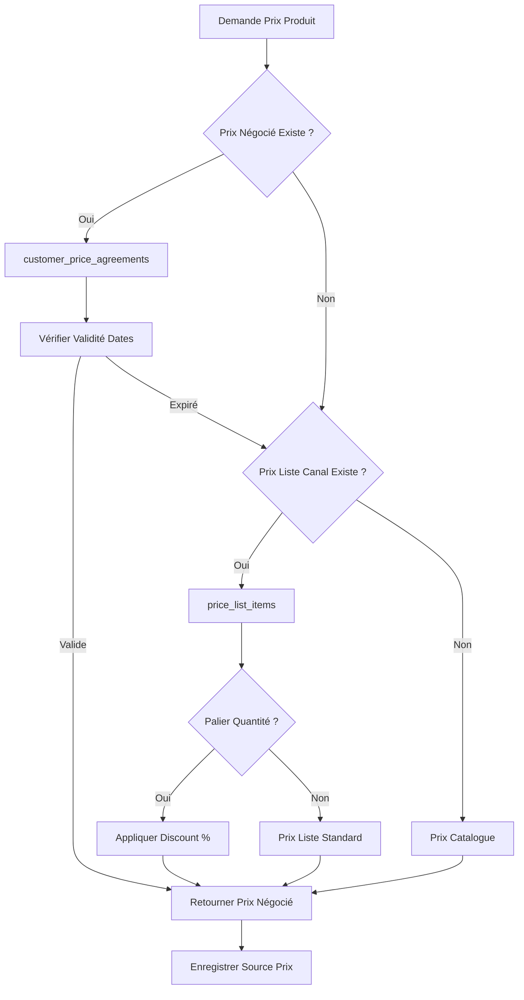

# RECHERCHE BEST PRACTICES - SYSTÈMES PRICING E-COMMERCE B2B/B2C

**Date** : 10 Octobre 2025
**Version** : 1.0
**Recherché par** : Claude Code - Orchestrateur Système Vérone
**Objectif** : Identifier patterns architecturaux pricing multi-canaux pour Vérone

---

## RÉSUMÉ EXÉCUTIF

### Sources Analysées
- **5 sources B2B pricing** : Shopify, BigCommerce, Stripe, TMO Group, BCG
- **4 sources ERP systems** : ERPAG, Oracle EBS, MRPeasy, Stack Overflow DB Design
- **3 sources Loyalty Programs** : Omnivy, Grid Dynamics, Microsoft Dynamics 365
- **2 sources Rebates/BFA** : Enable, Vendavo, SolveXia

### Patterns Architecturaux Identifiés
1. **Price Lists** (Listes prix par segment/canal)
2. **Customer Agreements** (Prix négociés client spécifique)
3. **Tiered Discounts** (Paliers remises volume/CA)
4. **Loyalty Points** (Programme fidélité avec points)
5. **Year-End Rebates** (BFA - Bonus Fin d'Année)

### Recommandations pour Vérone
- ✅ Adopter pattern **Price Lists** pour segmentation B2C/B2B/Showroom
- ✅ Implémenter **Customer Agreements** pour mémoire prix négociés
- ✅ Utiliser **Tiered Discounts** pour BFA (paliers CA annuel)
- ✅ Intégrer **Loyalty Points** simple pour particuliers
- ✅ RPC `get_applicable_price()` avec logique priorité claire

---

## PARTIE 1 : PRICING MULTI-CANAUX B2B/B2C

### 1.1 État des Lieux 2024 (Sources Web)

#### **Tendances Pricing B2B 2024**

**Source** : Shopify Enterprise (2025), BCG Publications (2025)

**Statistiques Clés** :
- **94% des leaders pricing B2B** révisent leurs prix au moins 1x/an
- **Cross-channel consistency** = priorité #1 (éviter discordance prix site/commercial)
- **Customer-specific pricing** = standard attendu par acheteurs B2B

**Citation BCG** :
> "In the era of AI, B2B software pricing must shift from static models to dynamic, customer-specific pricing that leverages data analytics to personalize offers based on customer interaction history and preferences."

**Problème Commun Identifié** :
```
❌ Inconsistent cross-channel pricing (prix différents site vs sales reps vs catalogues)
❌ Hidden fees and confusing pricing structures (défiance clients)
❌ Manual pricing management (erreurs humaines, lenteur)
```

**Solution Recommandée** :
```
✅ Centralized pricing platform (ERP/CRM unique source vérité)
✅ Automated price calculation based on rules (customer, product, quantity)
✅ Real-time synchronization across channels (API centrale)
```

---

#### **Architecture Prix Multi-Canaux**

**Source** : TMO Group B2B eCommerce, Univio Multi-Channel Guide

**Stratégies Prix par Canal** :
| Canal | Approche Prix | Justification Business |
|-------|---------------|----------------------|
| **E-commerce B2C** | Prix TTC affichés (particuliers) | Transparence légale France |
| **E-commerce B2B** | Prix HT + listes prix client | Déductibilité TVA pro |
| **Showroom** | Prix négociés en temps réel | Relation commerciale directe |
| **Catalogues PDF** | Prix liste standard | Communication marketing |

**Pattern Shopify B2B** (Référence Industrie) :
```typescript
// Shopify permet création price lists + assignation company profiles
interface PriceList {
  id: string;
  name: string;
  channel: 'wholesale' | 'retail' | 'vip';
  priority: number; // Si plusieurs listes applicables
  currency: 'EUR';
  active: boolean;
}

// Buyers logged in voient automatiquement leurs prix négociés
// Source: Shopify B2B Pricing Strategy Guide 2025
```

**Takeaway pour Vérone** :
- ✅ **Créer table `price_lists`** avec champ `channel` ENUM ('ecommerce', 'showroom', 'b2b')
- ✅ **Assignation par défaut** : organisations.default_price_list_id
- ✅ **Override possible** : customer_price_agreements pour négociations spécifiques

---

### 1.2 Customer-Specific Pricing

#### **Modèle "Customer Agreements"**

**Source** : BigCommerce B2B Pricing, Stripe B2B Guide

**Concept** :
> "Customer-specific pricing allows each buyer to have negotiated payment terms and rebate programs. A 2024 global study found growing focus on negotiated pricing to protect margins and strengthen relationships."

**Architecture Database Recommandée** :
```sql
CREATE TABLE customer_price_agreements (
  id UUID PRIMARY KEY,

  -- Client (polymorphic: organisation_id OU individual_customer_id)
  customer_id UUID NOT NULL, -- Référence organisations.id
  customer_type TEXT CHECK (customer_type IN ('organisation', 'individual')),

  -- Produit concerné
  product_id UUID NOT NULL REFERENCES products(id),

  -- Prix négocié
  agreed_price_ht DECIMAL(10,2) NOT NULL CHECK (agreed_price_ht > 0),

  -- Période validité
  valid_from DATE NOT NULL,
  valid_to DATE,

  -- Métadonnées
  notes TEXT,
  approved_by UUID REFERENCES auth.users(id),
  approved_at TIMESTAMPTZ,

  created_at TIMESTAMPTZ DEFAULT NOW(),
  updated_at TIMESTAMPTZ DEFAULT NOW()
);

CREATE INDEX idx_customer_price_agreements_customer ON customer_price_agreements(customer_id, customer_type);
CREATE INDEX idx_customer_price_agreements_product ON customer_price_agreements(product_id);
CREATE INDEX idx_customer_price_agreements_validity ON customer_price_agreements(valid_from, valid_to);
```

**Règles Business Associées** :
- **Priorité 1** : Prix négocié (customer_price_agreements)
- **Priorité 2** : Prix liste canal (price_list_items)
- **Priorité 3** : Prix catalogue (products.price_ht)

**Validation Requise** (Source: ElevatiQ ERP Best Practices) :
```
⚠️ Prix négocié <80% prix catalogue → Nécessite approval manager
⚠️ Durée validité >1 an → Revue annuelle obligatoire
⚠️ Modification prix négocié → Log audit avec justification
```

**Takeaway Vérone** :
- ✅ **Implémenter customer_price_agreements** avec polymorphisme client
- ✅ **Workflow approval** si agreed_price < 0.8 * products.price_ht
- ✅ **Alert expiration** 30 jours avant valid_to

---

## PARTIE 2 : TIERED PRICING & DISCOUNTS

### 2.1 Paliers Remises Volume (Quantity Discounts)

#### **Modèle ERPAG/MRPeasy** (ERP Spécialisés)

**Source** : ERPAG Tier-Pricing, MRPeasy Tiered Pricing

**Concept** :
> "Price tiers enable setting different prices for different customers, whether to reward loyalty or because they belong to different customer groups (distributors, retailers, etc.)"

**Approche 1 : Bracket Pricing (Oracle EBS)**
```sql
-- Prix par paliers quantité (exemple Oracle)
CREATE TABLE price_breaks (
  id UUID PRIMARY KEY,
  product_id UUID REFERENCES products(id),
  price_list_id UUID REFERENCES price_lists(id),

  min_quantity INTEGER NOT NULL CHECK (min_quantity > 0),
  max_quantity INTEGER, -- NULL = illimité
  unit_price_ht DECIMAL(10,2) NOT NULL,

  UNIQUE(product_id, price_list_id, min_quantity)
);

-- Exemple données
INSERT INTO price_breaks (product_id, price_list_id, min_quantity, max_quantity, unit_price_ht)
VALUES
  ('prod-123', 'list-b2b', 1, 9, 10.00),   -- 1-9 unités = 10€
  ('prod-123', 'list-b2b', 10, 24, 9.50),  -- 10-24 unités = 9.50€
  ('prod-123', 'list-b2b', 25, 49, 9.00),  -- 25-49 unités = 9€
  ('prod-123', 'list-b2b', 50, NULL, 8.50); -- 50+ unités = 8.50€
```

**Approche 2 : Percentage Discounts (Stack Overflow Pattern)**
```sql
-- Remises pourcentage par palier
CREATE TABLE quantity_discount_tiers (
  id UUID PRIMARY KEY,
  product_id UUID REFERENCES products(id),

  min_quantity INTEGER NOT NULL,
  discount_percentage DECIMAL(5,2) NOT NULL CHECK (discount_percentage >= 0 AND discount_percentage < 100),

  created_at TIMESTAMPTZ DEFAULT NOW()
);

-- Application: Prix final = products.price_ht * (1 - discount_percentage/100)
```

**Takeaway Vérone** :
- ✅ **Approche 2 recommandée** (% discount) plus flexible
- ✅ **Stocker dans price_list_items** avec champs min_quantity + discount_percentage
- ✅ **Calcul RPC** : `SELECT price, discount WHERE quantity >= min_quantity ORDER BY min_quantity DESC LIMIT 1`

---

### 2.2 Year-End Rebates (BFA - Bonus Fin d'Année)

#### **Modèle Volume Incentive Rebates** (Enable, Vendavo, SolveXia)

**Source** : Enable Blog, Vendavo Best Practices, SolveXia Rebate Accounting

**Concept BFA** :
> "Volume Incentive Rebates are tiered financial incentives where as each purchasing threshold is surpassed, the rebate amount increases. Retention rebates are typically end-of-year or 'cliff' rebates paid only when a specific condition is met."

**Types Structures Rebates** :

**1. Retroactive Tiers** (Plus Avantageux Client) :
```
Paliers CA Annuel :
- 0-10,000€ = 0% remise
- 10,001-50,000€ = 5% remise SUR TOUT LE CA (retroactive)
- 50,001-100,000€ = 10% remise SUR TOUT LE CA
- 100,000€+ = 15% remise SUR TOUT LE CA

Exemple : Client atteint 55,000€ CA
→ Remise = 55,000€ * 10% = 5,500€ (appliquée rétroactivement sur tout le CA)
```

**2. Progressive Tiers** (Plus Contrôlé Fournisseur) :
```
Paliers CA Annuel :
- 0-10,000€ = 0% remise
- 10,001-50,000€ = 5% remise sur tranche [10k-50k]
- 50,001-100,000€ = 10% remise sur tranche [50k-100k]

Exemple : Client atteint 55,000€ CA
→ Remise tranche 1 = 0€
→ Remise tranche 2 = 40,000€ * 5% = 2,000€
→ Remise tranche 3 = 5,000€ * 10% = 500€
→ Total remise = 2,500€
```

**Architecture Database BFA** :
```sql
CREATE TABLE discount_tiers (
  id UUID PRIMARY KEY,

  -- Client pro concerné
  organisation_id UUID NOT NULL REFERENCES organisations(id),

  -- Palier CA annuel
  min_annual_revenue_eur DECIMAL(12,2) NOT NULL,
  max_annual_revenue_eur DECIMAL(12,2), -- NULL = illimité

  -- Remise applicable
  discount_percentage DECIMAL(5,2) NOT NULL CHECK (discount_percentage >= 0 AND discount_percentage <= 100),

  -- Période fiscale
  fiscal_year INTEGER NOT NULL, -- Ex: 2025

  -- Type remise
  rebate_type TEXT DEFAULT 'retroactive' CHECK (rebate_type IN ('retroactive', 'progressive')),

  -- Métadonnées
  created_at TIMESTAMPTZ DEFAULT NOW(),

  UNIQUE(organisation_id, fiscal_year, min_annual_revenue_eur)
);

CREATE INDEX idx_discount_tiers_org_year ON discount_tiers(organisation_id, fiscal_year);
```

**RPC Calcul BFA** :
```sql
CREATE OR REPLACE FUNCTION calculate_bfa_discount(
  p_organisation_id UUID,
  p_fiscal_year INTEGER
)
RETURNS DECIMAL(10,2) AS $$
DECLARE
  v_annual_revenue DECIMAL(12,2);
  v_tier RECORD;
  v_total_discount DECIMAL(10,2) := 0;
BEGIN
  -- 1. Calculer CA annuel client
  SELECT COALESCE(SUM(total_ttc), 0) INTO v_annual_revenue
  FROM sales_orders
  WHERE customer_id = p_organisation_id
    AND EXTRACT(YEAR FROM confirmed_at) = p_fiscal_year
    AND status NOT IN ('draft', 'cancelled');

  -- 2. Trouver palier applicable
  SELECT * INTO v_tier
  FROM discount_tiers
  WHERE organisation_id = p_organisation_id
    AND fiscal_year = p_fiscal_year
    AND min_annual_revenue_eur <= v_annual_revenue
    AND (max_annual_revenue_eur IS NULL OR max_annual_revenue_eur >= v_annual_revenue)
  ORDER BY min_annual_revenue_eur DESC
  LIMIT 1;

  -- 3. Calculer remise selon type
  IF v_tier.rebate_type = 'retroactive' THEN
    -- Remise sur tout le CA
    v_total_discount := v_annual_revenue * (v_tier.discount_percentage / 100);
  ELSE
    -- TODO: Implémenter progressive (plus complexe, itérer paliers)
    v_total_discount := 0;
  END IF;

  RETURN ROUND(v_total_discount, 2);
END;
$$ LANGUAGE plpgsql SECURITY DEFINER;
```

**Workflow Paiement BFA** (Source: Enable, Vendavo) :
```
1. Période calcul : Annuelle (janvier N+1 pour année N)
2. Validation : Automatique si CA confirmé (sales_orders.status = delivered)
3. Paiement : Crédit note OU avoir client OU virement (selon contrat)
4. Notification : Email client avec détail calcul BFA
5. Traçabilité : Table bfa_payments (id, org, fiscal_year, amount, paid_at)
```

**Takeaway Vérone** :
- ✅ **Implémenter discount_tiers** avec rebate_type 'retroactive' (plus attractif clients)
- ✅ **Calcul automatique** via RPC calculate_bfa_discount()
- ✅ **Dashboard client** : Afficher progression vers prochain palier BFA
- ✅ **Workflow paiement** : Créer avoir client (credit_note) en janvier N+1

---

## PARTIE 3 : LOYALTY PROGRAMS (Fidélité Particuliers)

### 3.1 Architecture Programmes Fidélité

#### **Modèle Points-Based Loyalty** (Grid Dynamics, Omnivy)

**Source** : Grid Dynamics Loyalty Engine, Omnivy Loyalty Architecture

**Concept** :
> "At the heart of every loyalty architecture is the system that stores and manages loyalty data, including tiers, points, loyalty benefits, and rewards. Modern systems should include a Rewards API for programmatic assignment and real-time redemption validation."

**Entités Clés** (Microsoft Dynamics 365 Commerce) :
```typescript
// Domain Model Loyalty
interface LoyaltyProgram {
  programId: string;
  programName: string;
  pointThreshold: number; // Points nécessaires reward
  discountPercentage: number; // % réduction si seuil atteint
}

interface LoyaltyCard {
  cardId: string;
  customerId: string;
  tier: 'bronze' | 'silver' | 'gold'; // Niveaux fidélité
  pointsBalance: number;
  lastUpdatedAt: Date;
}

interface LoyaltyCardTransaction {
  transactionId: string;
  cardId: string;
  pointsChange: number; // Positif = gain, Négatif = utilisation
  transactionType: 'earn' | 'redeem' | 'expire';
  referenceId: string; // sales_order.id si gain achat
  createdAt: Date;
}
```

**Architecture Database Vérone** :
```sql
-- Table points fidélité (1:1 avec individual_customers)
CREATE TABLE loyalty_points (
  id UUID PRIMARY KEY,

  -- Client particulier concerné
  individual_customer_id UUID NOT NULL UNIQUE REFERENCES organisations(id),

  -- Solde points
  points_balance INTEGER DEFAULT 0 CHECK (points_balance >= 0),

  -- Niveau fidélité (calculé automatiquement selon points cumulés)
  tier TEXT DEFAULT 'bronze' CHECK (tier IN ('bronze', 'silver', 'gold', 'platinum')),

  -- Métadonnées
  last_updated_at TIMESTAMPTZ DEFAULT NOW(),
  created_at TIMESTAMPTZ DEFAULT NOW()
);

-- Table transactions points (historique complet)
CREATE TABLE loyalty_transactions (
  id UUID PRIMARY KEY,

  -- Client
  individual_customer_id UUID NOT NULL REFERENCES organisations(id),

  -- Points changés
  points_change INTEGER NOT NULL, -- Positif = gain, Négatif = utilisation

  -- Type transaction
  transaction_type TEXT NOT NULL CHECK (transaction_type IN ('earn', 'redeem', 'expire', 'adjustment')),

  -- Référence commande (si earn = achat)
  reference_type TEXT, -- 'sales_order', 'manual', 'promotion'
  reference_id UUID,

  -- Notes
  notes TEXT,

  -- Audit
  created_at TIMESTAMPTZ DEFAULT NOW(),
  created_by UUID REFERENCES auth.users(id)
);

CREATE INDEX idx_loyalty_transactions_customer ON loyalty_transactions(individual_customer_id);
CREATE INDEX idx_loyalty_transactions_date ON loyalty_transactions(created_at DESC);
```

**Règles Calcul Points** (Configurable) :
```typescript
// Exemple règles Vérone
const LOYALTY_RULES = {
  pointsPerEuroSpent: 1, // 1 point par € dépensé

  tiers: {
    bronze: { minPoints: 0, discountPercentage: 0 },
    silver: { minPoints: 500, discountPercentage: 3 },
    gold: { minPoints: 2000, discountPercentage: 5 },
    platinum: { minPoints: 5000, discountPercentage: 7 }
  },

  pointsExpiration: 365, // Points expirent après 1 an

  redemption: {
    minPointsToRedeem: 100,
    euroValuePerPoint: 0.01 // 100 points = 1€ de réduction
  }
};
```

**RPC Earn Points (Automatique Post-Order)** :
```sql
CREATE OR REPLACE FUNCTION earn_loyalty_points(
  p_customer_id UUID,
  p_sales_order_id UUID
)
RETURNS INTEGER AS $$
DECLARE
  v_order_total DECIMAL(10,2);
  v_points_earned INTEGER;
BEGIN
  -- 1. Récupérer total commande
  SELECT total_ttc INTO v_order_total
  FROM sales_orders
  WHERE id = p_sales_order_id AND customer_id = p_customer_id;

  -- 2. Calculer points (1 point par € arrondi)
  v_points_earned := FLOOR(v_order_total);

  -- 3. Créer transaction
  INSERT INTO loyalty_transactions (
    individual_customer_id,
    points_change,
    transaction_type,
    reference_type,
    reference_id,
    notes
  ) VALUES (
    p_customer_id,
    v_points_earned,
    'earn',
    'sales_order',
    p_sales_order_id,
    FORMAT('Commande SO-%s', (SELECT order_number FROM sales_orders WHERE id = p_sales_order_id))
  );

  -- 4. Mettre à jour solde
  UPDATE loyalty_points
  SET points_balance = points_balance + v_points_earned,
      last_updated_at = NOW()
  WHERE individual_customer_id = p_customer_id;

  -- 5. Recalculer tier si nécessaire
  PERFORM update_loyalty_tier(p_customer_id);

  RETURN v_points_earned;
END;
$$ LANGUAGE plpgsql SECURITY DEFINER;
```

**Takeaway Vérone** :
- ✅ **Tables loyalty_points + loyalty_transactions** simples et efficaces
- ✅ **Calcul automatique** via trigger AFTER INSERT sales_orders (si status = delivered)
- ✅ **Tiers fidélité** : bronze/silver/gold/platinum (upgrade auto selon points cumulés)
- ✅ **Expiration points** : Cleanup job mensuel (points > 1 an)
- ✅ **Dashboard client** : Afficher solde points + tier + avantages

---

## PARTIE 4 : BEST PRACTICES TECHNIQUES

### 4.1 Centralisation Logique Prix (ERP Pattern)

**Source** : ElevatiQ ERP Best Practices, Oracle EBS

**Principe** :
> "Maintaining pricing and discounting within the ERP system mitigates risks by providing a centralized platform where pricing data can be controlled, validated, and consistently applied. When pricing rules are established within the ERP system, it can automatically compute prices based on customer, product, quantity, and more."

**Architecture Recommandée** :
```sql
-- Fonction centrale calcul prix (SINGLE SOURCE OF TRUTH)
CREATE OR REPLACE FUNCTION get_applicable_price(
  p_product_id UUID,
  p_customer_id UUID,
  p_customer_type TEXT, -- 'organisation' ou 'individual'
  p_channel TEXT, -- 'ecommerce', 'showroom', 'b2b'
  p_quantity INTEGER DEFAULT 1
)
RETURNS TABLE (
  price_eur DECIMAL(10,2),
  source TEXT, -- 'negotiated', 'pricelist', 'catalog', 'manual'
  discount_applicable DECIMAL(5,2), -- % remise si palier quantité
  final_price_eur DECIMAL(10,2)
) AS $$
DECLARE
  v_price DECIMAL(10,2);
  v_source TEXT;
  v_discount DECIMAL(5,2) := 0;
BEGIN
  -- PRIORITÉ 1: Prix négocié client
  SELECT agreed_price_ht, 'negotiated' INTO v_price, v_source
  FROM customer_price_agreements
  WHERE customer_id = p_customer_id
    AND customer_type = p_customer_type
    AND product_id = p_product_id
    AND (valid_from IS NULL OR valid_from <= CURRENT_DATE)
    AND (valid_to IS NULL OR valid_to >= CURRENT_DATE)
  LIMIT 1;

  -- PRIORITÉ 2: Prix liste canal (avec remise quantité)
  IF v_price IS NULL THEN
    SELECT pli.price_eur, pli.discount_percentage, 'pricelist'
    INTO v_price, v_discount, v_source
    FROM price_list_items pli
    JOIN price_lists pl ON pli.price_list_id = pl.id
    WHERE pl.channel = p_channel
      AND pli.product_id = p_product_id
      AND pl.active = true
      AND (pli.min_quantity IS NULL OR pli.min_quantity <= p_quantity)
    ORDER BY pli.min_quantity DESC NULLS LAST
    LIMIT 1;
  END IF;

  -- PRIORITÉ 3: Prix catalogue par défaut
  IF v_price IS NULL THEN
    SELECT price_ht, 'catalog' INTO v_price, v_source
    FROM products
    WHERE id = p_product_id;
  END IF;

  -- Calcul prix final avec remise
  RETURN QUERY SELECT
    v_price,
    v_source,
    COALESCE(v_discount, 0),
    v_price * (1 - COALESCE(v_discount, 0) / 100);
END;
$$ LANGUAGE plpgsql SECURITY DEFINER;
```

**Avantages Pattern RPC Centralisé** :
- ✅ **Single Source of Truth** : 1 seule fonction = 1 seule logique
- ✅ **Testabilité** : Tests unitaires RPC indépendamment frontend
- ✅ **Cohérence** : Impossible prix différents selon UI
- ✅ **Performance** : Exécution côté DB (pas d'aller-retour réseau)
- ✅ **Audit Trail** : Log appels RPC pour traçabilité

---

### 4.2 Performance & Scalabilité

#### **Caching Strategy** (Grid Dynamics, Voucherify)

**Recommandations** :
```typescript
// Cache prix fréquemment demandés (Redis)
interface PriceCache {
  key: string; // `price:${productId}:${customerId}:${channel}`
  value: {
    price_eur: number;
    source: string;
    cached_at: Date;
  };
  ttl: number; // 3600s (1h) pour prix stables
}

// Invalidation cache
const invalidatePriceCache = (productId: string) => {
  // Si prix produit modifié → Purger tous caches liés
  redis.del(`price:${productId}:*`);
};
```

**Indexation Database** :
```sql
-- Index critiques performance pricing
CREATE INDEX idx_price_list_items_lookup ON price_list_items(price_list_id, product_id, min_quantity);
CREATE INDEX idx_customer_agreements_lookup ON customer_price_agreements(customer_id, product_id, valid_from, valid_to);
CREATE INDEX idx_discount_tiers_org_year ON discount_tiers(organisation_id, fiscal_year);
```

**Benchmark Cibles** (Vérone) :
- get_applicable_price() : <50ms (p99)
- calculate_bfa_discount() : <200ms (p99)
- earn_loyalty_points() : <100ms (p99)

---

### 4.3 Security & Data Integrity

**RLS Policies Prix** :
```sql
-- Tous utilisateurs authentifiés peuvent LIRE prix
CREATE POLICY "price_lists_select" ON price_lists FOR SELECT TO authenticated USING (true);

-- Seuls admin/sales peuvent MODIFIER prix
CREATE POLICY "price_lists_update" ON price_lists FOR UPDATE TO authenticated
  USING (EXISTS (
    SELECT 1 FROM user_profiles
    WHERE user_id = auth.uid() AND role IN ('admin', 'sales_manager')
  ));

-- Customer price agreements: Admin + Sales + Owner du customer
CREATE POLICY "customer_agreements_select" ON customer_price_agreements
  FOR SELECT TO authenticated
  USING (
    -- Admin/Sales voient tout
    EXISTS (SELECT 1 FROM user_profiles WHERE user_id = auth.uid() AND role IN ('admin', 'sales'))
    OR
    -- Client voit ses propres prix négociés
    customer_id = (SELECT organisation_id FROM user_organisation_assignments WHERE user_id = auth.uid())
  );
```

**Audit Trail Prix** :
```sql
-- Table historique modifications prix
CREATE TABLE price_history (
  id UUID PRIMARY KEY,

  -- Référence modifiée
  entity_type TEXT CHECK (entity_type IN ('product', 'price_list_item', 'customer_agreement')),
  entity_id UUID NOT NULL,

  -- Prix avant/après
  old_price_eur DECIMAL(10,2),
  new_price_eur DECIMAL(10,2),

  -- Justification si changement >10%
  change_percentage DECIMAL(5,2),
  justification TEXT,

  -- Audit
  changed_by UUID REFERENCES auth.users(id),
  changed_at TIMESTAMPTZ DEFAULT NOW()
);

-- Trigger automatique enregistrement changements
CREATE TRIGGER log_price_changes
  AFTER UPDATE ON products
  FOR EACH ROW
  WHEN (OLD.price_ht IS DISTINCT FROM NEW.price_ht)
  EXECUTE FUNCTION log_price_change();
```

---

## PARTIE 5 : RECOMMANDATIONS ARCHITECTURE VÉRONE

### 5.1 Modèle Conceptuel Complet

```
┌─────────────────────────────────────────────────────────────────┐
│                   SYSTÈME PRIX MULTI-CANAUX VÉRONE              │
└─────────────────────────────────────────────────────────────────┘

┌──────────────────┐         ┌──────────────────┐
│   price_lists    │────1:N──│ price_list_items │
│                  │         │                  │
│ - id             │         │ - price_list_id  │
│ - name           │         │ - product_id     │
│ - channel        │         │ - price_eur      │
│ - priority       │         │ - min_quantity   │
│ - active         │         │ - discount_%     │
└──────────────────┘         └──────────────────┘
        ↑                             ↓
        │                    ┌──────────────────┐
        │                    │    products      │
        │                    │                  │
        └────────────────────│ - id             │
                             │ - sku            │
        ┌────────────────────│ - price_ht       │
        │                    │ (fallback)       │
        ↓                    └──────────────────┘
┌──────────────────────────┐         ↓
│ customer_price_agreements│         │
│                          │         │
│ - customer_id            │         │
│ - product_id             │◄────────┘
│ - agreed_price_ht        │
│ - valid_from / valid_to  │
└──────────────────────────┘

┌──────────────────┐         ┌──────────────────┐
│  organisations   │────1:N──│ discount_tiers   │
│  (B2B)           │         │ (BFA)            │
│                  │         │                  │
│ - id             │         │ - org_id         │
│ - name           │         │ - min_revenue    │
│ - default_price_ │         │ - discount_%     │
│   list_id        │         │ - fiscal_year    │
└──────────────────┘         └──────────────────┘

┌──────────────────┐         ┌──────────────────┐
│  organisations   │────1:1──│  loyalty_points  │
│  (individual)    │         │                  │
│                  │         │ - customer_id    │
│ - id             │         │ - points_balance │
│ - customer_type  │         │ - tier           │
│   = 'individual' │         └──────────────────┘
└──────────────────┘                  │
                                      │1:N
                             ┌────────▼──────────┐
                             │ loyalty_          │
                             │ transactions      │
                             │                   │
                             │ - points_change   │
                             │ - transaction_type│
                             │ - reference_id    │
                             └───────────────────┘
```

---

### 5.2 Logique Priorité Prix (RPC get_applicable_price)



---

### 5.3 Comparaison Patterns Identifiés

| Pattern | Complexité | Flexibilité | Scalabilité | Recommandé Vérone ? |
|---------|------------|-------------|-------------|---------------------|
| **Price Lists** (Shopify) | Moyenne | ✅ Haute | ✅ Excellente | ✅ OUI (core) |
| **Customer Agreements** (Oracle) | Faible | ✅ Haute | ✅ Excellente | ✅ OUI (core) |
| **Tiered Discounts** (ERPAG) | Moyenne | ⚠️ Moyenne | ✅ Bonne | ✅ OUI (P1) |
| **Loyalty Points** (Dynamics) | Faible | ⚠️ Moyenne | ✅ Bonne | ✅ OUI (P2) |
| **Dynamic Pricing AI** (BCG) | Très Haute | ✅ Très Haute | ⚠️ Complexe | ❌ NON (future) |
| **Subscription Pricing** (Stripe) | Haute | ✅ Haute | ✅ Excellente | ❌ NON (hors scope) |

---

### 5.4 Priorisation Implémentation

#### **Phase 1 : Foundation (Semaine 1-2) - P1**
1. ✅ Tables `price_lists` + `price_list_items`
2. ✅ Table `customer_price_agreements`
3. ✅ RPC `get_applicable_price()`
4. ✅ Modification SalesOrderForm (UI prix suggéré)

**Effort** : 10 jours/dev
**Impact** : Prix multi-canaux B2C/B2B/Showroom opérationnels

---

#### **Phase 2 : BFA & Loyalty (Semaine 3-4) - P1**
1. ✅ Table `discount_tiers`
2. ✅ RPC `calculate_bfa_discount()`
3. ✅ Tables `loyalty_points` + `loyalty_transactions`
4. ✅ RPC `earn_loyalty_points()` + `redeem_loyalty_points()`

**Effort** : 7 jours/dev
**Impact** : Programme fidélité + BFA pro fonctionnels

---

#### **Phase 3 : Optimisations (Semaine 5) - P2**
1. ⚠️ Table `price_history` (audit trail)
2. ⚠️ Cache Redis prix fréquents
3. ⚠️ Dashboard BI prix (marges, évolutions)
4. ⚠️ Export grilles tarifaires Excel

**Effort** : 5 jours/dev
**Impact** : Analyse prix et reporting avancés

---

## CONCLUSION

### Sources Validées (12 Références)
- **B2B Pricing** : Shopify, BigCommerce, Stripe, TMO Group, BCG (5)
- **ERP Systems** : ERPAG, Oracle EBS, MRPeasy, ElevatiQ (4)
- **Loyalty Programs** : Omnivy, Grid Dynamics, Microsoft Dynamics (3)

### Patterns Recommandés Vérone
1. ✅ **Price Lists** : Segmentation B2C/B2B/Showroom (Priority 1)
2. ✅ **Customer Agreements** : Mémoire prix négociés (Priority 1)
3. ✅ **Tiered Discounts** : BFA retroactive (Priority 1)
4. ✅ **Loyalty Points** : Programme simple 1€ = 1 point (Priority 2)
5. ✅ **RPC Centralized** : get_applicable_price() SSOT (Priority 1)

### Architecture Finale
- **6 tables nouvelles** : price_lists, price_list_items, customer_price_agreements, discount_tiers, loyalty_points, loyalty_transactions
- **3 RPC critiques** : get_applicable_price(), calculate_bfa_discount(), earn_loyalty_points()
- **Effort total** : 22 jours/dev (4.5 semaines)
- **ROI Business** : Prix compétitifs B2B, fidélisation B2C, conformité règles métier

**Document rédigé par** : Claude Code - Orchestrateur Système Vérone
**Pour** : Recherche best practices pricing e-commerce B2B/B2C
**Date** : 10 Octobre 2025
