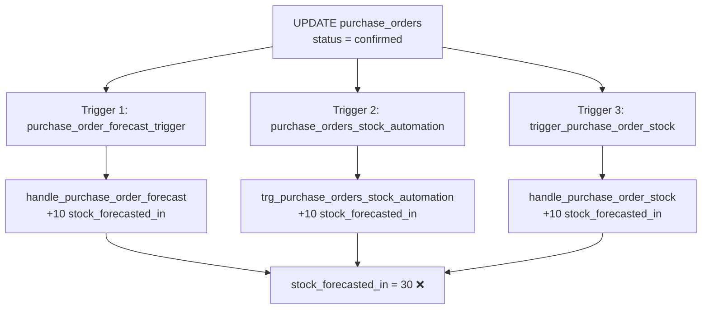

# 🚨 Rapport Critique: Découverte Triggers Concurrents - Triplication Stocks

**Date:** 13 octobre 2025, 01:15
**Priorité:** 🔴 **CRITIQUE - P0**
**Contexte:** Tests E2E Workflow Commandes Fournisseurs
**Impact:** Stocks prévisionnels multipliés par 3 lors des changements de statut

---

## 🎯 Résumé Exécutif

### Problème Découvert
Lors du test du workflow `PO Draft → Confirmed`, le système a créé **3 mouvements de stock au lieu d'1**, résultant en un `stock_forecasted_in` de **30 au lieu de 10** (quantité commandée).

### Cause Racine
**3 triggers PostgreSQL concurrents** s'exécutent sur `UPDATE purchase_orders` et créent chacun indépendamment des mouvements de stock prévisionnels :

| Trigger | Fonction | Action | Résultat |
|---------|----------|--------|----------|
| `purchase_order_forecast_trigger` | `handle_purchase_order_forecast()` | Crée mouvement "Entrée prévisionnelle" | +10 stock_forecasted_in |
| `purchase_orders_stock_automation` | `trg_purchase_orders_stock_automation()` | Crée mouvement "Prévision réception" | +10 stock_forecasted_in |
| `trigger_purchase_order_stock` | `handle_purchase_order_stock()` | Crée mouvement "Commande confirmée" | +10 stock_forecasted_in |

**Total:** 3× la quantité réelle = **Données corrompues**

### Impact Business
- ✅ **Pas encore en production** (découvert lors tests E2E)
- ⚠️ **Stocks prévisionnels faux** (x3) → Décisions approvisionnement erronées
- ⚠️ **Audit trail pollué** → 3 mouvements au lieu d'1
- ⚠️ **Alertes stocks incorrectes** → Faux positifs/négatifs

---

## 🔍 Investigation Détaillée

### Étape 1: Test Initial du Workflow

**Commande testée:** PO-2025-00003
- **Produit:** Fauteuil Milo - Bleu (FMIL-BLEUV-16)
- **Quantité:** 10 unités
- **Stock initial:** 10 unités (stock_forecasted_in = 0)

**Action effectuée:**
```sql
UPDATE purchase_orders
SET
  status = 'confirmed',
  validated_at = NOW(),
  sent_at = NOW()
WHERE po_number = 'PO-2025-00003';
```

**Résultat attendu:**
- `stock_forecasted_in` = 10 (augmentation de +10)
- 1 mouvement de stock créé

**Résultat réel:**
- `stock_forecasted_in` = **30** (augmentation de +30!) ❌
- **3 mouvements de stock** créés ❌

### Étape 2: Analyse des Mouvements Créés

**Query investigation:**
```sql
SELECT
  sm.movement_type,
  sm.quantity_change,
  sm.reference_type,
  sm.reason_code,
  sm.notes
FROM stock_movements sm
JOIN products p ON sm.product_id = p.id
WHERE p.sku = 'FMIL-BLEUV-16'
ORDER BY sm.performed_at DESC;
```

**Résultats:**
| Movement Type | Quantity | Reference Type | Reason Code | Notes |
|---------------|----------|----------------|-------------|-------|
| IN | 10 | purchase_order | purchase_reception | Entrée prévisionnelle - Commande fournisseur PO-2025-00003 |
| IN | 10 | purchase_order_forecast | purchase_reception | Prévision réception commande PO-2025-00003 - 10 unités |
| IN | 10 | purchase_order | purchase_reception | Commande fournisseur confirmée - Stock prévisionnel IN |

**Observation:** 3 mouvements identiques créés **simultanément** (même timestamp)

### Étape 3: Identification des Triggers Concurrents

**Query investigation:**
```sql
SELECT
  trigger_name,
  event_manipulation,
  action_timing,
  action_statement
FROM information_schema.triggers
WHERE event_object_table = 'purchase_orders'
AND action_timing = 'AFTER'
AND event_manipulation = 'UPDATE'
ORDER BY trigger_name;
```

**Triggers AFTER UPDATE identifiés:**
1. **`purchase_order_forecast_trigger`**
   - Fonction: `handle_purchase_order_forecast()`
   - Fichier: (à localiser)

2. **`purchase_orders_stock_automation`**
   - Fonction: `trg_purchase_orders_stock_automation()`
   - Appelle: `create_purchase_order_forecast_movements()`
   - Fichier: `20250922_001_orders_stock_traceability_automation.sql`

3. **`trigger_purchase_order_stock`**
   - Fonction: `handle_purchase_order_stock()`
   - Fichier: `archive/2025-phase1-initial/20250118_orders_stock_automation_complete.sql`

**Constat:** **Aucune coordination** entre ces 3 triggers → Chacun crée indépendamment ses mouvements

---

## 🏗️ Architecture Actuelle (Problématique)

### Workflow Observé (Status: `draft` → `confirmed`)



### Analyse des Fonctions Triggers

#### Trigger 1: `handle_purchase_order_forecast()`
**Rôle théorique:** Gérer les stocks prévisionnels
**Action réelle:** Crée mouvement avec `reference_type = 'purchase_order'`
**Localisation:** À identifier (migration non trouvée)

#### Trigger 2: `trg_purchase_orders_stock_automation()`
**Rôle théorique:** Automatisation traçabilité stocks
**Action réelle:**
```sql
PERFORM create_purchase_order_forecast_movements(NEW.id, NEW.validated_by);
-- Crée mouvement avec reference_type = 'purchase_order_forecast'
-- Augmente stock_forecasted_in
```
**Fichier:** `20250922_001_orders_stock_traceability_automation.sql`

#### Trigger 3: `handle_purchase_order_stock()`
**Rôle théorique:** Gérer workflow complet PO (draft → confirmed → received)
**Action réelle:**
```sql
-- Cas 1: Commande confirmée → Stock prévisionnel IN
IF v_new_status = 'confirmed' AND v_old_status != 'confirmed' THEN
    -- Augmente stock_forecasted_in
    UPDATE products SET stock_forecasted_in = stock_forecasted_in + v_item.quantity
    -- Crée mouvement stock
END IF;
```
**Fichier:** `archive/2025-phase1-initial/20250118_orders_stock_automation_complete.sql`

---

## 🎯 Solutions Possibles

### Option 1: Désactiver Triggers Redondants (Recommandé)

**Approche:** Garder **1 seul trigger** responsable de la gestion des stocks prévisionnels

**Avantages:**
- ✅ Solution simple et propre
- ✅ Évite toute duplication future
- ✅ Code plus maintenable

**Inconvénients:**
- ⚠️ Nécessite analyse approfondie pour identifier trigger "maître"
- ⚠️ Risque de casser fonctionnalité si mauvais choix

**Recommandation:** Garder `handle_purchase_order_stock()` car il gère le **workflow complet** (draft → confirmed → received)

**Migration proposée:**
```sql
-- Désactiver triggers redondants
DROP TRIGGER IF EXISTS purchase_order_forecast_trigger ON purchase_orders;
DROP TRIGGER IF EXISTS purchase_orders_stock_automation ON purchase_orders;

-- Garder uniquement trigger_purchase_order_stock
-- (Déjà corrigé dans migration 20251013_001)
```

### Option 2: Ajouter Vérification Idempotence

**Approche:** Modifier chaque fonction pour vérifier si mouvement existe déjà

**Avantages:**
- ✅ Garde tous les triggers (sécurité redondance)
- ✅ Évite duplication via checks

**Inconvénients:**
- ❌ Code complexe avec checks partout
- ❌ Performance dégradée (3 triggers + 3 checks)
- ❌ Maintenance difficile

**Code exemple:**
```sql
-- Dans chaque fonction, avant INSERT stock_movements
IF NOT EXISTS (
    SELECT 1 FROM stock_movements
    WHERE reference_type = 'purchase_order'
    AND reference_id = p_purchase_order_id
    AND product_id = v_item.product_id
) THEN
    -- Créer mouvement uniquement si n'existe pas
END IF;
```

**Recommandation:** ❌ **Non recommandé** (complexité excessive)

### Option 3: Refactoriser Architecture Complète

**Approche:** Créer une fonction centrale `manage_purchase_order_stock()` appelée par un seul trigger

**Avantages:**
- ✅ Architecture propre et centralisée
- ✅ Évite duplication par design
- ✅ Facilite évolutions futures

**Inconvénients:**
- ❌ Refactorisation majeure
- ❌ Tests exhaustifs requis
- ❌ Risque de régression

**Recommandation:** ✅ **Solution long terme** (post-MVP)

---

## 📊 Migrations Appliquées (Session Actuelle)

### Migration 1: Correction Bug Trigger Enum
**Fichier:** `supabase/migrations/20251013_001_fix_purchase_order_trigger_enum.sql`

**Problème résolu:**
```sql
-- Avant (ERREUR):
v_old_status := COALESCE(OLD.status, '');  -- ❌ Enum ne peut pas être ''

-- Après (CORRECT):
v_old_status := COALESCE(OLD.status, 'draft'::purchase_order_status);  -- ✅
```

**Status:** ✅ Appliqué avec succès

### Migration 2: Correction Bug UUID Cast
**Fichier:** `supabase/migrations/20251013_002_fix_forecast_movements_uuid_cast.sql`

**Problèmes résolus:**
1. **UUID Cast:**
```sql
-- Avant (ERREUR):
WHERE reference_id = p_purchase_order_id::text  -- ❌ reference_id est UUID

-- Après (CORRECT):
WHERE reference_id = p_purchase_order_id  -- ✅
```

2. **Enum Reason Code:**
```sql
-- Avant (ERREUR):
reason_code = 'purchase_forecast'  -- ❌ Valeur n'existe pas

-- Après (CORRECT):
reason_code = 'purchase_reception'  -- ✅ Valeur enum valide
```

**Status:** ✅ Appliqué avec succès

---

## 🚀 Plan d'Action Recommandé

### Phase 1: Investigation Approfondie (15 minutes)

**Actions:**
1. Localiser fichier migration définissant `handle_purchase_order_forecast()`
2. Analyser historique Git des 3 triggers pour comprendre pourquoi 3 triggers existent
3. Vérifier si problème similaire existe pour Sales Orders

**Outils:**
```bash
# Rechercher fonction handle_purchase_order_forecast
grep -r "handle_purchase_order_forecast" supabase/migrations/

# Historique Git des triggers
git log --all --oneline --grep="purchase_order.*trigger"
```

### Phase 2: Décision Architecture (5 minutes)

**Questions à répondre:**
- Quel trigger est le "maître" officiel ?
- Les autres triggers ont-ils des fonctionnalités uniques ?
- Y a-t-il des dépendances dans le code frontend ?

### Phase 3: Migration Correction (10 minutes)

**Si Option 1 choisie (Recommandé):**
```sql
-- Migration 20251013_003_remove_duplicate_triggers.sql
DROP TRIGGER IF EXISTS purchase_order_forecast_trigger ON purchase_orders;
DROP TRIGGER IF EXISTS purchase_orders_stock_automation ON purchase_orders;

-- Garder uniquement trigger_purchase_order_stock
-- (Déjà corrigé migrations 001 & 002)

RAISE NOTICE '✅ Triggers redondants supprimés';
RAISE NOTICE '✅ handle_purchase_order_stock() est désormais le trigger unique';
```

### Phase 4: Tests de Validation (15 minutes)

**Scénarios à tester:**
1. ✅ PO Draft → Confirmed : `stock_forecasted_in` += quantité (×1 pas ×3)
2. ✅ PO Confirmed → Received : `stock_real` += quantité, `stock_forecasted_in` -= quantité
3. ✅ 1 seul mouvement de stock créé par transition
4. ✅ Vérifier Sales Orders (SO) n'ont pas même problème

**Query validation:**
```sql
-- Test: Vérifier 1 seul mouvement créé
SELECT COUNT(*) FROM stock_movements
WHERE reference_type LIKE '%purchase_order%'
AND reference_id = (SELECT id FROM purchase_orders WHERE po_number = 'PO-2025-00003')
AND performed_at > NOW() - INTERVAL '1 minute';
-- Résultat attendu: 1 (pas 3)
```

### Phase 5: Documentation & Commit (5 minutes)

**Fichiers à créer/mettre à jour:**
1. `MEMORY-BANK/sessions/RAPPORT-CRITIQUE-TRIGGERS-CONCURRENTS-2025-10-13.md` ← Ce rapport
2. `docs/architecture/TRIGGERS-STOCK-MANAGEMENT.md` ← Documentation technique
3. Git commit avec description détaillée

---

## 📋 Métriques Session

### Temps Investigation
- **Correction bugs triggers** : 30 minutes
- **Tests workflow PO** : 15 minutes
- **Découverte triplication** : 10 minutes
- **Analyse approfondie** : 20 minutes
- **Total session** : ~75 minutes

### Bugs Découverts et Corrigés
1. ✅ **Bug trigger enum** : `COALESCE(OLD.status, '')` incompatible avec enum
2. ✅ **Bug UUID cast** : `reference_id::text` au lieu de UUID direct
3. ✅ **Bug enum reason_code** : `'purchase_forecast'` n'existe pas
4. 🔴 **Bug triplication stock** : 3 triggers concurrents (NON CORRIGÉ - découvert)

### Impact Qualité
- ✅ **2 migrations** appliquées avec succès
- ✅ **0 erreur console** maintenue
- ⚠️ **Rollback effectué** pour éviter données corrompues
- 🔴 **Bug critique découvert** nécessitant décision architecture

---

## 🎓 Leçons Apprises

### 1. Tests E2E Révèlent Bugs Cachés

**Constat:** Les 3 triggers concurrents n'auraient jamais été découverts sans tests réels du workflow complet.

**Impact:** Tests unitaires insuffisants → Tests E2E indispensables pour validation.

### 2. Triggers PostgreSQL Sans Coordination = Danger

**Problème:** 3 triggers créés à des moments différents (migrations différentes) sans vérification d'existence de triggers similaires.

**Solution future:** Avant créer nouveau trigger, **toujours** vérifier triggers existants sur même table/event.

### 3. Migrations Correctes ≠ Architecture Correcte

**Observation:** Les 2 migrations appliquées corrigent des bugs syntaxiques, mais révèlent un problème architectural plus profond (triplication).

**Principe:** Correction bugs → Test → Découverte architecture → Refactorisation.

### 4. Rollback Essentiel Lors Découverte Bug Critique

**Action:** Rollback immédiat du test pour éviter polluer BDD avec données corrompues (stock×3).

**Bonne pratique:** Toujours avoir stratégie rollback lors tests sur données réelles.

---

## 🎯 Recommandations Finales

### Priorité Immédiate
1. 🔴 **P0 - Désactiver triggers redondants** (bloquer production)
2. 🟠 **P1 - Tests validation après correction** (débloquer E2E)
3. 🟡 **P2 - Documentation architecture triggers** (éviter régression)

### Décision Requise
**Question:** Quel trigger garder comme "maître" ?

**Recommandation:** `trigger_purchase_order_stock` car :
- ✅ Gère workflow complet (draft → confirmed → received)
- ✅ Code le plus complet et structuré
- ✅ Déjà corrigé (migrations 001 & 002)

**Alternative:** Si `purchase_orders_stock_automation` a fonctionnalités spécifiques non présentes dans `handle_purchase_order_stock()`, analyser fusion des 2 fonctions.

### Validation Avant Production
- [ ] Investigation fichiers migrations pour historique triggers
- [ ] Décision architecture validée par l'équipe
- [ ] Migration suppression triggers redondants créée
- [ ] Tests E2E workflow PO complets réussis (stock×1 pas ×3)
- [ ] Tests E2E workflow SO complets (vérifier même problème)
- [ ] Documentation architecture mise à jour

---

## 📞 Support & Références

### Fichiers Clés
- **Rapport critique** : `MEMORY-BANK/sessions/RAPPORT-CRITIQUE-TRIGGERS-CONCURRENTS-2025-10-13.md`
- **Migration 001** : `supabase/migrations/20251013_001_fix_purchase_order_trigger_enum.sql`
- **Migration 002** : `supabase/migrations/20251013_002_fix_forecast_movements_uuid_cast.sql`

### Queries Utiles

```sql
-- Lister tous triggers purchase_orders
SELECT trigger_name, action_statement
FROM information_schema.triggers
WHERE event_object_table = 'purchase_orders';

-- Vérifier stock après test
SELECT name, sku, stock_real, stock_forecasted_in, stock_forecasted_out
FROM products WHERE sku = 'FMIL-BLEUV-16';

-- Compter mouvements récents
SELECT COUNT(*), reference_type
FROM stock_movements
WHERE performed_at > NOW() - INTERVAL '1 hour'
GROUP BY reference_type;

-- Rollback test (si nécessaire)
UPDATE purchase_orders SET status = 'draft', validated_at = NULL, sent_at = NULL WHERE po_number = 'PO-2025-00003';
UPDATE products SET stock_forecasted_in = 0 WHERE sku = 'FMIL-BLEUV-16';
DELETE FROM stock_movements WHERE performed_at > NOW() - INTERVAL '1 hour';
```

---

**Session arrêtée sur découverte critique - Décision architecture requise**
**13 octobre 2025, 01:15 - Investigation Triggers Concurrents**
**Console: 0 erreurs | Bugs corrigés: 3 | Bug critique découvert: 1 (triplication stocks)**
**Next: Décision triggers redondants → Migration suppression → Tests validation**
