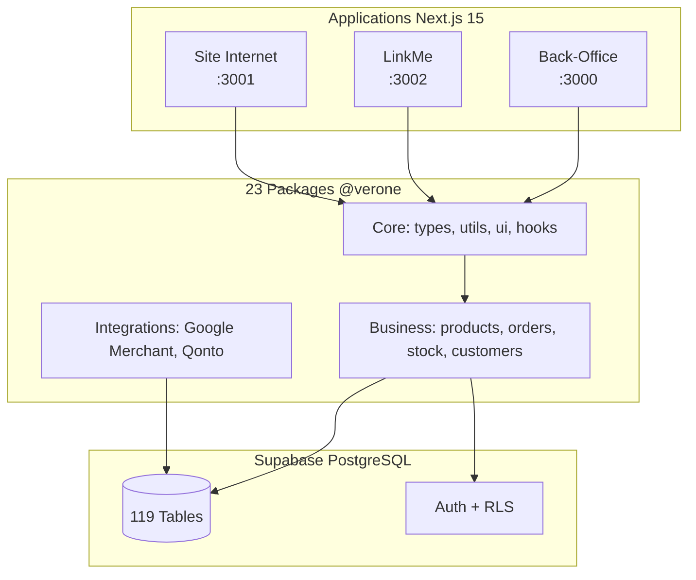

# Verone

Monorepo CRM/ERP pour concept store decoration et mobilier d'interieur — sourcing creatif, selections curatees.

---

## Architecture Overview


```mermaid
graph TB
    subgraph Apps["Applications Next.js 15"]
        BO["Back-Office<br/>:3000"]
        LM["LinkMe<br/>:3002"]
        SI["Site Internet<br/>:3001"]
    end

    subgraph Packages["23 Packages @verone"]
        CORE["Core: types, utils, ui, hooks"]
        BIZ["Business: products, orders, stock, customers"]
        INT["Integrations: Google Merchant, Qonto"]
    end

    subgraph Supabase["Supabase PostgreSQL"]
        DB[("119 Tables")]
        AUTH["Auth + RLS"]
    end

    BO --> CORE
    LM --> CORE
    SI --> CORE
    CORE --> BIZ
    BIZ --> DB
    BIZ --> AUTH
    INT --> DB
```

### Repo Map

```
verone-back-office/
├── apps/                       # 3 applications Next.js 15
│   ├── back-office/            # CRM/ERP (port 3000)
│   ├── linkme/                 # Affiliation (port 3002)
│   └── site-internet/          # E-commerce B2C (port 3001)
├── packages/@verone/           # 23 packages partages
│   ├── types/                  # Types TypeScript + Supabase
│   ├── ui/                     # 79 composants shadcn/ui
│   ├── utils/                  # Helpers (logger, excel, upload)
│   ├── products/               # Gestion produits
│   ├── orders/                 # Commandes
│   ├── stock/                  # Stock & alertes
│   └── ...                     # +17 autres packages
├── supabase/
│   └── migrations/             # 686 migrations SQL
├── docs/
│   ├── current/                # 31 docs canoniques
│   └── business-rules/         # 3 dossiers regles metier
├── tests/                      # E2E Playwright
└── .github/workflows/          # 5 pipelines CI/CD
```

---

## Applications

| App               | Port | Public                | Description                              | Routes Principales                                                       |
| ----------------- | ---- | --------------------- | ---------------------------------------- | ------------------------------------------------------------------------ |
| **back-office**   | 3000 | Admin, Gestionnaires  | CRM/ERP central - pilotage de l'activite | `/dashboard`, `/produits/catalogue`, `/commandes`, `/stocks`, `/finance` |
| **linkme**        | 3002 | Affilies, Partenaires | Plateforme commissions & selections      | `/dashboard`, `/ma-selection`, `/commissions`, `/statistiques`           |
| **site-internet** | 3001 | Clients B2C           | E-commerce decoration et mobilier        | `/catalogue`, `/produit/[id]`, `/panier`, `/checkout`                    |

### Details par Application

**Back-Office** (CRM/ERP)

- 28 modules metier : produits, commandes, stocks, finance, contacts
- 4 canaux de vente : LinkMe, Site Internet, Google Merchant, Prix clients
- Integrations : Google Merchant, Qonto, Revolut, Analytics

**LinkMe** (Affiliation)

- Dashboard affilie avec KPIs
- Gestion selections produits (drag & drop)
- Suivi commissions et demandes de paiement
- Analytics performance (Tremor charts)

**Site Internet** (E-commerce)

- Design epure (Playfair Display + Inter)
- Catalogue produits avec variantes
- Panier et checkout
- Animations Framer Motion

---

## Data Layer (Supabase)

### Tables Principales

| Domaine       | Tables                                                          | Description               |
| ------------- | --------------------------------------------------------------- | ------------------------- |
| **Produits**  | `products`, `categories`, `collections`, `product_images`       | Catalogue et organisation |
| **Commandes** | `sales_orders`, `purchase_orders`, `sample_orders`              | Ventes et achats          |
| **Stock**     | `stock_movements`, `stock_alert_tracking`, `stock_reservations` | Gestion inventaire        |
| **Clients**   | `individual_customers`, `contacts`, `customer_groups`           | CRM                       |
| **Finance**   | `invoices`, `payments`, `bank_transactions`                     | Comptabilite              |
| **LinkMe**    | `linkme_affiliates`, `linkme_commissions`, `linkme_selections`  | Affiliation               |
| **Auth**      | `user_app_roles`, `user_profiles`, `user_sessions`              | Utilisateurs              |

### Authentification & RLS

**Table centrale** : `user_app_roles`

- Un utilisateur peut avoir un role par app (back-office, linkme, site-internet)
- Roles back-office : `admin`, `manager`, `user`
- Roles linkme : `enseigne_admin`, `organisation_admin`, `client`
- RLS policies actives sur toutes les tables sensibles

---

## Getting Started

### Prerequisites

```
node >= 20
pnpm >= 10.13.1
```

### Installation

```bash
# Clone
git clone <repo-url>
cd verone-back-office

# Install dependencies
pnpm install

# Configure environment
cp .env.example .env.local
# Editer .env.local avec vos credentials Supabase
```

### Development

```bash
# Toutes les apps
npm run dev

# App specifique
npm run dev --filter=back-office
npm run dev --filter=linkme
npm run dev --filter=site-internet
```

### For AI Agents

**Consulter `.claude/INDEX.md`** pour instructions detaillees.

**Critical Paths:**

- Credentials: `.serena/memories/*-credentials-*.md`
- Context: `docs/current/serena/INDEX.md`
- Database: `.mcp.env`
- Workflow: `CLAUDE.md`

### Build & Validation

```bash
npm run build        # Build production
npm run type-check   # Validation TypeScript
npm run lint:fix     # Auto-fix ESLint
```

---

## Scripts & Commands

### Developpement

| Script               | Description                         |
| -------------------- | ----------------------------------- |
| `npm run dev`        | Demarre toutes les apps en mode dev |
| `npm run build`      | Build production                    |
| `npm run type-check` | Validation TypeScript               |
| `npm run lint:fix`   | Correction automatique ESLint       |

### Tests

| Script                           | Description                |
| -------------------------------- | -------------------------- |
| `npm run test:e2e`               | Tests Playwright E2E       |
| `npm run test:e2e:critical`      | Tests critiques uniquement |
| `npm run test:e2e:headed`        | Tests avec UI visible      |
| `npm run playwright:show-report` | Afficher rapport tests     |

### Audits Qualite

| Script                     | Description                 |
| -------------------------- | --------------------------- |
| `npm run audit:all`        | Tous les audits             |
| `npm run audit:duplicates` | Code duplique (jscpd)       |
| `npm run audit:cycles`     | Cycles dependencies (madge) |
| `npm run audit:deadcode`   | Code mort (knip)            |

### Validations

| Script                   | Description            |
| ------------------------ | ---------------------- |
| `npm run validate:all`   | Toutes les validations |
| `npm run validate:types` | Alignement types DB    |
| `npm run validate:hooks` | Hooks dupliques        |
| `npm run check:console`  | Erreurs console        |

### Database

| Script                   | Description              |
| ------------------------ | ------------------------ |
| `npm run generate:types` | Regenerer types Supabase |

---

## Documentation

**Source de verite** : [`docs/current/`](./docs/current/) (31 fichiers .md)

Voir [`docs/README.md`](./docs/README.md) pour l'index complet.

---

## Security

- **Secrets** : Variables d'environnement Vercel (jamais en code)
- **`.env`** : Gitignored, ne jamais commit
- **RLS** : Row Level Security actif sur tables sensibles
- **RGPD** : Conformite documentee dans [`docs/legal/`](./docs/legal/)

---

## CI/CD

5 workflows GitHub Actions dans [`.github/workflows/`](./.github/workflows/)

| Workflow                           | Trigger       | Description                                    |
| ---------------------------------- | ------------- | ---------------------------------------------- |
| `quality.yml`                      | Push/PR       | Type-check, lint, tests critiques (sequential) |
| `protect-main-source.yml`          | PR main       | Bloque PRs vers main hors release staging      |
| `auto-release-staging-to-main.yml` | manual / cron | Release periodique staging → main              |
| `db-drift-cron.yml`                | cron          | Detection drift schema Supabase                |
| `scratchpad-cleanup.yml`           | cron          | Purge `docs/scratchpad/` ancien                |

Deploiement Vercel : integration native (preview sur push staging, production sur merge `main`).

### Pipeline Production

```
Feature branch → PR → staging (preview Vercel auto)
   ↓
Release PR staging → main (auto-release-staging-to-main.yml)
   ↓
Quality Gates (quality.yml) → Deploy Production Vercel
```

---

## Contributing

### Workflow Git

```bash
# 1. Partir de staging
git checkout staging && git pull
git checkout -b feat/[APP-DOMAIN-NNN]-ma-feature

# 2. Developper

# 3. Valider
pnpm --filter @verone/[app] type-check  # Doit passer
pnpm --filter @verone/[app] build       # Doit passer
pnpm --filter @verone/[app] lint        # Doit passer

# 4. Commit (Task ID obligatoire)
git add <files-precis>
git commit -m "[APP-DOMAIN-NNN] type: description"

# 5. Push & PR vers staging (jamais main)
git push -u origin feat/[APP-DOMAIN-NNN]-ma-feature
gh pr create --base staging --title "[APP-DOMAIN-NNN] ..." --body "..."
```

### Regles

- **Toute branche feature/fix part de staging** et PR vers staging
- **JAMAIS** PR vers main (sauf release `staging → main` periodique)
- **1 PR = 1 bloc fonctionnellement coherent**, pas 1 PR par sous-tache
- **Build + type-check + lint** verts avant commit
- **PR review** + CI verte requises pour merge
- **Auto-deploy** preview sur push staging, production sur merge staging → main

---

## Task Management

Tasks trackées dans `.tasks/` (Git-tracked, 1 fichier par task).

### Structure

```
.tasks/
├── LM-ORD-009.md        # 1 fichier = 1 task
├── BO-DASH-001.md
├── INDEX.md             # Généré auto (gitignored)
└── TEMPLATE.md          # Template
```

### Format Task ID

`[APP]-[DOMAIN]-[NNN]` où APP = BO | LM | WEB

| Prefixe   | Application                 |
| --------- | --------------------------- |
| `BO-*`    | back-office                 |
| `LM-*`    | linkme                      |
| `SI-*`    | site-internet               |
| `INFRA-*` | infrastructure / CI / rules |
| `NO-TASK` | chores (deps, etc.)         |

### Créer une Task

```bash
# Copier le template
cp .tasks/TEMPLATE.md .tasks/LM-ORD-011.md

# Éditer le frontmatter YAML
# ---
# id: LM-ORD-011
# app: linkme
# domain: ORDER
# status: pending
# priority: high
# created: 2026-01-15
# commits: []
# ---

# Ajouter au git
git add .tasks/LM-ORD-011.md
```

### Voir toutes les Tasks

```bash
# Générer l'index
.tasks/generate-index.sh

# Afficher l'index
cat .tasks/INDEX.md
```

### Format Commit

**Obligatoire** : Task ID dans chaque commit

```bash
# Format requis
git commit -m "[APP-DOMAIN-NNN] type: description"

# Exemples valides
git commit -m "[LM-ORD-009] feat: refonte workflow order form"
git commit -m "[BO-DASH-001] fix: cache invalidation"
git commit -m "[NO-TASK] chore: update dependencies"
```

**Validation automatique** : Le hook `commit-msg` bloque les commits sans Task ID valide.

---

## Tech Stack

| Categorie      | Technologies                                   |
| -------------- | ---------------------------------------------- |
| **Framework**  | Next.js 15.5.7, React 18.3.1, TypeScript 5.3.3 |
| **UI**         | shadcn/ui, Radix UI, Tailwind CSS 3.4.1        |
| **Database**   | Supabase (PostgreSQL), @supabase/ssr           |
| **Validation** | Zod 4.1.12, React Hook Form                    |
| **State**      | TanStack Query 5.20.1, SWR 2.3.6               |
| **Monorepo**   | Turborepo 2.6.0, pnpm 10.13.1                  |
| **Testing**    | Playwright 1.55.0                              |
| **Deploy**     | Vercel (auto-deploy main)                      |

---

**Proprietary** - Verone 2025. Tous droits reserves.

_Version 5.1.0 - 2026-01-09 - Docs cleanup Sprint 2_
