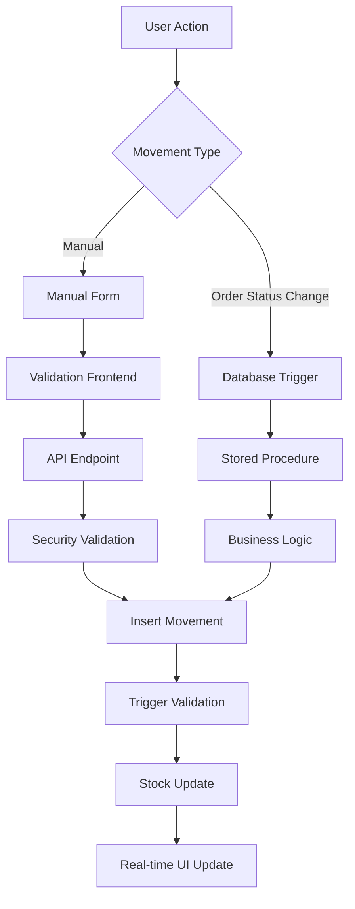
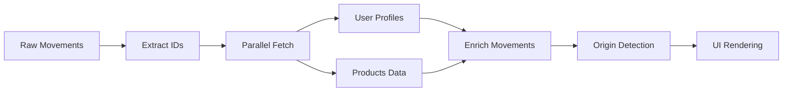

# 🏗️ Stock Traceability - Technical Architecture Documentation

**Date**: 22 septembre 2025
**Version**: 1.0
**Type**: Architecture Documentation
**Scope**: Stock Movement Traceability System

## 📋 Architecture Overview

Le système de traçabilité des mouvements de stock suit une architecture event-driven avec triggers de base de données pour automatiser les workflows et une interface React optimisée pour la consultation et gestion.

## 🗄️ Database Architecture

### Core Tables

#### `stock_movements` (Enhanced)
```sql
CREATE TABLE stock_movements (
  id UUID DEFAULT uuid_generate_v4() PRIMARY KEY,
  product_id UUID NOT NULL REFERENCES products(id),
  warehouse_id UUID REFERENCES warehouses(id),
  movement_type movement_type_enum NOT NULL, -- IN, OUT, ADJUST, TRANSFER
  quantity_change INTEGER NOT NULL,
  quantity_before INTEGER NOT NULL,
  quantity_after INTEGER NOT NULL,
  unit_cost DECIMAL(10,2),
  reference_type TEXT, -- 🆕 Type de référence (manual_adjustment, sales_order_confirmation, etc.)
  reference_id UUID,   -- 🆕 ID de la référence (commande, ajustement, etc.)
  notes TEXT,
  reason_code stock_reason_enum,
  affects_forecast BOOLEAN DEFAULT false, -- 🆕 Indique si c'est un mouvement prévisionnel
  forecast_type TEXT CHECK (forecast_type IN ('in', 'out')), -- 🆕 Type prévisionnel
  performed_by UUID NOT NULL REFERENCES auth.users(id),
  performed_at TIMESTAMPTZ DEFAULT now(),
  created_at TIMESTAMPTZ DEFAULT now(),
  updated_at TIMESTAMPTZ DEFAULT now()
);
```

#### Index Strategy
```sql
-- Performance pour traçabilité
CREATE INDEX idx_stock_movements_reference
ON stock_movements(reference_type, reference_id);

CREATE INDEX idx_stock_movements_forecast
ON stock_movements(affects_forecast, forecast_type)
WHERE affects_forecast = true;

-- Requêtes temporelles
CREATE INDEX idx_stock_movements_performed_at
ON stock_movements(performed_at DESC);

-- Jointures utilisateur
CREATE INDEX idx_stock_movements_performed_by
ON stock_movements(performed_by);
```

### Database Triggers Architecture

#### 1. Sales Order Automation
```sql
-- Trigger principal pour statuts commandes clients
CREATE OR REPLACE FUNCTION handle_sales_order_status_change()
RETURNS trigger AS $$
BEGIN
  -- Confirmation : Mouvements prévisionnels
  IF NEW.status = 'confirmed' AND OLD.status != 'confirmed' THEN
    PERFORM create_sales_order_forecast_movements(NEW.id);
  END IF;

  -- Expédition : Mouvements réels
  IF NEW.status = 'shipped' AND OLD.status != 'shipped' THEN
    PERFORM create_sales_order_shipment_movements(NEW.id);
  END IF;

  RETURN NEW;
END;
$$ LANGUAGE plpgsql;

CREATE TRIGGER sales_order_status_change_trigger
  AFTER UPDATE ON sales_orders
  FOR EACH ROW
  EXECUTE FUNCTION handle_sales_order_status_change();
```

#### 2. Stored Procedures for Business Logic
```sql
-- Création mouvements prévisionnels commande client
CREATE OR REPLACE FUNCTION create_sales_order_forecast_movements(p_sales_order_id UUID)
RETURNS void AS $$
DECLARE
    order_item RECORD;
BEGIN
    FOR order_item IN
        SELECT soi.product_id, soi.quantity, so.performed_by, so.confirmed_at
        FROM sales_order_items soi
        JOIN sales_orders so ON soi.sales_order_id = so.id
        WHERE so.id = p_sales_order_id AND so.status = 'confirmed'
    LOOP
        INSERT INTO stock_movements (
            product_id, movement_type, quantity_change, quantity_before, quantity_after,
            reference_type, reference_id, notes, reason_code, affects_forecast,
            forecast_type, performed_by, performed_at
        ) VALUES (
            order_item.product_id, 'OUT', order_item.quantity, 0, 0,
            'sales_order_confirmation', p_sales_order_id,
            'Commande client confirmée - Stock prévisionnel OUT',
            'sale', true, 'out', order_item.performed_by, order_item.confirmed_at
        );
    END LOOP;
END;
$$ LANGUAGE plpgsql;
```

### Validation Logic
```sql
-- Contrainte de cohérence calculs
CREATE OR REPLACE FUNCTION validate_movement_calculation()
RETURNS trigger AS $$
BEGIN
  -- Validation quantity_change pour mouvements réels
  IF NOT NEW.affects_forecast THEN
    IF NEW.movement_type = 'OUT' AND NEW.quantity_change > 0 THEN
      RAISE EXCEPTION 'Quantity change doit être négatif pour OUT si affects_forecast=false';
    END IF;

    IF NEW.movement_type = 'IN' AND NEW.quantity_change < 0 THEN
      RAISE EXCEPTION 'Quantity change doit être positif pour IN si affects_forecast=false';
    END IF;
  END IF;

  -- Empêcher stock négatif sur mouvements réels
  IF NOT NEW.affects_forecast AND NEW.quantity_after < 0 THEN
    RAISE EXCEPTION 'Le stock ne peut pas être négatif';
  END IF;

  RETURN NEW;
END;
$$ LANGUAGE plpgsql;

CREATE TRIGGER validate_movement_trigger
  BEFORE INSERT OR UPDATE ON stock_movements
  FOR EACH ROW
  EXECUTE FUNCTION validate_movement_calculation();
```

## 🎯 Frontend Architecture

### Component Hierarchy

```
📁 src/components/business/
├── movements-table.tsx          # 🎯 Colonne "Origine" + display logic
├── movements-filters.tsx        # Filtres avancés + user selection
├── movements-stats.tsx          # Métriques et statistiques
├── product-stock-history-modal.tsx # Historique produit spécifique
└── general-stock-movement-modal.tsx # Création mouvements manuels

📁 src/hooks/
├── use-movements-history.ts     # Hook principal historique complet
├── use-stock-movements.ts       # Gestion mouvements + reason codes
└── use-stock.ts                 # Stock management global

📁 src/app/
└── historique-mouvements/
    └── page.tsx                 # Page dédiée avec layout complet
```

### Core Components Details

#### 1. MovementsTable Component
**Path**: `src/components/business/movements-table.tsx`

```typescript
interface MovementWithDetails {
  id: string
  product_id: string
  movement_type: 'IN' | 'OUT' | 'ADJUST' | 'TRANSFER'
  quantity_change: number
  quantity_before: number
  quantity_after: number
  reference_type?: string      // 🔑 Key for origin detection
  reference_id?: string        // 🔑 Reference to source entity
  affects_forecast: boolean    // 🔑 Real vs forecast movement
  forecast_type?: 'in' | 'out'
  performed_by: string
  performed_at: string

  // Enriched data
  product_name?: string
  product_sku?: string
  user_name?: string          // 🔑 Displayed in Origin column
  reason_description?: string
}
```

**Origin Detection Logic**:
```typescript
const getMovementOrigin = (movement: MovementWithDetails) => {
  const userName = movement.user_name || 'Utilisateur inconnu'
  const referenceType = movement.reference_type

  // Manual movements
  if (referenceType === 'manual_adjustment' || referenceType === 'manual_entry') {
    return {
      icon: <Settings className="h-3 w-3 text-blue-600" />,
      text: `Manuel - ${userName}`,
      badge: <Badge variant="default" className="bg-blue-50 text-blue-700">Manuel</Badge>
    }
  }

  // Order-triggered movements
  if (referenceType?.includes('order') || referenceType?.includes('purchase') || referenceType?.includes('sale')) {
    const orderType = referenceType.includes('purchase') ? 'ACHAT' :
                     referenceType.includes('sale') ? 'VENTE' : 'CMD'
    const orderRef = movement.reference_id?.substring(0, 8) || 'INCONNUE'

    return {
      icon: <ShoppingCart className="h-3 w-3 text-purple-600" />,
      text: `Commande ${orderType}-${orderRef} - ${userName}`,
      badge: <Badge variant="default" className="bg-purple-50 text-purple-700">Commande</Badge>
    }
  }

  // Fallback for unknown types
  return {
    icon: <Clock className="h-3 w-3 text-gray-600" />,
    text: `${referenceType || 'Non spécifié'} - ${userName}`,
    badge: <Badge variant="secondary">{referenceType || 'Autre'}</Badge>
  }
}
```

#### 2. Data Fetching Strategy
**Path**: `src/hooks/use-movements-history.ts`

**Optimized JOIN Resolution**:
```typescript
// ❌ BEFORE - Incorrect Supabase JOIN syntax
.select(`
  *,
  products:product_id(id, name, sku),
  user_profiles:performed_by(user_id, first_name, last_name)
`)

// ✅ AFTER - Separate queries with data enrichment
const enrichMovements = async (movements: RawMovement[]) => {
  const userIds = [...new Set(movements.map(m => m.performed_by).filter(Boolean))]
  const productIds = [...new Set(movements.map(m => m.product_id).filter(Boolean))]

  const [userProfiles, products] = await Promise.all([
    supabase.from('user_profiles').select('user_id, first_name, last_name').in('user_id', userIds),
    supabase.from('products').select('id, name, sku').in('id', productIds)
  ])

  return movements.map(movement => ({
    ...movement,
    user_name: getUserName(userProfiles.data, movement.performed_by),
    product_name: getProductName(products.data, movement.product_id),
    product_sku: getProductSku(products.data, movement.product_id)
  }))
}
```

### Performance Optimizations

#### 1. Query Optimization
```typescript
// Pagination optimisée
const fetchMovements = useCallback(async (filters: MovementHistoryFilters) => {
  let query = supabase
    .from('stock_movements')
    .select('*', { count: 'exact' })
    .order('performed_at', { ascending: false })
    .range(filters.offset || 0, (filters.offset || 0) + (filters.limit || 50) - 1)

  // Apply filters efficiently
  if (filters.dateRange) {
    query = query
      .gte('performed_at', filters.dateRange.from.toISOString())
      .lte('performed_at', filters.dateRange.to.toISOString())
  }

  // ... other filters
}, [])
```

#### 2. Caching Strategy
```typescript
// Memoization for expensive computations
const enrichedMovements = useMemo(() => {
  return movements.map(movement => ({
    ...movement,
    originInfo: getMovementOrigin(movement), // Cached computation
    formattedDate: formatDate(movement.performed_at)
  }))
}, [movements])
```

## 🔐 Security Architecture

### RLS Policies

#### Stock Movements Access
```sql
-- Lecture par organisation
CREATE POLICY select_stock_movements ON stock_movements
FOR SELECT USING (
  EXISTS (
    SELECT 1 FROM user_profiles up
    WHERE up.user_id = auth.uid()
    AND up.organisation_id = stock_movements.organisation_id
  )
);

-- Insertion mouvements manuels (Managers+)
CREATE POLICY insert_manual_movements ON stock_movements
FOR INSERT WITH CHECK (
  reference_type IN ('manual_adjustment', 'manual_entry')
  AND EXISTS (
    SELECT 1 FROM user_profiles up
    WHERE up.user_id = auth.uid()
    AND up.role IN ('manager', 'admin')
  )
);

-- Système uniquement pour mouvements automatiques
CREATE POLICY insert_auto_movements ON stock_movements
FOR INSERT WITH CHECK (
  reference_type NOT IN ('manual_adjustment', 'manual_entry')
  AND performed_by = auth.uid()
);
```

### API Security Middleware
```typescript
// src/lib/middleware/api-security.ts
export async function validateStockMovementAccess(
  userId: string,
  movementType: string,
  organisationId: string
): Promise<boolean> {
  // Vérifier permissions utilisateur
  const userProfile = await getUserProfile(userId)
  if (!userProfile || userProfile.organisation_id !== organisationId) {
    return false
  }

  // Mouvements manuels : Manager+ requis
  if (['manual_adjustment', 'manual_entry'].includes(movementType)) {
    return ['manager', 'admin'].includes(userProfile.role)
  }

  // Mouvements automatiques : Système uniquement
  return false // Handled by DB triggers only
}
```

## 📊 Data Flow Architecture

### Movement Creation Flow



### Data Enrichment Pipeline



## 🎨 UI/UX Architecture

### Design System Integration

#### Color Palette (Vérone Brand)
```typescript
const VERONE_COLORS = {
  primary: '#000000',      // Noir signature
  secondary: '#FFFFFF',    // Blanc pur
  accent: '#666666',       // Gris élégant

  // Functional colors (badges only)
  manual: {
    bg: 'bg-blue-50',
    text: 'text-blue-700',
    icon: 'text-blue-600'
  },
  order: {
    bg: 'bg-purple-50',
    text: 'text-purple-700',
    icon: 'text-purple-600'
  }
} as const
```

#### Component Design Patterns
```typescript
// Consistent badge pattern
const BadgePattern = {
  manual: (
    <Badge variant="default" className="bg-blue-50 text-blue-700 hover:bg-blue-50">
      Manuel
    </Badge>
  ),
  order: (
    <Badge variant="default" className="bg-purple-50 text-purple-700 hover:bg-purple-50">
      Commande
    </Badge>
  )
}

// Icon consistency
const IconPattern = {
  manual: <Settings className="h-3 w-3 text-blue-600" />,
  order: <ShoppingCart className="h-3 w-3 text-purple-600" />,
  fallback: <Clock className="h-3 w-3 text-gray-600" />
}
```

### Responsive Design
```typescript
// Mobile-first column layout
const COLUMN_CONFIG = {
  mobile: ['Date', 'Produit', 'Type', 'Quantité'],
  tablet: ['Date', 'Produit', 'Type', 'Quantité', 'Origine'],
  desktop: ['Date', 'Produit', 'Type', 'Quantité', 'Motif', 'Origine', 'Utilisateur', 'Coût', 'Notes']
}
```

## 📈 Performance Architecture

### Optimization Strategies

#### 1. Database Level
- **Indexes**: Strategic indexing on `(reference_type, reference_id)` and `performed_at`
- **Partitioning**: Monthly partitions pour tables volumineuses
- **Connection Pooling**: Supabase automatic pooling

#### 2. Application Level
```typescript
// Pagination avec total count optimisé
const PAGINATION_CONFIG = {
  defaultPageSize: 50,
  maxPageSize: 100,
  countQuery: 'exact', // Only when needed
  prefetchNext: true   // Background loading
}

// Debounced filters
const useFiltersDebounced = (filters: MovementHistoryFilters, delay = 300) => {
  return useDebounce(filters, delay)
}
```

#### 3. Client Level
```typescript
// Virtual scrolling pour grandes listes
const VirtualizedTable = React.memo(({ movements }) => {
  const [virtualItems, totalSize] = useVirtualizer({
    count: movements.length,
    getScrollElement: () => parentRef.current,
    estimateSize: () => 60, // Row height
    overscan: 10
  })

  return (
    <div style={{ height: totalSize }}>
      {virtualItems.map(item => (
        <MovementRow key={item.key} movement={movements[item.index]} />
      ))}
    </div>
  )
})
```

## 🔧 Error Handling Architecture

### Error Categories

#### 1. Database Errors
```sql
-- Custom error types
CREATE OR REPLACE FUNCTION handle_stock_error(error_code TEXT, details TEXT)
RETURNS void AS $$
BEGIN
  CASE error_code
    WHEN 'INSUFFICIENT_STOCK' THEN
      RAISE EXCEPTION 'Stock insuffisant: %', details;
    WHEN 'INVALID_CALCULATION' THEN
      RAISE EXCEPTION 'Calcul invalide: %', details;
    WHEN 'PERMISSION_DENIED' THEN
      RAISE EXCEPTION 'Permission refusée: %', details;
  END CASE;
END;
$$ LANGUAGE plpgsql;
```

#### 2. Frontend Error Boundaries
```typescript
// Global error boundary pour mouvements
export class MovementsErrorBoundary extends Component {
  state = { hasError: false, error: null }

  static getDerivedStateFromError(error: Error) {
    return { hasError: true, error }
  }

  render() {
    if (this.state.hasError) {
      return (
        <ErrorFallback
          error={this.state.error}
          resetErrorBoundary={() => this.setState({ hasError: false })}
        />
      )
    }

    return this.props.children
  }
}
```

#### 3. API Error Handling
```typescript
// Standardized error responses
export const handleMovementError = (error: any) => {
  const errorMap = {
    '23503': 'Produit introuvable',
    '23505': 'Mouvement déjà existant',
    'PGRST301': 'Permissions insuffisantes'
  }

  const message = errorMap[error.code] || error.message || 'Erreur inconnue'

  toast({
    title: "Erreur de mouvement",
    description: message,
    variant: "destructive"
  })
}
```

## 🔍 Monitoring & Observability

### Performance Metrics
```typescript
// Performance tracking
export const trackMovementPerformance = (operation: string, duration: number) => {
  analytics.track('movement_performance', {
    operation,
    duration,
    timestamp: Date.now(),
    user_id: getCurrentUserId()
  })
}

// Usage dans les hooks
const fetchMovements = async () => {
  const start = performance.now()
  try {
    // ... fetch logic
  } finally {
    trackMovementPerformance('fetch_movements', performance.now() - start)
  }
}
```

### Error Tracking
```typescript
// Structured error logging
export const logMovementError = (error: Error, context: any) => {
  logger.error('Movement operation failed', {
    error: error.message,
    stack: error.stack,
    context,
    timestamp: new Date().toISOString(),
    user_id: getCurrentUserId()
  })
}
```

## 🚀 Deployment Architecture

### Build Process
```json
// package.json scripts
{
  "scripts": {
    "build": "next build",
    "build:check": "npm run type-check && npm run lint && npm run build",
    "type-check": "tsc --noEmit",
    "lint": "next lint",
    "db:generate-types": "supabase gen types typescript --local > src/lib/supabase/types.ts"
  }
}
```

### Environment Configuration
```typescript
// Environment-specific configs
const CONFIG = {
  development: {
    enableDebugLogs: true,
    pageSizeDefault: 25,
    enablePerformanceTracking: false
  },
  production: {
    enableDebugLogs: false,
    pageSizeDefault: 50,
    enablePerformanceTracking: true
  }
} as const
```

---

**Architecture Status**: ✅ IMPLEMENTED
**Next Review**: Novembre 2025
**Performance Target**: <2s page load, >99% uptime
**Scalability**: Designed for 10K+ movements/month