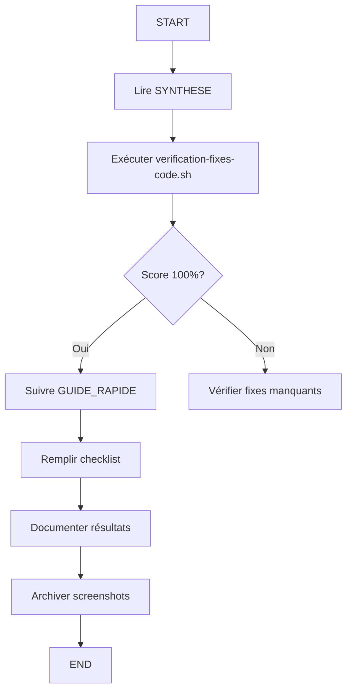
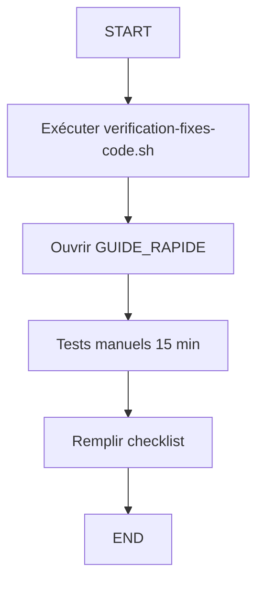
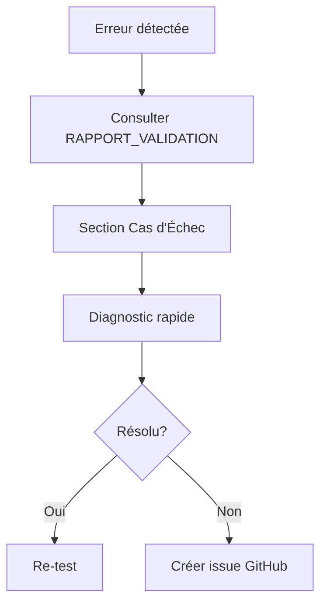

# 📚 VALIDATION FIXES #2 ET #3 - DOCUMENTATION

**Date création:** 2025-10-03
**Agent:** Vérone Test Expert
**Statut:** ✅ Prêt pour tests manuels

---

## 🎯 OBJECTIF

Valider les 2 fixes appliqués au système Vérone:
- **Fix #3:** Auto-génération slug organisations (résout erreur 400)
- **Fix #2:** Image facultative sourcing rapide (validation frontend)

---

## 📁 FICHIERS DISPONIBLES

### 1️⃣ START HERE: Guide Rapide ⚡

**Fichier:** `GUIDE_RAPIDE_TESTS_FIXES.md`
**Taille:** 3.9 KB
**Temps:** 10-15 minutes

**Contenu:**
- Checklist condensée
- Actions étape par étape
- Success criteria
- Commandes cleanup

**Utilisation:**
```bash
cat TASKS/testing/GUIDE_RAPIDE_TESTS_FIXES.md
# OU
open -a "Typora" TASKS/testing/GUIDE_RAPIDE_TESTS_FIXES.md
```

**👉 COMMENCER PAR CE FICHIER**

---

### 2️⃣ Rapport Validation Complet 📋

**Fichier:** `RAPPORT_VALIDATION_FIXES_2_3.md`
**Taille:** 13 KB
**Temps lecture:** 20 minutes

**Contenu:**
- Analyse détaillée des fixes
- Protocole de test exhaustif
- Template rapport final
- Cas d'échec et diagnostics
- Screenshots requis

**Utilisation:**
```bash
# Référence complète pour tests détaillés
cat TASKS/testing/RAPPORT_VALIDATION_FIXES_2_3.md
```

**📖 RÉFÉRENCE DÉTAILLÉE**

---

### 3️⃣ Synthèse Exécutive 📊

**Fichier:** `SYNTHESE_TESTS_FIXES_2_3.md`
**Taille:** 7.7 KB
**Temps lecture:** 10 minutes

**Contenu:**
- Résumé vérification code (12/12 ✅)
- Fixes confirmés
- Documentation créée
- Critères succès
- Prochaines étapes

**Utilisation:**
```bash
# Vue d'ensemble et statut
cat TASKS/testing/SYNTHESE_TESTS_FIXES_2_3.md
```

**📈 VUE D'ENSEMBLE**

---

### 4️⃣ Script Vérification Code 🔍

**Fichier:** `verification-fixes-code.sh`
**Taille:** 6.6 KB
**Exécutable:** ✅

**Contenu:**
- 12 vérifications automatiques
- Contrôle code source
- Validation migrations
- Score coloré

**Utilisation:**
```bash
# Exécuter vérification
./TASKS/testing/verification-fixes-code.sh

# Résultat: 12/12 PASS ✅
```

**🤖 VÉRIFICATION AUTOMATIQUE**

---

## 🚀 WORKFLOW RECOMMANDÉ

### Nouveau Testeur



**Temps total:** ~30 minutes (lecture + tests)

---

### Testeur Expérimenté



**Temps total:** ~15 minutes (tests uniquement)

---

### Diagnostic Erreur



---

## 📊 STATUT VÉRIFICATION CODE

**Exécuté:** 2025-10-03 00:28
**Résultat:** ✅ **12/12 vérifications passées (100%)**

### Détail

#### Fix #3: Organisations (4/4)
- ✅ Fonction `generateSlug()` définie
- ✅ Slug utilisé dans insert/update
- ✅ Preview slug UI visible
- ✅ Normalisation NFD accents

#### Fix #2: Sourcing Rapide (4/4)
- ✅ Validation image commentée
- ✅ Commentaire FIX présent
- ✅ Label "(facultatif)"
- ✅ ImageFile optional type

#### Vérifications Additionnelles (4/4)
- ✅ Hook `useSourcingProducts` existe
- ✅ Hook `useOrganisations` existe
- ✅ Migration sourcing system
- ✅ Migration organisations (slug)

---

## 🧪 TESTS MANUELS REQUIS

### Raison

⚠️ **MCP non disponibles:**
- MCP Playwright Browser: Non connecté
- MCP Supabase: Non connecté

**Impact:**
- Tests automatisés impossibles
- Validation manuelle nécessaire pour:
  - Console erreurs 400 en temps réel
  - Toast succès UI
  - Vérification BDD (slug, image_url NULL)

### Solution

**Tests manuels avec:**
- Browser DevTools (Console + Network)
- Navigation UI réelle
- Vérification visuelle

**Durée:** 15 minutes (procédure optimisée)

---

## 📋 CHECKLISTS DISPONIBLES

### Fix #3: Organisations

- [ ] Navigation `/organisation`
- [ ] Formulaire fournisseur ouvert
- [ ] Données remplies: "TEST - Validation Fix #3 Nordic"
- [ ] Preview slug: `test-validation-fix-3-nordic`
- [ ] Soumission formulaire
- [ ] HTTP Status: 200/201
- [ ] Console: 0 erreur 400
- [ ] Fournisseur visible liste

**Critères succès:** 7/8 ✅ (tous critiques requis)

---

### Fix #2: Sourcing Rapide

- [ ] Navigation `/catalogue/create`
- [ ] Mode "Sourcing Rapide"
- [ ] **Image VIDE** (CRITICAL)
- [ ] Données remplies: "TEST - Validation Fix #2 Canapé"
- [ ] Label "(facultatif)" visible
- [ ] Soumission formulaire
- [ ] HTTP Status: 200/201
- [ ] Console: 0 erreur validation
- [ ] Produit visible liste sourcing

**Critères succès:** 8/9 ✅ (tous critiques requis)

---

## 📸 PREUVES REQUISES

### Screenshots (6 minimum)

**Fix #3:**
1. `fix3-formulaire-slug-preview.png`
2. `fix3-network-tab-200.png`
3. `fix3-liste-fournisseur-visible.png`

**Fix #2:**
1. `fix2-formulaire-sans-image.png`
2. `fix2-network-tab-200.png`
3. `fix2-liste-sourcing-produit-visible.png`

**Localisation:**
```bash
mkdir -p TASKS/testing/screenshots/2025-10-03
# Sauvegarder screenshots ici
```

---

## 🔧 COMMANDES UTILES

### Vérification Préliminaire

```bash
# Vérifier code fixes appliqués
./TASKS/testing/verification-fixes-code.sh

# Vérifier serveur dev
curl http://localhost:3000 || npm run dev

# Vérifier migrations appliquées
cd supabase && supabase db diff
```

---

### Cleanup Après Tests

```bash
# Supprimer données test (via Supabase SQL Editor)
DELETE FROM organisations WHERE name LIKE 'TEST - Validation Fix #3%';
DELETE FROM product_drafts WHERE name LIKE 'TEST - Validation Fix #2%';

# Archiver screenshots
mkdir -p TASKS/testing/screenshots/$(date +%Y-%m-%d)
mv *.png TASKS/testing/screenshots/$(date +%Y-%m-%d)/

# Commit résultats
git add TASKS/testing/
git commit -m "✅ TESTS: Validation fixes #2 et #3 - PASS"
```

---

### Diagnostics Rapides

```bash
# Erreur 400 Fix #3
grep -r "slug VARCHAR" supabase/migrations/

# Erreur validation Fix #2
grep -A3 "FIX: Image facultative" src/components/business/sourcing-quick-form.tsx

# Rebuild cache Next.js
rm -rf .next && npm run dev
```

---

## 📈 MÉTRIQUES ATTENDUES

### Performance

| Action | SLO | Critique |
|--------|-----|----------|
| Création organisation | < 2s | NON |
| Création produit sourcing | < 2s | NON |
| Navigation pages | < 1s | NON |

**Note:** SLOs non critiques pour validation fixes

---

### Qualité

| Métrique | Cible | Critique |
|----------|-------|----------|
| Console erreurs 400/500 | 0 | OUI |
| Console warnings | ≤ 3 | NON |
| HTTP success rate | 100% | OUI |
| Toast succès | Affiché | NON |

---

## 🎯 PROCHAINES ÉTAPES

### Tests VALIDÉS ✅

1. Archiver screenshots → `screenshots/2025-10-03/`
2. Cleanup données test (SQL DELETE)
3. Mettre à jour `manifests/business-rules/FIXES_VALIDATED.md`
4. Commit résultats tests
5. Fermer tickets fixes #2 et #3

---

### Tests ÉCHOUÉS ❌

1. Documenter erreur complète (console + screenshot)
2. Consulter section "Cas d'Échec" dans `RAPPORT_VALIDATION_FIXES_2_3.md`
3. Diagnostic rapide avec commandes ci-dessus
4. Créer issue GitHub avec:
   - Fix concerné
   - Erreur console
   - Screenshot
   - Étape échec

---

## 📞 SUPPORT

### Temps Bloqué > 30 min

**Fournir:**
1. Résultat `verification-fixes-code.sh`
2. Screenshot console complète
3. Network tab (requête échouée)
4. Étape exacte bloquante

**Contact:**
- GitHub issue: `verone-back-office`
- Labels: `bug`, `testing`, `fix-validation`

---

## 📚 RÉFÉRENCES

### Code Source

- **Fix #3:** `/src/components/business/organisation-form.tsx` (lignes 70-92)
- **Fix #2:** `/src/components/business/sourcing-quick-form.tsx` (lignes 101-105, 190)

### Migrations

- **Sourcing System:** `/supabase/migrations/20250922_002_product_sourcing_system.sql`
- **Organisations:** `/supabase/migrations/20250113_002_create_auth_tables.sql`

### Hooks

- **Organisations:** `/src/hooks/use-organisations.ts`
- **Sourcing Products:** `/src/hooks/use-sourcing-products.ts`

---

## 🏆 CONCLUSION

### Statut Actuel

✅ **Fixes code:** 100% appliqués (12/12 vérifications)
⏳ **Tests manuels:** EN ATTENTE D'EXÉCUTION
📄 **Documentation:** COMPLÈTE ET PRÊTE

### Recommandation Finale

**🚀 PROCÉDER AUX TESTS MANUELS**

1. Ouvrir: `GUIDE_RAPIDE_TESTS_FIXES.md`
2. Suivre checklist (~15 min)
3. Documenter résultats
4. Archiver preuves

**Temps estimé:** 15-20 minutes
**Difficulté:** Faible (procédure guidée)

---

**FIN DU README - DOCUMENTATION COMPLÈTE**

---

## 📊 CHANGELOG

| Date | Action | Statut |
|------|--------|--------|
| 2025-10-03 00:27 | Création GUIDE_RAPIDE | ✅ |
| 2025-10-03 00:27 | Création RAPPORT_VALIDATION | ✅ |
| 2025-10-03 00:28 | Création verification-fixes-code.sh | ✅ |
| 2025-10-03 00:28 | Exécution vérification: 12/12 PASS | ✅ |
| 2025-10-03 00:30 | Création SYNTHESE | ✅ |
| 2025-10-03 00:35 | Création README (ce fichier) | ✅ |
