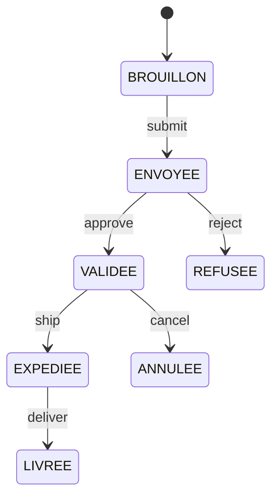
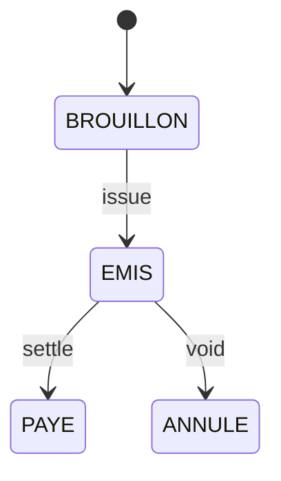

# WORKFLOWS — États & transitions (présentation)

## Commande (vente)

**Horodatages** : validated_at, shipped_at, delivered_at, cancelled_at

## Facture (vente/achat)

**Horodatages** : issued_at, paid_at, voided_at

## Stock (mouvements)
- Types : IN, OUT, ADJUST, TRANSFER
- Règles : réserve à VALIDEE, décrémente à EXPEDIEE.
