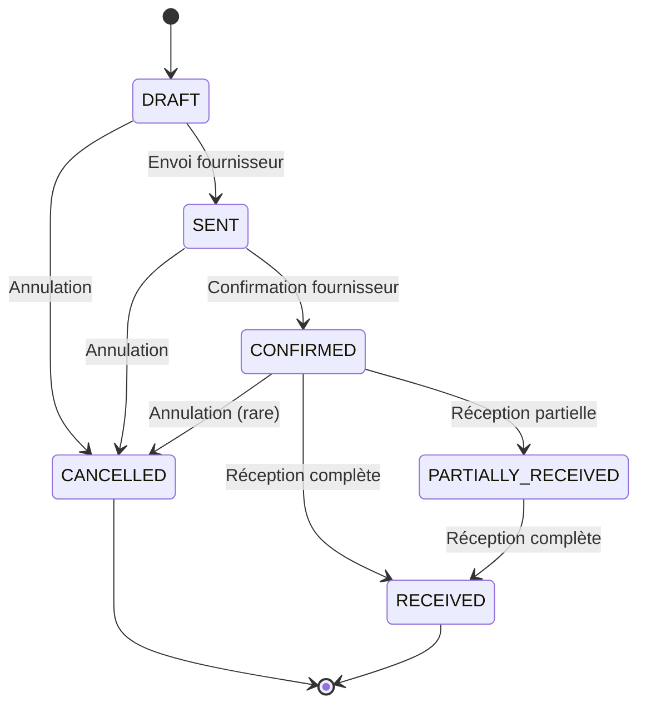
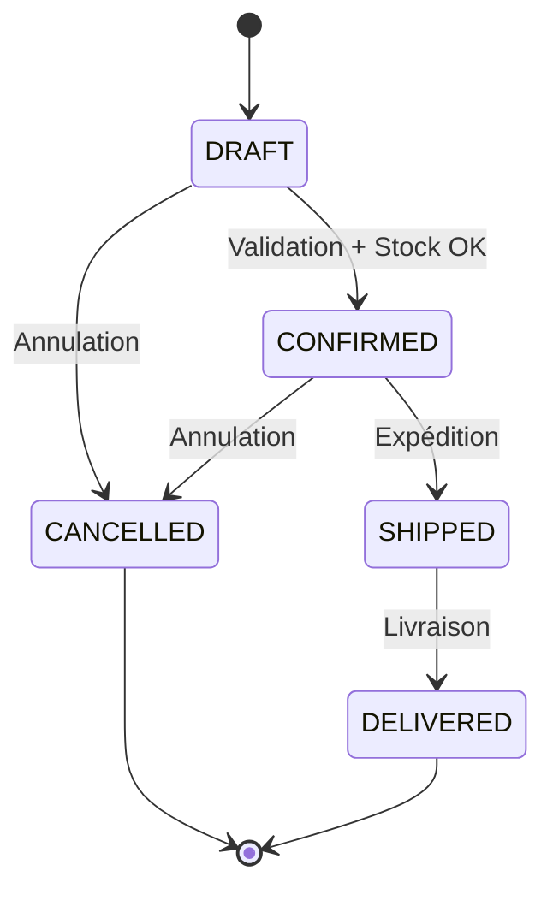

# 🛒 Règles Métier - Gestion Cycle de Vie Commandes
**Date** : 16 septembre 2025
**Version** : 1.0
**Status** : ✅ IMPLÉMENTÉ

## 🎯 Objectifs

Définir les règles métier pour la gestion complète du cycle de vie des commandes (fournisseurs et clients) dans Vérone Back Office, garantissant :
- **Workflows stricts** avec transitions contrôlées
- **Intégration stock** transparente et automatique
- **Traçabilité complète** des actions utilisateurs
- **Prévention erreurs** via validations business robustes

## 🔄 Commandes Fournisseurs (Purchase Orders)

### **États et Transitions**



### **Règles par Statut**

#### **DRAFT (Brouillon)**
**Permissions** :
- ✅ Modification libre (items, quantités, prix, fournisseur)
- ✅ Suppression autorisée
- ✅ Transition vers SENT ou CANCELLED

**Validations** :
- ✅ Fournisseur obligatoire et actif
- ✅ Au moins 1 item avec quantité > 0
- ✅ Prix unitaires > 0
- ✅ Utilisateur appartient à l'organisation

**Business Logic** :
```typescript
const draftRules = {
  canEdit: true,
  canDelete: true,
  canAddItems: true,
  canRemoveItems: true,
  mustHaveSupplier: true,
  mustHaveItems: true,
  itemsMinQuantity: 1,
  pricesRequired: false // Prix par défaut du catalogue
}
```

#### **SENT (Envoyée)**
**Actions Automatiques** :
- 📧 Email automatique fournisseur (futur)
- 🕐 `sent_at` = now(), `sent_by` = user_id
- 📝 Log audit "Commande envoyée à [fournisseur]"

**Permissions** :
- ❌ Modification items interdite
- ❌ Suppression interdite
- ✅ Transition vers CONFIRMED ou CANCELLED
- ✅ Ajout notes/commentaires

#### **CONFIRMED (Confirmée)**
**Actions Automatiques** :
- 🕐 `validated_at` = now(), `validated_by` = user_id
- 📊 Calcul date livraison prévue
- 🔔 Notification équipe réception

**Permissions** :
- ❌ Modification items interdite
- ✅ Réception partielle/totale
- ✅ Annulation exceptionnelle (avec validation manager)

#### **PARTIALLY_RECEIVED (Partiellement Reçue)**
**Calcul Automatique** :
```sql
-- Recalcul statut après chaque réception
UPDATE purchase_orders SET status =
  CASE
    WHEN (SELECT SUM(quantity_received) FROM purchase_order_items WHERE purchase_order_id = po.id) =
         (SELECT SUM(quantity) FROM purchase_order_items WHERE purchase_order_id = po.id)
    THEN 'received'
    WHEN (SELECT SUM(quantity_received) FROM purchase_order_items WHERE purchase_order_id = po.id) > 0
    THEN 'partially_received'
    ELSE 'confirmed'
  END
WHERE id = $1;
```

#### **RECEIVED (Reçue)**
**Actions Automatiques** :
- 🕐 `received_at` = now(), `received_by` = user_id
- 📦 Tous mouvements stock IN finalisés
- 💰 Déclenchement facturation (futur)
- ✅ Commande archivée (lecture seule)

### **Réception Marchandises**

#### **Règles Business**
```typescript
interface ReceptionRules {
  canReceiveMore: (item: POItem) => item.quantity_received < item.quantity
  maxReceivable: (item: POItem) => item.quantity - item.quantity_received
  requiresStockMovement: true
  updatesUnitCost: boolean // true si coût différent prévu
  createsAlert: (variance: number) => Math.abs(variance) > 0.1 // 10% écart
}
```

#### **Processus Automatique**
1. **Validation quantités** : quantity_received ≤ quantity_ordered
2. **Création mouvement stock** : Automatique via hook `use-stock-movements`
3. **Mise à jour coûts** : Si unit_cost fourni, mise à jour coût moyen produit
4. **Recalcul statut commande** : Trigger automatique
5. **Notification utilisateur** : Toast success + détails réception

```typescript
const receiveItems = async (orderId: string, items: ReceiveItemData[]) => {
  for (const item of items) {
    // 1. Mise à jour quantité reçue
    await updatePOItem(item.item_id, { quantity_received: item.quantity })

    // 2. Création mouvement stock IN
    await createStockMovement({
      product_id: item.product_id,
      movement_type: 'IN',
      quantity_change: item.quantity_received,
      unit_cost: item.unit_cost,
      reference_type: 'purchase_order',
      reference_id: orderId,
      notes: `Réception PO ${poNumber} - ${item.notes}`
    })
  }

  // 3. Recalcul statut commande
  await recalculatePOStatus(orderId)
}
```

## 🛍️ Commandes Clients (Sales Orders)

### **États et Transitions**



### **Règles par Statut**

#### **DRAFT (Brouillon)**
**Validations Temps Réel** :
```typescript
const draftValidation = {
  stockCheck: 'live', // Vérification disponibilité en temps réel
  priceValidation: 'catalog', // Prix du catalogue obligatoire
  customerRequired: true,
  itemsMinQuantity: 1,
  totalMinAmount: 0 // Pas de minimum
}
```

**UX Préventive** :
- 🔴 Alerte visuelle stock insuffisant
- ⚠️ Warning si stock faible (< 5 unités)
- ✅ Validation verte si stock OK

#### **CONFIRMED (Confirmée)**
**Actions Automatiques Critiques** :
```typescript
const confirmOrder = async (orderId: string) => {
  // 1. Validation stock finale
  const stockOK = await validateStockAvailability(orderId)
  if (!stockOK) throw new Error('Stock insuffisant')

  // 2. Création réservations automatiques
  await createStockReservations(orderId, {
    expires_at: new Date(Date.now() + 24 * 60 * 60 * 1000), // 24h
    reference_type: 'sales_order',
    reference_id: orderId
  })

  // 3. Notification client (futur)
  await sendOrderConfirmation(orderId)

  // 4. Mise à jour statut + timestamps
  await updateOrderStatus(orderId, 'confirmed')
}
```

**Règles Réservations** :
- ⏰ **Expiration** : 24h automatique si pas d'expédition
- 🔒 **Exclusivité** : Stock réservé indisponible autres commandes
- 🔄 **Nettoyage** : Cleanup automatique réservations expirées

#### **SHIPPED (Expédiée)**
**Processus Intégré Stock** :
```typescript
const shipOrder = async (orderId: string, shippingData: ShippingData) => {
  const order = await getOrderWithItems(orderId)

  for (const item of order.items) {
    // 1. Mouvement stock OUT
    await createStockMovement({
      movement_type: 'OUT',
      quantity_change: item.quantity,
      reference_type: 'sales_order',
      reference_id: orderId,
      notes: `Expédition SO ${order.so_number} - ${shippingData.carrier}`
    })

    // 2. Libération réservation
    await releaseStockReservation(item.product_id, orderId)
  }

  // 3. Tracking expédition
  await createShippingTracking(orderId, shippingData)
}
```

### **Prévention Survente**

#### **Système Multi-Niveaux**
```typescript
interface StockValidation {
  level1: 'real_time_ui'     // UX préventive temps réel
  level2: 'confirmation'     // Validation stricte avant confirmation
  level3: 'reservation'      // Réservation automatique post-confirmation
  level4: 'shipping'         // Vérification finale avant expédition
}
```

#### **Algorithme Validation**
```sql
-- Fonction validation stock commande complète
CREATE OR REPLACE FUNCTION validate_sales_order_stock(p_order_id uuid)
RETURNS boolean AS $$
DECLARE
  item_record RECORD;
  available_stock decimal;
BEGIN
  -- Vérifier chaque item de la commande
  FOR item_record IN
    SELECT product_id, quantity
    FROM sales_order_items
    WHERE sales_order_id = p_order_id
  LOOP
    -- Calculer stock disponible
    available_stock := get_available_stock(item_record.product_id);

    -- Vérifier suffisance
    IF available_stock < item_record.quantity THEN
      RETURN false;
    END IF;
  END LOOP;

  RETURN true;
END;
$$ LANGUAGE plpgsql;
```

## 🔒 Règles de Sécurité et Audit

### **Traçabilité Utilisateurs**
Chaque transition d'état enregistre :
```typescript
interface AuditTrail {
  action: string           // 'status_change', 'item_received', 'shipped'
  old_status: string
  new_status: string
  user_id: string
  timestamp: Date
  ip_address?: string
  user_agent?: string
  notes?: string
}
```

### **Permissions Granulaires**
```typescript
const orderPermissions = {
  draft: {
    canEdit: ['admin', 'sales', 'procurement'],
    canDelete: ['admin', 'sales'],
    canApprove: ['admin', 'manager']
  },
  confirmed: {
    canCancel: ['admin', 'manager'],
    canReceive: ['admin', 'warehouse'],
    canShip: ['admin', 'warehouse']
  },
  readonly: ['received', 'delivered', 'cancelled']
}
```

### **Validation Business Contraintes**
```typescript
const businessConstraints = {
  maxOrderValue: 50000,     // Validation manager au-delà
  maxItemQuantity: 100,     // Alerte stock important
  allowBackorder: false,    // Pas de commande sans stock
  allowPartialShipping: true, // Expédition partielle autorisée
  reservationTTL: 24        // Heures avant expiration réservation
}
```

## 🔄 Intégrations Cross-Module

### **Stock ↔ Commandes**
```typescript
// Synchronisation bidirectionnelle
const stockOrderIntegration = {
  onStockUpdate: async (productId: string) => {
    // Vérifier commandes en attente si stock redevient disponible
    await checkPendingOrders(productId)
  },

  onOrderCancel: async (orderId: string) => {
    // Libérer réservations automatiquement
    await releaseAllReservations(orderId)
  },

  onStockMovement: async (movement: StockMovement) => {
    // Notifier si mouvement impact commandes en cours
    await checkImpactedOrders(movement.product_id)
  }
}
```

### **Alertes Automatiques**
```typescript
const alerts = {
  lowStockOnOrder: (productId: string, orderQuantity: number) => {
    // Alerte si commande épuise stock sous seuil
  },

  delayedDelivery: (orderId: string, expectedDate: Date) => {
    // Alerte si livraison retardée vs prévision
  },

  highValueOrder: (orderValue: number) => {
    // Validation manager si commande > seuil
  },

  suspiciousPattern: (customerId: string, frequency: number) => {
    // Détection patterns commandes anormaux
  }
}
```

## 📊 Métriques Business

### **KPIs Commandes Fournisseurs**
```typescript
interface PurchaseOrderKPIs {
  averageLeadTime: number        // Délai moyen confirmed → received
  onTimeDeliveryRate: number     // % livraisons dans les temps
  qualityIssueRate: number       // % réceptions avec écarts
  supplierPerformance: Record<string, number> // Score par fournisseur
}
```

### **KPIs Commandes Clients**
```typescript
interface SalesOrderKPIs {
  conversionRate: number         // % draft → confirmed
  averageOrderValue: number      // Panier moyen
  fulfillmentRate: number        // % commandes expédiées à temps
  stockoutRate: number           // % refus pour stock insuffisant
}
```

## ✅ Tests de Validation

### **Scénarios Critiques Business**
```typescript
describe('Orders Lifecycle Management', () => {
  test('Purchase Order Complete Workflow', async () => {
    // 1. Création draft avec items
    // 2. Validation et envoi fournisseur
    // 3. Confirmation par fournisseur
    // 4. Réception partielle avec mouvements stock
    // 5. Réception complète et clôture
    // 6. Vérification cohérence stock final
  })

  test('Sales Order Stock Validation', async () => {
    // 1. Tentative commande stock insuffisant → rejet
    // 2. Commande stock suffisant → confirmation + réservation
    // 3. Expédition → mouvement OUT + libération réservation
    // 4. Vérification stock final cohérent
  })

  test('Concurrent Orders Stock Management', async () => {
    // 1. Deux commandes simultanées même produit
    // 2. Validation une seule confirmation si stock limite
    // 3. Première confirmée, seconde rejetée
    // 4. Vérification prévention survente
  })
})
```

---

**Workflows robustes garantissant intégrité business et prévention erreurs dans la gestion des commandes Vérone.**