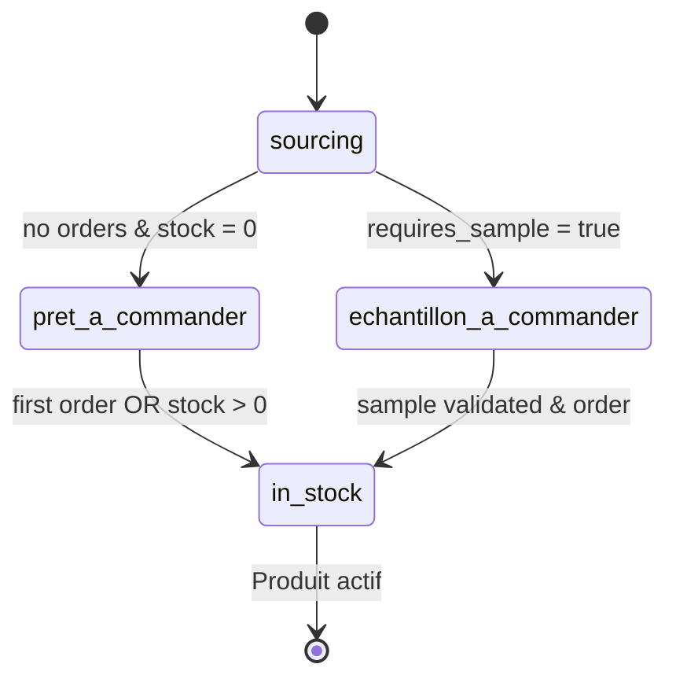

# 🔄 Règles Métier - Workflow Sourcing Produits
**Date** : 23 septembre 2025
**Version** : 1.0
**Status** : ✅ IMPLÉMENTÉ

## 🎯 Objectifs

Définir les règles métier pour le workflow complet de sourcing dans Vérone Back Office :
- **Sourcing Rapide** : Création express avec 3 champs obligatoires
- **Types de sourcing** : Interne (catalogue général) vs Client (consultation spécifique)
- **Transitions automatiques** : Statuts basés sur commandes et stock
- **Validation obligatoire** : Liaison fournisseur avant activation

## 📊 États et Statuts Produits

### **Nouveaux Statuts Sourcing**

```sql
-- Extension enum pour workflow sourcing
ALTER TYPE availability_status_type ADD VALUE 'sourcing';
ALTER TYPE availability_status_type ADD VALUE 'pret_a_commander';
ALTER TYPE availability_status_type ADD VALUE 'echantillon_a_commander';
```

### **Machine à États Sourcing**



### **Logique de Calcul Automatique**

```sql
CREATE FUNCTION calculate_sourcing_product_status(p_product_id UUID)
RETURNS availability_status_type AS $$
DECLARE
    product_record products%ROWTYPE;
    has_purchase_orders BOOLEAN := false;
    has_stock BOOLEAN := false;
BEGIN
    SELECT * INTO product_record FROM products WHERE id = p_product_id;

    -- Seulement pour produits sourcing
    IF product_record.creation_mode != 'sourcing' THEN
        RETURN product_record.status;
    END IF;

    -- Vérifier commandes fournisseurs confirmées
    SELECT EXISTS(
        SELECT 1 FROM purchase_order_items poi
        JOIN purchase_orders po ON poi.purchase_order_id = po.id
        WHERE poi.product_id = p_product_id
        AND po.status IN ('confirmed', 'partially_received', 'received')
    ) INTO has_purchase_orders;

    -- Vérifier stock physique
    has_stock := COALESCE(product_record.stock_real, 0) > 0;

    -- Règles de transition
    IF product_record.requires_sample THEN
        RETURN 'echantillon_a_commander'::availability_status_type;
    ELSIF NOT has_purchase_orders AND NOT has_stock THEN
        RETURN 'pret_a_commander'::availability_status_type;
    ELSIF has_purchase_orders OR has_stock THEN
        RETURN 'in_stock'::availability_status_type;
    ELSE
        RETURN 'sourcing'::availability_status_type;
    END IF;
END;
$$ LANGUAGE plpgsql;
```

## 🚀 Sourcing Rapide - Règles de Création

### **Formulaire Obligatoire : 3 Champs**

```typescript
interface SourcingRequiredFields {
  // 1. IMAGE - Obligatoire
  imageFile: File // PNG, JPG, WEBP max 10MB

  // 2. NOM PRODUIT - Obligatoire
  name: string // Min 5 caractères, description claire

  // 3. URL FOURNISSEUR - Obligatoire
  supplier_page_url: string // URL valide vers fiche produit fournisseur
}

interface SourcingOptionalFields {
  // 4. CLIENT ASSIGNÉ - Facultatif
  assigned_client_id?: string // Si fourni → sourcing_type = 'client'

  // Automatique selon client
  sourcing_type: 'interne' | 'client' // Calculé automatiquement
  creation_mode: 'sourcing' // Fixe pour ce workflow
}
```

### **Validation Business**

```typescript
const validateSourcingData = (data: SourcingFormData) => {
  const errors: string[] = [];

  // Nom produit
  if (!data.name || data.name.trim().length < 5) {
    errors.push('Le nom du produit doit contenir au moins 5 caractères');
  }

  // URL fournisseur
  try {
    new URL(data.supplier_page_url);
  } catch {
    errors.push('URL fournisseur invalide');
  }

  // Image
  if (!data.imageFile) {
    errors.push('Une image est obligatoire');
  } else if (data.imageFile.size > 10 * 1024 * 1024) {
    errors.push('Image trop volumineuse (max 10MB)');
  }

  return errors;
};
```

### **Processus de Création**

```typescript
const createSourcingDraft = async (data: SourcingFormData) => {
  // 1. Validation
  const errors = validateSourcingData(data);
  if (errors.length > 0) throw new Error(errors.join(', '));

  // 2. Upload image
  const imageUrl = await uploadProductImage(data.imageFile);

  // 3. Déterminer type sourcing
  const sourcingType = data.assigned_client_id ? 'client' : 'interne';

  // 4. Créer brouillon
  const draftData = {
    name: data.name,
    supplier_page_url: data.supplier_page_url,
    creation_mode: 'sourcing',
    sourcing_type: sourcingType,
    assigned_client_id: data.assigned_client_id || null,
    status: 'draft'
  };

  const draft = await supabase
    .from('product_drafts')
    .insert([draftData])
    .select()
    .single();

  // 5. Lier image
  await linkImageToDraft(draft.id, imageUrl);

  return draft;
};
```

## 🔄 Workflow de Validation

### **Obligation Fournisseur**

**Aucun produit sourcing ne peut être validé sans fournisseur lié**

```typescript
const validateSourcing = async (productId: string) => {
  const product = await getProduct(productId);

  // Vérification fournisseur obligatoire
  if (!product.supplier_id) {
    throw new Error('Un fournisseur doit être lié avant la validation du sourcing');
  }

  // Calculer nouveau statut automatiquement
  const newStatus = await calculateSourcingProductStatus(productId);

  // Mettre à jour produit
  await updateProduct(productId, { status: newStatus });

  // Log transition
  console.log(`Product ${productId} validated: ${product.status} → ${newStatus}`);

  return newStatus;
};
```

### **Écran Validation Sourcing**

```typescript
interface SourcingValidationUI {
  // Bandeau bloquant si pas de fournisseur
  supplier_required_banner: {
    show: '!product.supplier_id',
    message: 'Lier un fournisseur avant validation',
    actions: ['Sélectionner fournisseur', 'Nouveau fournisseur']
  },

  // Bouton validation disponible seulement si fournisseur
  validate_button: {
    enabled: 'product.supplier_id !== null',
    action: 'validateSourcing(productId)',
    redirect: 'automatic to product detail'
  },

  // Création fournisseur avec retour automatique
  create_supplier_flow: {
    modal: 'supplier creation form',
    on_success: 'auto-link to product + return to validation'
  }
}
```

## 📋 Page Sourcing Produits - Filtres Business

### **Filtres Obligatoires**

```typescript
interface SourcingFilters {
  // Type de sourcing
  sourcing_type: {
    options: ['', 'interne', 'client'],
    labels: ['Tous types', 'Sourcing Interne', 'Sourcing Client']
  },

  // Liaison fournisseur
  has_supplier: {
    options: ['', 'yes', 'no'],
    labels: ['Tous', 'Avec fournisseur', 'Sans fournisseur'],
    business_rule: 'Produits sans fournisseur ne peuvent pas être validés'
  },

  // Statut sourcing
  status: {
    options: ['', 'sourcing', 'pret_a_commander', 'echantillon_a_commander'],
    labels: ['Tous statuts', 'En sourcing', 'Prêt à commander', 'Échantillon à commander']
  },

  // Exigence échantillon
  requires_sample: {
    options: ['', 'yes', 'no'],
    labels: ['Tous', 'Échantillon requis', 'Pas d\'échantillon']
  }
}
```

### **Actions Contextuelles**

```typescript
const getProductActions = (product: SourcingProduct) => {
  const actions: Action[] = [
    { label: 'Voir détail', href: `/catalogue/${product.id}` }
  ];

  // Selon statut et contexte
  if (product.supplier_id) {
    actions.push({
      label: 'Valider sourcing',
      action: 'validateSourcing',
      style: 'success',
      tooltip: 'Calculer automatiquement le nouveau statut'
    });
  } else {
    actions.push({
      label: 'Lier fournisseur',
      href: `/catalogue/${product.id}?edit=supplier`,
      style: 'warning',
      tooltip: 'Obligatoire avant validation'
    });
  }

  return actions;
};
```

## 🏷️ Badges et Indicateurs Visuels

### **Badges Statut**

```typescript
const STATUS_VISUAL = {
  'sourcing': {
    color: 'bg-gray-100 text-gray-800',
    icon: 'Clock',
    description: 'Produit en phase de recherche'
  },

  'pret_a_commander': {
    color: 'bg-blue-100 text-blue-800',
    icon: 'CheckCircle',
    description: 'Fournisseur lié, prêt pour première commande'
  },

  'echantillon_a_commander': {
    color: 'bg-orange-100 text-orange-800',
    icon: 'AlertTriangle',
    description: 'Échantillon requis avant commande'
  },

  'in_stock': {
    color: 'bg-green-100 text-green-800',
    icon: 'Package',
    description: 'Produit activé et disponible'
  }
};
```

### **Badges Contexte**

```typescript
const CONTEXT_BADGES = {
  sourcing_client: {
    label: 'Sourcing Client',
    color: 'bg-purple-100 text-purple-800',
    tooltip: 'Produit sourcé pour client spécifique'
  },

  requires_sample: {
    label: 'Échantillon requis',
    color: 'bg-orange-100 text-orange-800',
    tooltip: 'Validation échantillon avant commande'
  },

  no_supplier: {
    label: 'Aucun fournisseur',
    color: 'bg-red-100 text-red-800',
    tooltip: 'Validation bloquée'
  }
};
```

## 🔄 Triggers Automatiques

### **Mise à Jour Statut sur Réception Commande**

```sql
-- Trigger automatique lors réception commande fournisseur
CREATE TRIGGER trigger_update_sourcing_status_on_po_reception
    AFTER UPDATE OF status ON purchase_orders
    FOR EACH ROW
    WHEN (NEW.status IN ('confirmed', 'partially_received', 'received')
          AND OLD.status != NEW.status)
    EXECUTE FUNCTION update_sourcing_product_status_on_reception();

-- Fonction trigger
CREATE FUNCTION update_sourcing_product_status_on_reception()
RETURNS TRIGGER AS $$
DECLARE
    product_record products%ROWTYPE;
    new_status availability_status_type;
BEGIN
    -- Pour chaque produit de la commande
    FOR product_record IN
        SELECT p.* FROM products p
        JOIN purchase_order_items poi ON p.id = poi.product_id
        WHERE poi.purchase_order_id = NEW.id
        AND p.creation_mode = 'sourcing'
    LOOP
        -- Recalculer statut
        new_status := calculate_sourcing_product_status(product_record.id);

        -- Mettre à jour si changement
        IF new_status != product_record.status THEN
            UPDATE products
            SET status = new_status, updated_at = now()
            WHERE id = product_record.id;

            -- Log transition
            RAISE LOG 'Product % sourcing status: % → % (PO reception)',
                product_record.id, product_record.status, new_status;
        END IF;
    END LOOP;

    RETURN NEW;
END;
$$ LANGUAGE plpgsql;
```

### **Notifications Automatiques**

```typescript
const sourcingNotifications = {
  // Produit prêt à commander
  ready_to_order: {
    trigger: 'status = pret_a_commander',
    recipients: ['procurement_team'],
    message: 'Produit {name} prêt pour première commande fournisseur'
  },

  // Échantillon requis
  sample_required: {
    trigger: 'status = echantillon_a_commander',
    recipients: ['assigned_user', 'sales_team'],
    message: 'Échantillon requis pour {name} avant validation'
  },

  // Produit activé
  activated: {
    trigger: 'status = in_stock AND old_status != in_stock',
    recipients: ['sales_team'],
    message: 'Produit {name} maintenant actif et disponible'
  }
};
```

## 📊 Métriques Sourcing

### **KPIs Workflow**

```typescript
interface SourcingMetrics {
  // Efficacité sourcing
  average_sourcing_duration: 'Temps moyen sourcing → activation',
  supplier_link_rate: '% produits avec fournisseur lié',
  validation_success_rate: '% produits sourcés qui deviennent actifs',

  // Performance équipe
  sourcing_throughput: 'Nombre produits sourcés / semaine',
  pending_validations: 'Produits en attente validation',
  sample_approval_time: 'Délai moyen validation échantillons',

  // Business impact
  sourcing_revenue_contribution: 'CA généré par produits ex-sourcing',
  client_sourcing_satisfaction: 'Satisfaction sourcing client spécifique'
}
```

### **Statistiques Temps Réel**

```sql
-- Vue statistiques sourcing
CREATE VIEW sourcing_dashboard AS
SELECT
    COUNT(*) FILTER (WHERE status = 'sourcing') as en_sourcing,
    COUNT(*) FILTER (WHERE status = 'pret_a_commander') as pret_commande,
    COUNT(*) FILTER (WHERE status = 'echantillon_a_commander') as echantillon,
    COUNT(*) FILTER (WHERE supplier_id IS NOT NULL) as avec_fournisseur,
    COUNT(*) FILTER (WHERE sourcing_type = 'client') as sourcing_client,
    COUNT(*) FILTER (WHERE requires_sample = true) as necessite_echantillon
FROM products
WHERE creation_mode = 'sourcing';
```

## ✅ Tests de Validation

### **Scénarios Critiques**

```typescript
describe('Sourcing Workflow Business Rules', () => {
  test('Création sourcing rapide - 3 champs obligatoires', async () => {
    const validData = {
      name: 'Fauteuil Design Test',
      supplier_page_url: 'https://fournisseur.com/produit/123',
      imageFile: mockImageFile
    };

    const draft = await createSourcingDraft(validData);
    expect(draft.creation_mode).toBe('sourcing');
    expect(draft.sourcing_type).toBe('interne');
  });

  test('Calcul automatique statut sourcing', async () => {
    const product = await createSourcingProduct({ requires_sample: false });

    // Initial: pas de commande, pas de stock → prêt à commander
    const status1 = await calculateSourcingProductStatus(product.id);
    expect(status1).toBe('pret_a_commander');

    // Après première commande → actif
    await createPurchaseOrder(product.id, { status: 'confirmed' });
    const status2 = await calculateSourcingProductStatus(product.id);
    expect(status2).toBe('in_stock');
  });

  test('Validation bloquée sans fournisseur', async () => {
    const product = await createSourcingProduct({ supplier_id: null });

    await expect(validateSourcing(product.id))
      .rejects.toThrow('fournisseur doit être lié');
  });

  test('Trigger automatique sur réception', async () => {
    const product = await createSourcingProduct();
    const po = await createPurchaseOrder(product.id);

    // Simuler réception
    await updatePurchaseOrderStatus(po.id, 'received');

    // Vérifier mise à jour automatique
    const updatedProduct = await getProduct(product.id);
    expect(updatedProduct.status).toBe('in_stock');
  });
});
```

---

**Workflow robuste garantissant une gestion professionnelle du sourcing avec transitions automatiques et validations business.**