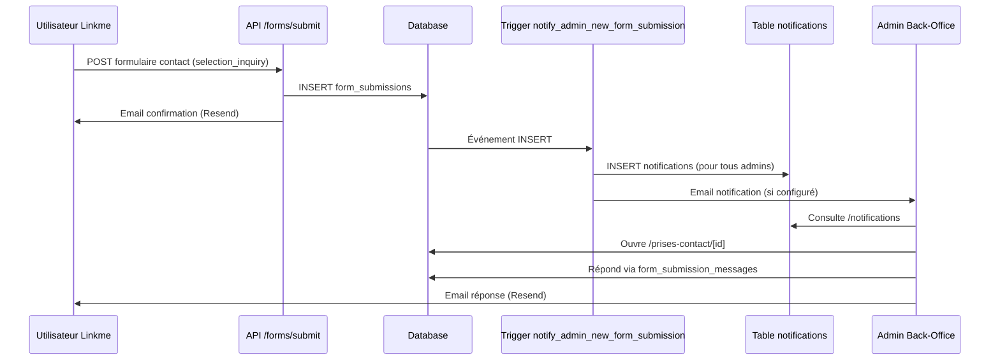
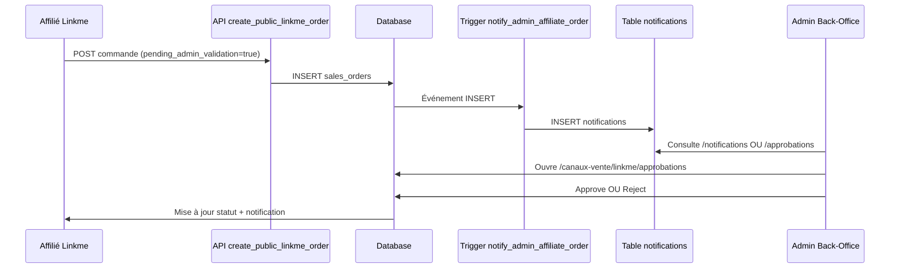
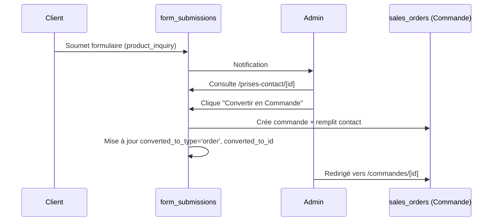

# Notifications, Formulaires & Approbations - Architecture Back-Office

**Date**: 2026-01-16
**Auteur**: Audit technique complet
**Statut**: Documentation validée

---

## Vue d'Ensemble

Le back-office Vérone utilise **3 systèmes distincts** pour gérer différents types d'interactions et workflows métier. Cette documentation clarifie leur rôle, leurs tables, et quand utiliser chacun.

---

## 1. Notifications Système (`/notifications`)

### Rôle

Alertes **auto-générées** par l'application pour notifier les utilisateurs d'événements système ou business importants.

### Exemples d'Usage

- Stock négatif ou en rupture
- SLA dépassé sur une commande
- Nouvelle commande affilié nécessitant validation
- Produit affilié soumis pour approbation
- Organisation en attente de validation

### Table Database

**`notifications`**

Colonnes principales:

- `user_id`: UUID de l'utilisateur destinataire
- `type`: 'system' | 'business' | 'catalog' | 'operations' | 'performance' | 'maintenance'
- `severity`: 'urgent' | 'important' | 'info'
- `title`: Titre de la notification
- `message`: Message détaillé
- `action_url`: Lien vers la page concernée
- `read`: Statut de lecture (boolean)

### Déclenchement

**Automatique** via triggers database:

- `notify_admin_new_form_submission()` → Nouveau formulaire reçu
- `notify_admin_affiliate_order()` → Commande affilié en attente
- `notify_admin_product_approval()` → Produit affilié soumis
- `notify_admin_organisation_approval()` → Organisation en attente
- `notify_so_delayed()` → Commande en retard
- `notify_stock_negative_forecast()` → Stock prévisionnel négatif

### Page UI

**URL**: `/notifications`
**Fichier**: `apps/back-office/src/app/notifications/page.tsx`

**Fonctionnalités**:

- Filtres par type, sévérité, statut (lues/non lues)
- Grouping par date (aujourd'hui, hier, cette semaine, plus ancien)
- Search bar
- Actions: marquer comme lu, supprimer

### Configuration Emails

**URL**: `/parametres/notifications`
**Fichier**: `apps/back-office/src/app/parametres/notifications/page.tsx`

**Rôle**: Gérer les destinataires d'emails pour les formulaires de contact
**Table**: `app_settings.notification_emails`

---

## 2. Formulaires de Contact (`/prises-contact`)

### Rôle

Gestion centralisée de **toutes les demandes externes** reçues via formulaires publics (Linkme, Website, etc.).

### Exemples d'Usage

- Contact Sélection (depuis page Linkme)
- Demande de compte affilié
- Réclamation SAV
- Question produit
- Demande de consultation
- Support technique
- Demande générale

### Tables Database

#### `form_submissions` (Table centrale)

Architecture **extensible** supportant N types de formulaires sans migration.

Colonnes principales:

- `form_type`: Code du type de formulaire (référence `form_types.code`)
- `source`: 'linkme' | 'website' | 'backoffice' | 'other'
- `source_reference_id`: ID contextuel (selection_id, order_id, etc.)
- `first_name`, `last_name`, `email`, `phone`: Informations contact
- `company_name`, `role`: Informations professionnelles (optionnelles)
- `subject`, `message`: Contenu du formulaire
- `status`: 'new' | 'open' | 'pending' | 'replied' | 'closed' | 'spam'
- `priority`: 'low' | 'medium' | 'high' | 'urgent'
- `assigned_to`: Utilisateur assigné
- `sla_deadline`: Deadline calculée automatiquement
- `converted_to_type`, `converted_to_id`: Conversion polymorphique
- `metadata`: JSONB flexible pour données spécifiques

#### `form_types` (Configuration types)

7 types pré-configurés, **extensibles sans migration**:

| Code                   | Label                | SLA | Priorité | Description                         |
| ---------------------- | -------------------- | --- | -------- | ----------------------------------- |
| `selection_inquiry`    | Contact Sélection    | 24h | high     | Demande d'information depuis Linkme |
| `account_request`      | Demande de Compte    | 48h | high     | Création compte affilié             |
| `sav_request`          | SAV/Réclamation      | 4h  | urgent   | Service après-vente                 |
| `product_inquiry`      | Question Produit     | 48h | medium   | Information produit                 |
| `consultation_request` | Demande Consultation | 24h | high     | Consultation projet                 |
| `technical_support`    | Support Technique    | 24h | medium   | Assistance technique                |
| `general_inquiry`      | Demande Générale     | 72h | low      | Autres demandes                     |

#### `form_submission_messages` (Thread conversation)

Historique des échanges liés à un formulaire.

Colonnes principales:

- `submission_id`: Référence vers `form_submissions`
- `message`: Contenu du message
- `is_internal`: Note interne (true) ou réponse client (false)
- `sent_via`: 'email' | 'internal' | 'other'
- `email_id`: ID email Resend si envoyé
- `created_by`: Auteur du message

### Déclenchement

**Manuel** : Utilisateur remplit formulaire public (Linkme, Website)

**Automatique** :

- Trigger `notify_admin_new_form_submission()` → Crée notification in-app
- Envoi email de confirmation au client
- Envoi email aux admins (si configuré dans `app_settings`)

### Pages UI

#### Liste des formulaires

**URL**: `/prises-contact`
**Fichier**: `apps/back-office/src/app/prises-contact/page.tsx`

**Fonctionnalités**:

- Filtres par statut, priorité, type
- Grouping par date ou par type
- Search bar
- Badges visuels (statut, priorité)

#### Détail formulaire

**URL**: `/prises-contact/[id]`
**Fichier**: `apps/back-office/src/app/prises-contact/[id]/page.tsx`

**Fonctionnalités**:

- Édition statut, priorité, notes internes
- Actions de conversion:
  - Convertir en Commande
  - Convertir en Consultation
  - Convertir en Sourcing
  - Convertir en Contact CRM
- Thread messages (à implémenter complètement)
- Envoi réponses par email via Resend

### API Endpoints (Linkme)

| Endpoint                        | Méthode | Rôle                      |
| ------------------------------- | ------- | ------------------------- |
| `/api/forms/submit`             | POST    | Soumission formulaire     |
| `/api/emails/form-notification` | POST    | Email notification admin  |
| `/api/emails/form-confirmation` | POST    | Email confirmation client |

---

## 3. Approbations Business (`/canaux-vente/linkme/approbations`)

### Rôle

Validation centralisée des **workflows métier internes** nécessitant une approbation admin.

### Exemples d'Usage

- Approuver commande affilié
- Valider produit affilié (avec calcul commission)
- Accepter organisation affiliée

### Tables Database

Pas de table dédiée, utilise les tables métier existantes:

- **`sales_orders`** avec `pending_admin_validation = true`
- **`products`** avec `affiliate_approval_status = 'pending_approval'`
- **`organisations`** avec `approval_status = 'pending_validation'`

### Déclenchement

**Business workflow**:

- Commande créée par affilié → nécessite validation admin
- Produit soumis par affilié → nécessite approbation commission
- Organisation créée via formulaire → nécessite validation

**Automatique**:

- Trigger `notify_admin_affiliate_order()` → Notification in-app
- Trigger `notify_admin_product_approval()` → Notification in-app
- Trigger `notify_admin_organisation_approval()` → Notification in-app

### Page UI

**URL**: `/canaux-vente/linkme/approbations`
**Fichier**: `apps/back-office/src/app/canaux-vente/linkme/approbations/page.tsx` (1811 lignes)

**3 Onglets**:

1. **Commandes**
   - Liste: Commandes avec `pending_admin_validation = true`
   - Actions: Approuver, Rejeter (avec motif)
   - Détails: Client, produits, montants, marge

2. **Produits**
   - Liste: Produits avec `affiliate_approval_status = 'pending_approval'`
   - Actions: Approuver (définir commission), Rejeter
   - Détails: Prix, fournisseur, commission proposée

3. **Organisations**
   - Liste: Organisations avec `approval_status = 'pending_validation'`
   - Actions: Approuver, Rejeter, Demander modifications
   - Détails: Informations légales, contacts, documents

---

## Quand Utiliser Quel Système ?

| Besoin                                        | Système       | Table              | Page                                |
| --------------------------------------------- | ------------- | ------------------ | ----------------------------------- |
| Alerter admins d'un événement système         | Notifications | `notifications`    | `/notifications`                    |
| Traiter demande client/affilié via formulaire | Formulaires   | `form_submissions` | `/prises-contact`                   |
| Valider workflow business interne             | Approbations  | Tables métier      | `/canaux-vente/linkme/approbations` |
| Configurer emails de notification             | Config        | `app_settings`     | `/parametres/notifications`         |

---

## Workflows Complets

### Workflow 1: Contact Sélection (Linkme → Back-Office)



### Workflow 2: Approbation Commande Affilié



### Workflow 3: Nouveau Formulaire → Conversion Commande



---

## Avantages de l'Architecture Actuelle

### 1. Séparation des Responsabilités

- **Notifications**: Événements système auto-générés
- **Formulaires**: Demandes externes structurées
- **Approbations**: Validation workflow métier

### 2. Extensibilité

- **Formulaires**: Ajout de nouveaux types sans migration (via `form_types`)
- **Notifications**: Nouveaux triggers selon besoins métier
- **Approbations**: Workflow évolutif par canal de vente

### 3. Traçabilité

- Historique complet dans `form_submission_messages`
- Audit trail dans `notifications`
- Timestamps et `created_by` sur toutes les tables

### 4. Conversion Polymorphique

Un formulaire peut être converti en:

- Consultation
- Commande
- Sourcing
- Contact CRM
- Lead commercial

---

## Points d'Amélioration Identifiés

### 1. UI Thread Messages (Phase 3)

**Statut**: Table `form_submission_messages` existe, UI non implémentée

**À faire**:

- Composant `FormSubmissionMessages` dans `/prises-contact/[id]`
- Affichage historique des échanges
- Formulaire d'ajout de message
- Bouton "Envoyer par email" (via Resend)

### 2. Dashboard Widgets

**À faire**:

- Widget "Formulaires en attente" (count `form_submissions` status='new')
- Widget "Approbations en attente" (count commandes/produits/orgs)
- Séparation visuelle claire entre les deux

### 3. Types TypeScript

**Statut**: Utilise `any` pour contourner types manquants

**À faire**:

```bash
npx supabase gen types typescript --linked > packages/@verone/types/src/supabase.ts
```

### 4. Renommage Routes (Optionnel)

**Proposition**: `/prises-contact` → `/demandes` ou `/formulaires`

Plus explicite car gère aussi SAV, demandes compte, support technique, etc.

---

## Résumé des Corrections Appliquées (2026-01-16)

### Bug Critique Corrigé

**Problème**: Colonne `company` en DB vs `company_name` dans code
**Impact**: Erreurs silencieuses lors soumission formulaires
**Solution**: Migration `20260116_002_rename_company_to_company_name.sql` appliquée
**Statut**: ✅ CORRIGÉ

### Tables Obsolètes Supprimées

**Table**: `linkme_contact_requests`
**Créée**: 2026-01-10
**Supprimée**: 2026-01-15 (migration `20260115_007_drop_linkme_contact_requests.sql`)
**Remplacée par**: `form_submissions` avec type `selection_inquiry`
**Statut**: ✅ NETTOYÉE

---

## Fichiers de Référence

### Migrations Clés

- `20260115_001_create_form_submissions.sql` - Table centrale
- `20260115_002_create_form_types.sql` - Types de formulaires
- `20260115_003_create_form_submission_messages.sql` - Thread messages
- `20260115_005_form_submissions_rls.sql` - Sécurité RLS
- `20260115_006_form_submission_triggers.sql` - Triggers notifications
- `20260115_008_fix_form_notification_trigger.sql` - Fix colonne data
- `20260116_002_rename_company_to_company_name.sql` - Fix naming

### Pages Back-Office

- `apps/back-office/src/app/notifications/page.tsx`
- `apps/back-office/src/app/parametres/notifications/page.tsx`
- `apps/back-office/src/app/prises-contact/page.tsx`
- `apps/back-office/src/app/prises-contact/[id]/page.tsx`
- `apps/back-office/src/app/canaux-vente/linkme/approbations/page.tsx`

### API Linkme

- `apps/linkme/src/app/api/forms/submit/route.ts`
- `apps/linkme/src/app/api/emails/form-notification/route.ts`
- `apps/linkme/src/app/api/emails/form-confirmation/route.ts`

---

**Dernière mise à jour**: 2026-01-16
**Validé par**: Audit technique complet back-office
