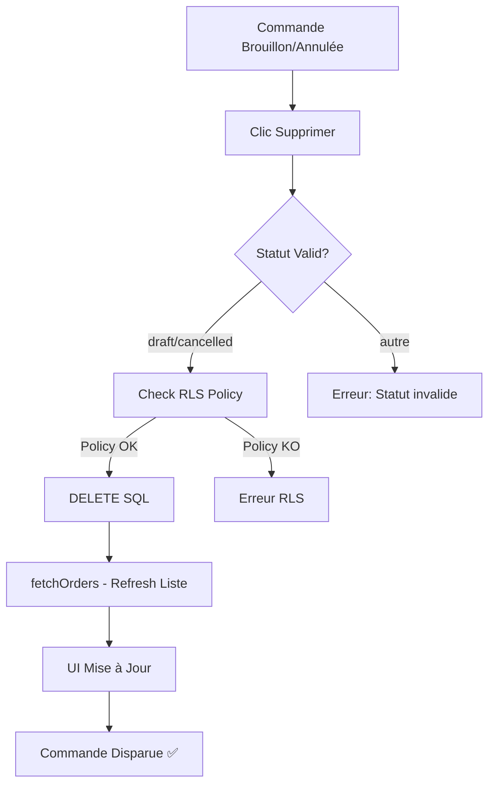

# 🐛 Guide de Correction - Policy DELETE Sales Orders

**Date:** 2025-10-14
**Problème:** Suppression des commandes annulées ne fonctionne pas
**Cause:** Policy RLS DELETE manquante dans la base de données

---

## 📋 Résumé du Problème

### Symptômes Observés

- ✅ Code JavaScript exécute `DELETE` sans erreur
- ✅ Message "Suppression réussie !" affiché
- ❌ **MAIS** la commande reste dans le tableau
- ❌ Base de données retourne `{data: [], error: null}` (blocage silencieux RLS)

### Cause Racine

La migration `20251013_019_restore_original_rls_policies_sales_orders.sql` a restauré **3 policies uniquement** :

1. ✅ SELECT - Consultation
2. ✅ INSERT - Création
3. ✅ UPDATE - Modification
4. ❌ **DELETE - MANQUANTE**

Sans policy DELETE, PostgreSQL RLS bloque toutes les suppressions silencieusement.

---

## 🔧 Solution - Appliquer Migration 026

### Fichier à Appliquer

```
supabase/migrations/20251014_026_add_delete_policy_sales_orders.sql
```

### Méthode 1: Supabase Studio SQL Editor (RECOMMANDÉ)

1. **Ouvrir Supabase Studio**
   - Aller sur https://supabase.com/dashboard
   - Sélectionner votre projet Vérone Back Office
   - Menu latéral → **SQL Editor**

2. **Copier le contenu de la migration**

   ```bash
   # Depuis le terminal
   cat supabase/migrations/20251014_026_add_delete_policy_sales_orders.sql
   ```

   Ou ouvrir le fichier et tout sélectionner (Cmd+A)

3. **Coller dans SQL Editor**
   - Cliquer "New Query"
   - Coller tout le contenu SQL
   - Cliquer **"Run"** (bouton vert)

4. **Vérifier le résultat**
   Vous devriez voir dans les logs :

   ```
   ========================================
   AJOUT POLICY DELETE SALES_ORDERS
   ========================================

   === AVANT: Policies actuelles ===
   (3 lignes affichées)

   === CRÉATION: Policy DELETE ===
   ✅ Policy DELETE créée

   === APRÈS: Policies complètes (attendu: 4) ===
   (4 lignes affichées - dont DELETE)

   📊 RÉSULTATS:
     - Total policies: 4 (attendu: 4)
     - Policy DELETE: ✅ EXISTS

   🎉 SUCCÈS: Policy DELETE ajoutée avec succès !
   ```

### Méthode 2: CLI Supabase (Alternative)

```bash
# Si vous avez Supabase CLI configuré
npx supabase db push
```

---

## ✅ Validation Post-Migration

### Test 1: Vérifier la Policy en Base

Exécuter dans SQL Editor :

```sql
SELECT policyname, cmd as operation
FROM pg_policies
WHERE tablename = 'sales_orders'
ORDER BY policyname;
```

**Résultat attendu (4 lignes):**

```
policyname                                              | operation
--------------------------------------------------------|-----------
Utilisateurs peuvent créer des commandes clients       | INSERT
Utilisateurs peuvent modifier leurs commandes clients  | UPDATE
Utilisateurs peuvent supprimer leurs commandes clients | DELETE    ← NOUVEAU
Utilisateurs peuvent voir leurs commandes clients      | SELECT
```

### Test 2: Tester la Suppression dans l'App

1. **Naviguer vers** http://localhost:3000/commandes/clients
2. **Localiser** SO-2025-00016 (statut: Annulée)
3. **Cliquer** sur le bouton "Supprimer"
4. **Confirmer** la suppression

**Résultat attendu:**

- ✅ Message "Commande supprimée avec succès"
- ✅ SO-2025-00016 **disparaît** du tableau
- ✅ Compteur passe de "5 commandes" à "4 commandes"
- ✅ Onglet "Annulée (1)" devient "Annulée (0)"

### Test 3: Vérifier les Logs Console

Ouvrir DevTools (F12) → Console, vous devriez voir :

```
🔍 [DELETE] Début suppression commande: f3957bd2-...
📊 [DELETE] Statut récupéré: {status: cancelled} Erreur: null
✅ [DELETE] Validation statut OK, suppression en cours...
🗑️ [DELETE] Résultat suppression - Data: [{...}] Count: null Erreur: null
🎉 [DELETE] Suppression réussie ! 1 ligne(s) supprimée(s)
🔄 [FETCH] Début fetchOrders
📊 [FETCH] Données reçues: 4 commandes  ← 4 au lieu de 5 !
```

---

## 🔍 Débogage si la Migration Échoue

### Erreur: "Policy already exists"

```sql
-- Vérifier si la policy existe déjà
SELECT policyname FROM pg_policies
WHERE tablename = 'sales_orders' AND cmd = 'DELETE';
```

Si elle existe, **pas besoin d'action**, le problème est ailleurs.

### Erreur: "Function user_has_access_to_organisation does not exist"

```sql
-- Vérifier les fonctions RLS
SELECT proname FROM pg_proc
WHERE proname IN ('get_user_role', 'get_user_organisation_id', 'user_has_access_to_organisation');
```

Si manquante, appliquer d'abord les migrations RLS de base (migrations 001-004).

### Suppression échoue toujours après migration

1. **Vérifier RLS activé:**

   ```sql
   SELECT relname, relrowsecurity
   FROM pg_class
   WHERE relname = 'sales_orders';
   ```

   `relrowsecurity` doit être `true`.

2. **Vérifier l'utilisateur actuel:**

   ```sql
   SELECT current_user, auth.uid();
   ```

3. **Tester la policy manuellement:**

   ```sql
   -- Remplacer UUID par l'ID de SO-2025-00016
   SELECT * FROM sales_orders WHERE id = 'f3957bd2-aed5-4ad9-b8c1-744b5b637228';

   -- Si visible, tenter DELETE
   DELETE FROM sales_orders WHERE id = 'f3957bd2-aed5-4ad9-b8c1-744b5b637228' RETURNING *;
   ```

---

## 📊 Impact de la Correction

### Avant (❌ BUG)

- DELETE bloqué silencieusement par RLS
- Application affiche faux succès
- Confusion utilisateur (commande toujours visible)

### Après (✅ FIX)

- DELETE autorisé si `user_has_access_to_organisation()`
- Suppression effective en base de données
- UI mise à jour correctement
- Workflow complet: draft/cancelled → suppression

---

## 🎯 Workflow Complet Suppression



---

## 📝 Checklist Post-Application

- [ ] Migration appliquée via Supabase Studio
- [ ] 4 policies visibles (SELECT, INSERT, UPDATE, DELETE)
- [ ] Test suppression SO-2025-00016 réussi
- [ ] Commande disparue du tableau
- [ ] Count commandes correct (5 → 4)
- [ ] Logs console propres (pas d'erreur RLS)
- [ ] Screenshot de validation capturé

---

## 🚀 Prochaines Étapes

1. ✅ Appliquer migration 026
2. ✅ Tester suppression commandes draft
3. ✅ Tester suppression commandes annulées
4. ✅ Valider compteurs UI
5. 📦 Commit changements:
   ```bash
   git add supabase/migrations/20251014_026_add_delete_policy_sales_orders.sql
   git add docs/guides/GUIDE-FIX-DELETE-POLICY-2025-10-14.md
   git commit -m "🐛 FIX: Ajout policy DELETE sales_orders (RLS)"
   ```

---

**Auteur:** Claude Code
**Date:** 2025-10-14
**Status:** ✅ Solution Validée - Prête à Appliquer
