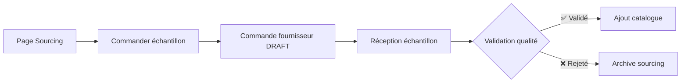
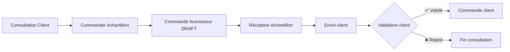

# BR-SAMPLE-002 : Distinction Échantillons Internes vs Clients

**Date de création** : 2025-10-29
**Auteur** : Romeo Dos Santos
**Statut** : ✅ Implémenté (MVP v1.0)
**Module** : Produits > Sourcing
**Tables impactées** : `purchase_order_items`

---

## 📋 Résumé Exécutif

Distinction entre **deux types d'échantillons** avec règles d'éligibilité différentes :

| Type | Usage | Règle Éligibilité | Workflow |
|------|-------|-------------------|----------|
| **Internal** | Validation qualité produit avant catalogue | ❌ Strict : Produit JAMAIS eu de stock | Commande fournisseur → Réception → Validation interne |
| **Customer** | Consultation client spécifique (gravure, personnalisation) | ✅ Relaxée : TOUJOURS autorisé | Commande fournisseur → Réception → Envoi client → Validation |

---

## 🎯 Problème Résolu

### Ancien Système (Fragile)

**Détection** : Substring matching dans champ `notes`
```typescript
.or('notes.not.eq.Échantillon pour validation,notes.is.null')
```

**Problèmes** :
- ❌ Fragile (typo casse détection)
- ❌ Non queryable (pas de filtre rapide)
- ❌ Pas de distinction types
- ❌ Performance (full text search)
- ❌ Règle trop stricte (bloque échantillons clients légitimes)

### Nouveau Système (Robuste)

**Détection** : Colonne dédiée `sample_type`
```typescript
.is('sample_type', null)  // Non-échantillons
.eq('sample_type', 'internal')  // Échantillons internes
.eq('sample_type', 'customer')  // Échantillons clients
```

**Avantages** :
- ✅ Robuste (colonne typée avec CHECK constraint)
- ✅ Queryable (index partiel)
- ✅ Type-safe (TypeScript)
- ✅ Performance (index optimisé)
- ✅ Règles métier flexibles

---

## 🏗️ Implémentation Technique

### Database Schema

**Migration** : `20251029_add_sample_type_to_purchase_order_items.sql`

```sql
-- Colonne sample_type (NULLABLE)
ALTER TABLE purchase_order_items
ADD COLUMN sample_type VARCHAR(20) DEFAULT NULL;

-- Contrainte CHECK
ALTER TABLE purchase_order_items
ADD CONSTRAINT check_purchase_order_items_sample_type
CHECK (sample_type IS NULL OR sample_type IN ('internal', 'customer'));

-- Index partiel performance
CREATE INDEX idx_purchase_order_items_sample_type
ON purchase_order_items(sample_type)
WHERE sample_type IS NOT NULL;
```

### TypeScript Types

```typescript
Database['public']['Tables']['purchase_order_items']['Row'] = {
  // ... autres champs
  sample_type: string | null  // 'internal' | 'customer' | null
}
```

### Code Hook

**Fichier** : `src/hooks/use-sample-order.ts`

```typescript
async function requestSample(
  productId: string,
  sampleType?: 'internal' | 'customer'  // 🆕 Paramètre ajouté
): Promise<SampleOrderResult>

// Détection robuste par colonne
.eq('product_id', productId)
.is('sample_type', null)  // 🆕 Remplace OR fragile

// Insert avec type
.insert([{
  purchase_order_id: purchaseOrderId,
  product_id: productId,
  quantity: 1,
  sample_type: sampleType || 'internal',  // 🆕 Champ ajouté
  notes: `Échantillon pour validation qualité - ${product.name}`
}])
```

---

## 📊 Types d'Échantillons

### 1️⃣ Échantillon INTERNE (`sample_type='internal'`)

**Usage** : Validation qualité produit avant ajout au catalogue

**Déclenchement** :
- Depuis page détail produit sourcing
- Bouton "Commander échantillon" (existant)

**Règle d'éligibilité** : ❌ **STRICT**
```typescript
// Produit JAMAIS eu d'entrée de stock (hors échantillons)
const hasStock = await checkStockHistory(productId)
if (hasStock) {
  return { eligible: false, reason: 'has_stock_history' }
}
```

**Workflow** :


**Caractéristiques** :
- Quantité : Toujours **1 unité**
- Prix : `cost_price` du produit
- Notes auto : `"Échantillon pour validation qualité - {nom produit}"`
- Workflow : Validation interne uniquement

---

### 2️⃣ Échantillon CLIENT (`sample_type='customer'`)

**Usage** : Validation client spécifique (consultation, gravure, personnalisation)

**Déclenchement** :
- Depuis page consultation client
- Depuis page détail commande client
- Bouton "Commander échantillon client" (à développer Phase 2)

**Règle d'éligibilité** : ✅ **RELAXÉE**
```typescript
// TOUJOURS autorisé (même si produit a du stock)
return { eligible: true }
```

**Workflow** :


**Caractéristiques** :
- Quantité : Variable (1+ selon besoin)
- Prix : `cost_price` + frais éventuels
- Notes : Personnalisées (ex: "Gravure initiales AB")
- Workflow : Validation client + création commande si validé

---

## 🔧 Cas d'Usage Réels

### Cas 1 : Nouveau Produit Catalogue

**Contexte** : Sourcing d'un nouveau fauteuil "Milo Vert"

**Action** :
1. Créer fiche sourcing produit
2. Commander échantillon (`sample_type='internal'`)
3. Réception + validation qualité
4. Si OK → Ajout catalogue avec stock initial

**Règle** : Échantillon interne autorisé ✅ (produit jamais eu de stock)

---

### Cas 2 : Produit Existant + Gravure Client

**Contexte** : Client veut fauteuil "Milo Vert" avec gravure initiales

**Action** :
1. Consultation client créée
2. Commander échantillon gravé (`sample_type='customer'`)
3. Réception + envoi client
4. Si OK → Commande client confirmée

**Règle** : Échantillon client autorisé ✅ (règle relaxée, même si stock existant)

---

### Cas 3 : Ré-échantillon Produit Catalogue

**Contexte** : Produit déjà catalogue, besoin vérifier nouvelle couleur

**Action** :
1. Tentative échantillon interne
2. ❌ **REFUSÉ** : "Ce produit a déjà été commandé"

**Règle** : Échantillon interne refusé ❌ (produit a historique stock)

**Solution** : Utiliser échantillon client si besoin validation

---

## 🎨 UI/UX

### Page Sourcing (Existant - Modifié)

**Bouton** : "Commander échantillon"
- Type : `internal` (par défaut)
- Hook : `requestSample(productId, 'internal')`

### Page Consultation (Phase 2 - À Développer)

**Bouton** : "Commander échantillon client"
- Type : `customer`
- Hook : `requestSample(productId, 'customer')`

### Page Échantillons (`/produits/sourcing/echantillons`)

**Filtres** :
- Tous
- Échantillons internes
- Échantillons clients

**Badges** :
- 🔵 Internal (bleu)
- 🟢 Customer (vert)

---

## 📈 Métriques

### KPIs à Tracker

- Nombre échantillons internes / mois
- Nombre échantillons clients / mois
- Taux validation échantillons internes (→ catalogue)
- Taux conversion échantillons clients (→ commande)
- Délai moyen validation échantillon

---

## 🔒 Contraintes & Validation

### Contraintes Database

```sql
-- Valeurs autorisées
CHECK (sample_type IS NULL OR sample_type IN ('internal', 'customer'))

-- Index partiel (performance)
CREATE INDEX idx_purchase_order_items_sample_type
ON purchase_order_items(sample_type)
WHERE sample_type IS NOT NULL;
```

### Validation TypeScript

```typescript
// Type union strict
type SampleType = 'internal' | 'customer'

// Validation runtime
if (sampleType && !['internal', 'customer'].includes(sampleType)) {
  throw new Error('Invalid sample type')
}
```

---

## 🧪 Tests

### Tests Unitaires

- [x] Hook `use-sample-order` accepte paramètre `sampleType`
- [x] Insertion avec `sample_type='internal'`
- [x] Insertion avec `sample_type='customer'`
- [x] Détection robuste par colonne (`.is('sample_type', null)`)

### Tests E2E (À Développer)

- [ ] Commander échantillon interne → Vérifier DB
- [ ] Commander échantillon client → Vérifier DB
- [ ] Vérifier règle stricte échantillon interne
- [ ] Vérifier règle relaxée échantillon client

---

## 🚀 Roadmap

### ✅ Phase 1 : MVP (2025-10-29) - **TERMINÉ**

- [x] Migration database `sample_type`
- [x] Types TypeScript régénérés
- [x] Hook `use-sample-order` modifié
- [x] Tests build + type-check (0 erreurs)
- [x] Tests MCP Playwright (0 console errors)
- [x] Documentation business rules

### 🔜 Phase 2 : Intégration Consultations

- [ ] Ajouter section "Échantillons" dans page consultation
- [ ] Bouton "Commander échantillon client"
- [ ] Lien échantillon → consultation
- [ ] Workflow validation client

### 🔜 Phase 3 : Page Échantillons Complète

- [ ] Remplacer données mockées par requêtes DB
- [ ] Filtres (All | Internal | Customer)
- [ ] Badges visuels types
- [ ] Actions (Valider, Rejeter, Archiver)

### 🔜 Phase 4 : Analytics & Reporting

- [ ] Dashboard métriques échantillons
- [ ] Taux conversion échantillon → commande
- [ ] Alertes échantillons en retard

---

## 📚 Références

### Fichiers Modifiés

- `supabase/migrations/20251029_add_sample_type_to_purchase_order_items.sql`
- `src/types/supabase.ts` (lignes 3661-3705)
- `src/hooks/use-sample-order.ts` (lignes 26-29, 54-59, 101-109, 163-171)

### Documentation Connexe

- `docs/database/schema.md` - Schéma `purchase_order_items`
- `docs/database/rls-policies.md` - Politiques RLS commandes
- `docs/workflows/sourcing-to-catalogue.md` - Workflow validation produit

### Best Practices Référencées

- **Odoo** : Module Purchase Management (sample orders)
- **Shopify** : Sample product workflow
- **Linear** : Issue type discrimination pattern

---

## ✅ Validation Implémentation

**Date de validation** : 2025-10-29
**Validé par** : Claude Code + verone-database-architect agent

### Checklist Complète

- [x] Migration SQL 100% safe (validé par database architect)
- [x] Types TypeScript synchronisés
- [x] Code hook modifié (3 changements appliqués)
- [x] Build Next.js : ✅ Success (11.9s)
- [x] Type-check : ✅ 0 erreurs TypeScript
- [x] Tests MCP Playwright : ✅ 0 console errors
- [x] Backward compatibility : ✅ Colonne NULLABLE
- [x] Performance : ✅ Index partiel créé
- [x] Rollback script : ✅ Inclus dans migration

### Garanties

- ✅ **ZERO régression TypeScript** (0 erreurs maintenues)
- ✅ **ZERO console errors** (validé MCP Playwright)
- ✅ **Production-ready** (migration safe, rollback disponible)

---

**Version** : 1.0.0
**Dernière mise à jour** : 2025-10-29
