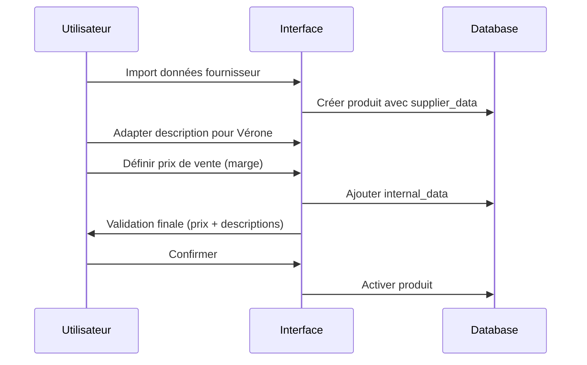
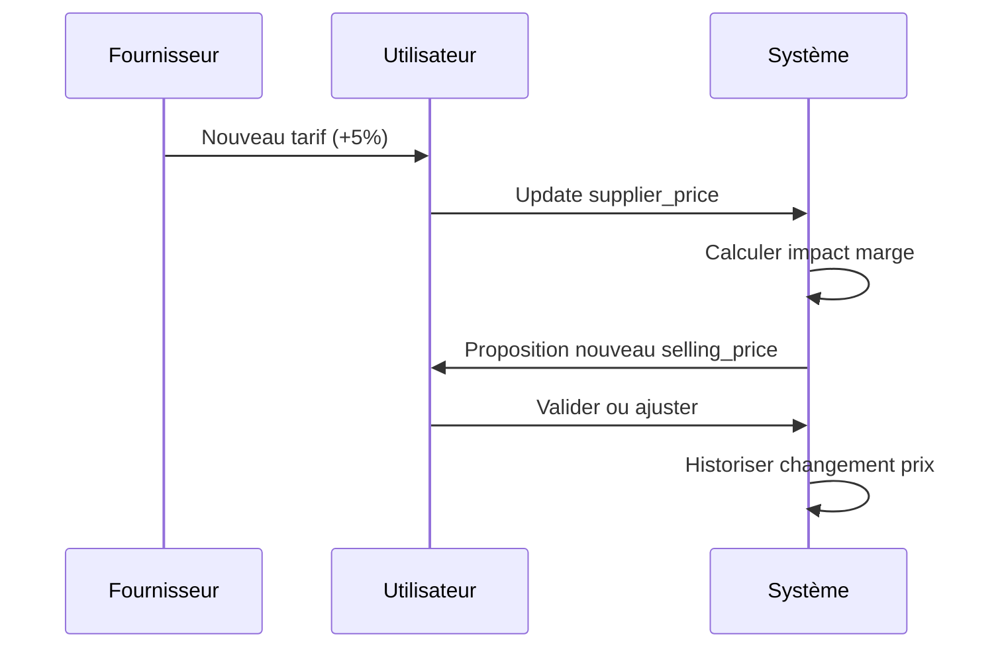

# 🏢 Séparation Données Fournisseur vs Internes - Règles Business Vérone

> **Version**: 1.0 - Première version validée
> **Date**: 2025-01-15
> **Statut**: ✅ **VALIDÉ** - Règles business pour séparation claire des données

## 🎯 Principe Fondamental

**RÈGLE ABSOLUE** : Distinction claire entre les données du fournisseur et nos données internes pour chaque produit, avec labellisation explicite de tous les champs.

> **"S'il y a un prix, je veux savoir c'est un prix de quoi"** - Exigence utilisateur

## 📊 Structure de Données - Vue d'Ensemble

```typescript
interface ProductDataStructure {
  // DONNÉES FOURNISSEUR (reçues du fournisseur)
  supplier: {
    description: string      // Description technique du fournisseur
    reference: string        // Référence fournisseur (leur SKU)
    price: number           // Prix d'achat HT (en centimes)
    lead_time?: number      // Délai livraison fournisseur (jours)
    minimum_order?: number  // Quantité minimum commande
    catalog_url?: string    // Lien catalogue fournisseur
    notes?: string          // Notes techniques fournisseur
  }

  // DONNÉES INTERNES VÉRONE (nos données commerciales)
  internal: {
    description: string      // Notre description commerciale/marketing
    selling_price: number   // Notre prix de vente HT (en centimes)
    margin_percentage: number // Marge calculée automatiquement
    marketing_notes?: string // Notes commerciales internes
    internal_reference?: string // Notre référence interne si différente
    sales_arguments?: string[] // Arguments de vente
    target_market?: string   // Marché cible (B2B/B2C/Premium)
  }

  // DONNÉES PARTAGÉES (communes)
  shared: {
    name: string            // Nom produit (peut être adapté vs fournisseur)
    dimensions: Dimensions  // Dimensions exactes
    weight: number         // Poids
    images: string[]       // Photos (nos photos + photos fournisseur)
    category_hierarchy: CategoryHierarchy
    stock_quantity: number
    gtin?: string
  }
}
```

## 💰 Gestion des Prix - Règles Strictes

### **PRIX-001 : Distinction Obligatoire des Prix**

**Champs Prix Requis** :
- ✅ **`supplier_price`** : Prix d'achat fournisseur HT (en centimes)
- ✅ **`selling_price`** : Prix de vente Vérone HT (en centimes)
- ✅ **`margin_percentage`** : Marge calculée automatiquement

**Calculs Automatiques** :
```typescript
function calculateMargin(sellingPrice: number, supplierPrice: number): number {
  return ((sellingPrice - supplierPrice) / supplierPrice) * 100
}

function calculateSellingPrice(supplierPrice: number, targetMargin: number): number {
  return supplierPrice * (1 + targetMargin / 100)
}
```

### **PRIX-002 : Validation Business Rules**

**Contraintes Prix** :
- Marge minimum : 20% (configurable par catégorie)
- Marge maximum : 400% (alerte si dépassement)
- Prix de vente DOIT être > prix d'achat
- Validation lors de toute modification

**Alertes Automatiques** :
- ⚠️ Marge < 20% → Alerte "Marge faible"
- ⚠️ Marge > 200% → Alerte "Marge élevée - vérifier concurrence"
- 🚨 Prix vente < Prix achat → Erreur bloquante

### **PRIX-003 : Historique et Évolution**

```typescript
interface PriceHistory {
  date: string
  supplier_price: number
  selling_price: number
  margin_percentage: number
  reason: 'supplier_increase' | 'market_adjustment' | 'promotion' | 'manual_update'
  user_id: string
}
```

## 📝 Gestion des Descriptions - Séparation Marketing/Technique

### **DESC-001 : Description Fournisseur vs Description Vérone**

**Description Fournisseur (`supplier_description`)** :
- Informations techniques détaillées
- Spécifications matériaux
- Instructions d'entretien
- Normes et certifications
- **Objectif** : Référence technique interne

**Description Vérone (`internal_description`)** :
- Description commerciale/marketing
- Mise en valeur des atouts produit
- Adaptation au style Vérone (élégance, luxe)
- Arguments de vente clients
- **Objectif** : Communication client finale

### **DESC-002 : Exemples de Transformation**

```
FOURNISSEUR → VÉRONE

"Fauteuil structure métal tubulaire Ø16mm,
revêtement polyester 100%, rembourrage
mousse polyuréthane densité 35kg/m³"

→

"Fauteuil au design contemporain alliant
confort et élégance. Structure métallique
robuste et assise moelleuse pour un confort
optimal. Parfait pour créer un espace
détente raffiné."
```

## 🏷️ Références et Identifiants

### **REF-001 : Système de Références Multiple**

**Référence Fournisseur (`supplier_reference`)** :
- SKU/référence du fournisseur
- Code commande chez le fournisseur
- **Usage** : Commandes, SAV, communications fournisseur

**Référence Interne Vérone (`internal_reference`)** :
- Notre SKU selon nomenclature Vérone
- Format : [FAMILLE]-[PRODUIT]-[COULEUR]-[MATIÈRE]
- **Usage** : Catalogues clients, gestion interne, commandes

**GTIN/EAN (`gtin`)** :
- Code-barres international unique
- Commun fournisseur/Vérone si existant
- **Usage** : Logistique, intégrations externes

### **REF-002 : Traçabilité et Mapping**

```typescript
interface ReferenceMapping {
  verone_sku: string        // Notre référence
  supplier_reference: string // Référence fournisseur
  gtin?: string             // Code-barres
  alternative_references?: string[] // Autres références (ancien SKU, etc.)
}
```

## 🔄 Workflows de Gestion

### **Workflow 1 : Création Produit depuis Catalogue Fournisseur**



### **Workflow 2 : Mise à Jour Prix Fournisseur**



## 🖥️ Interface Utilisateur - Spécifications

### **Sections d'Édition Séparées**

**1. Section "Informations Fournisseur"**
```typescript
interface SupplierInfoSection {
  supplier_description: string
  supplier_reference: string
  supplier_price: number       // Label: "Prix d'achat fournisseur HT"
  supplier_lead_time?: number
  supplier_catalog_url?: string
  supplier_notes?: string
}
```

**2. Section "Informations Commerciales Vérone"**
```typescript
interface InternalInfoSection {
  internal_description: string
  selling_price: number        // Label: "Prix de vente Vérone HT"
  margin_percentage: number    // Label: "Marge %" (calculé auto)
  marketing_notes?: string
  sales_arguments?: string[]
  target_market?: string
}
```

**3. Section "Calculs et Validation"**
```typescript
interface PricingValidation {
  margin_amount: number        // Label: "Marge en €" (selling - supplier)
  margin_percentage: number    // Label: "Marge en %"
  competitive_analysis?: CompetitorPricing
  price_history: PriceHistory[]
}
```

### **Composants UI Requis**

1. **`<SupplierInfoEditSection />`** : Édition données fournisseur
2. **`<InternalInfoEditSection />`** : Édition données commerciales Vérone
3. **`<PricingCalculatorSection />`** : Calculateur marge + validation
4. **`<PriceHistorySection />`** : Historique évolution prix
5. **`<ReferenceMapping />`** : Gestion des références multiples

## 📋 Labellisation des Champs - Exigences UX

### **Labels Obligatoires pour tous les Prix**

```typescript
const PRICE_LABELS = {
  supplier_price: "Prix d'achat fournisseur HT",
  selling_price: "Prix de vente Vérone HT",
  margin_amount: "Marge en € (vente - achat)",
  margin_percentage: "Marge en %",
  cost_with_shipping: "Coût total (achat + transport)",
  recommended_retail: "Prix conseillé TTC client"
}
```

### **Labels pour les Descriptions**

```typescript
const DESCRIPTION_LABELS = {
  supplier_description: "Description technique fournisseur",
  internal_description: "Description commerciale Vérone",
  marketing_notes: "Notes marketing internes",
  sales_arguments: "Arguments de vente",
  supplier_notes: "Notes techniques fournisseur"
}
```

### **Labels pour les Références**

```typescript
const REFERENCE_LABELS = {
  supplier_reference: "Référence fournisseur",
  internal_reference: "SKU Vérone",
  gtin: "Code-barres GTIN/EAN",
  alternative_references: "Autres références"
}
```

## 🔒 Permissions et Accès

### **Niveaux d'Autorisation**

**Lecture Seule** :
- Tous les utilisateurs peuvent voir les données fournisseur
- Accès aux calculs de marge (pourcentage uniquement)

**Édition Données Fournisseur** :
- Rôle : `catalogue:supplier-data:edit`
- Modifications prix d'achat, descriptions techniques
- Historisation automatique des changements

**Édition Données Commerciales** :
- Rôle : `catalogue:pricing:edit`
- Modifications prix de vente, descriptions marketing
- Validation business rules (marge minimum)

**Administration Complète** :
- Rôle : `catalogue:admin`
- Accès à l'historique détaillé des prix
- Configuration des règles de marge par catégorie

## 📊 Rapports et Analytics

### **Tableaux de Bord Pricing**

1. **Vue Marge Globale**
   - Marge moyenne par catégorie
   - Top/Flop marges
   - Évolution marges dans le temps

2. **Analyse Fournisseurs**
   - Évolution prix fournisseurs
   - Impact changements tarifs sur marges
   - Négociation insights

3. **Performance Commerciale**
   - Conversion par niveau de marge
   - Optimisation pricing par segment

### **Alertes Automatiques**

- 🚨 **Marge négative** : Prix vente < Prix achat
- ⚠️ **Marge faible** : < 20% (configurable)
- 📈 **Hausse fournisseur** : +X% vs période précédente
- 🔄 **Prix obsolètes** : Pas mis à jour depuis 6 mois

## ✅ Migration et Transition

### **Étapes de Migration depuis Données Actuelles**

1. **Audit Prix Existants**
   - Identifier les champs `price_ht` actuels
   - Déterminer s'il s'agit de prix d'achat ou de vente
   - Mapping vers `supplier_price` ou `selling_price`

2. **Séparation Descriptions**
   - Analyser descriptions existantes
   - Identifier contenu technique vs commercial
   - Répartition `supplier_description` / `internal_description`

3. **Calcul Marges Manquantes**
   - Pour produits avec un seul prix, estimer l'autre
   - Règles par défaut par catégorie
   - Validation manuelle des estimations

### **Validation Post-Migration**

- [ ] **100% des produits** ont supplier_price ET selling_price
- [ ] **Toutes les marges** sont positives et cohérentes
- [ ] **Labels UI** affichent clairement la nature de chaque prix
- [ ] **Descriptions** sont bien séparées fournisseur/Vérone
- [ ] **Références** mappées correctement

---

## 🎯 Objectifs Business

### **Clarté et Traçabilité**
- ✅ Distinction immédiate entre données fournisseur/internes
- ✅ Labels explicites pour tous les champs prix
- ✅ Historique complet des évolutions pricing

### **Optimisation Commerciale**
- ✅ Calculs de marge automatiques et fiables
- ✅ Alertes proactives sur marges anormales
- ✅ Support décisionnel pour pricing stratégique

### **Efficacité Opérationnelle**
- ✅ Import simplifié données fournisseur
- ✅ Adaptation rapide descriptions pour catalogues clients
- ✅ Gestion références multiples sans confusion

---

**Note Critique** : Cette séparation répond directement à l'exigence utilisateur de clarté absolue sur la nature de chaque donnée, particulièrement les prix. L'implémentation doit garantir qu'aucun champ ne soit ambigu dans son origine ou sa destination.