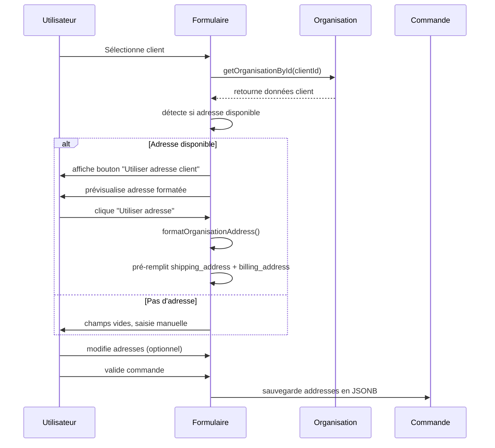
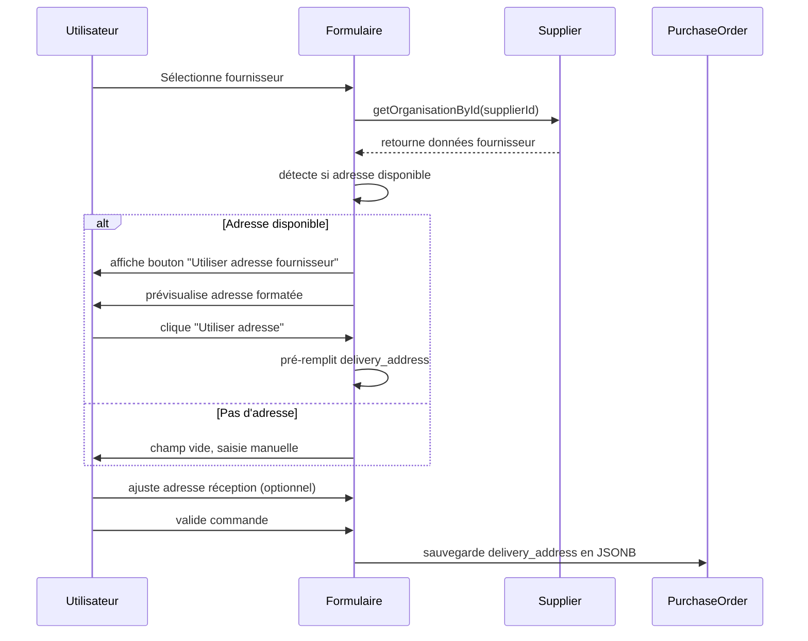

# 🏠 Règles Métier - Auto-remplissage Adresses Commandes

**Date** : 16 septembre 2025
**Version** : 1.0
**Status** : ✅ IMPLÉMENTÉ

## 🎯 Objectifs

Définir les règles métier pour l'auto-remplissage des adresses lors de la création de commandes clients et fournisseurs dans Vérone Back Office, garantissant :

- **UX optimisée** avec saisie assistée intelligente
- **Cohérence données** depuis les fiches organisations officielles
- **Isolation stricte** entre données commandes et organisations
- **Flexibilité utilisateur** pour ajustements ponctuels

## 📋 Règles Business Fondamentales

### **RG-ADDR-001 : Source Unique de Vérité**

**Règle** : Les adresses pré-remplies proviennent EXCLUSIVEMENT des fiches organisations

```typescript
const addressSource = {
  origin:
    'organisations.address_line1|address_line2|postal_code|city|region|country',
  format: 'name + adresse complète sur lignes séparées',
  validation: 'adresse disponible = au moins 1 champ adresse renseigné',
};
```

### **RG-ADDR-002 : Détection Automatique**

**Règle** : L'aide à la saisie s'active automatiquement si adresse disponible

```typescript
const autoDetection = {
  trigger: 'onChange sélection organisation (client|fournisseur)',
  condition: 'address_line1 OR city OR postal_code != null',
  ui: "bouton 'Utiliser adresse [type_organisation]' visible",
  fallback: 'champs vides, saisie manuelle standard',
};
```

### **RG-ADDR-003 : Isolation Données Stricte**

**Règle** : Modifications adresses commandes N'IMPACTENT JAMAIS les organisations

```typescript
const dataIsolation = {
  source: 'organisations table (read-only dans contexte commande)',
  target: 'orders.shipping_address|billing_address|delivery_address (JSONB)',
  isolation: 'modification commande !== modification organisation',
  integrity: 'organisation.address_* inchangée même si order.address modifiée',
};
```

## 🔄 Workflows par Type de Commande

### **Commandes Clients (Sales Orders)**

#### **Workflow Standard**



#### **Règles Spécifiques Clients**

- **RG-SALES-ADDR-001** : Adresse livraison ET facturation pré-remplies identiquement
- **RG-SALES-ADDR-002** : Utilisateur peut différencier livraison ≠ facturation après copie
- **RG-SALES-ADDR-003** : Format stockage : `{"name": "...", "address": "ligne1\nligne2\nville"}`

### **Commandes Fournisseurs (Purchase Orders)**

#### **Workflow Standard**



#### **Règles Spécifiques Fournisseurs**

- **RG-PURCHASE-ADDR-001** : Seule l'adresse de livraison (réception) est pré-remplie
- **RG-PURCHASE-ADDR-002** : Adresse = où Vérone recevra la marchandise
- **RG-PURCHASE-ADDR-003** : Modification fréquente pour entrepôts alternatifs autorisée

## 📊 Formatage et Structure Données

### **Format d'Affichage Standard**

```typescript
const formatOrganisationAddress = (org: Organisation): string => {
  const parts = [
    org.name, // Nom organisation
    org.address_line1, // Adresse principale
    org.address_line2, // Complément adresse
    [org.postal_code, org.city].filter(Boolean).join(' '), // CP + Ville
    org.region, // Région/État
    org.country, // Pays
  ].filter(Boolean); // Supprime valeurs vides

  return parts.join('\n'); // Lignes séparées
};
```

### **Structure Stockage JSONB**

```json
{
  "name": "Nom Client/Fournisseur",
  "address_line1": "123 Rue Example",
  "address_line2": "Appartement 4B",
  "postal_code": "75001",
  "city": "Paris",
  "region": "Île-de-France",
  "country": "France",
  "formatted": "Nom Client\n123 Rue Example\nAppartement 4B\n75001 Paris\nÎle-de-France\nFrance"
}
```

## ⚖️ Règles de Validation

### **RG-VAL-001 : Validation Adresse Disponible**

```typescript
const hasValidAddress = (org: Organisation): boolean => {
  return !!(org.address_line1 || org.city || org.postal_code);
};
```

### **RG-VAL-002 : Validation Format Commande**

```typescript
const validateOrderAddress = (address: string): boolean => {
  return address.length <= 2000 && address.trim().length > 0;
};
```

### **RG-VAL-003 : Validation Cohérence Organisation**

```typescript
const validateOrganisationAccess = (userId: string, orgId: string): boolean => {
  // RLS Supabase : utilisateur peut accéder à l'organisation
  return await checkRLSPolicy(userId, orgId);
};
```

## 🔒 Règles de Sécurité

### **RG-SEC-001 : Contrôle Accès Organisations**

- Utilisateur accède uniquement aux organisations de son tenant
- RLS Supabase appliqué sur `organisations.select`
- Pas d'exposition données organisations d'autres tenants

### **RG-SEC-002 : Sanitisation Adresses**

- Nettoyage caractères spéciaux avant sauvegarde
- Limitation longueur champs adresse (2000 caractères max)
- Validation format postal_code selon pays

### **RG-SEC-003 : Audit Trail**

```typescript
const auditAddressUsage = {
  event: 'address_autofill_used',
  metadata: {
    source_organisation_id: 'uuid',
    target_order_type: 'sales|purchase',
    user_id: 'uuid',
    timestamp: 'ISO8601',
  },
};
```

## 🎛️ Règles Interface Utilisateur

### **RG-UI-001 : Visibilité Conditionnelle**

```typescript
const buttonVisibility = {
  show: 'hasValidAddress(selectedOrganisation) === true',
  hide: '!selectedOrganisation || !hasValidAddress(selectedOrganisation)',
  text: {
    customer: 'Utiliser adresse client',
    supplier: 'Utiliser adresse fournisseur',
  },
};
```

### **RG-UI-002 : Prévisualisation Obligatoire**

- Adresse formatée affichée AVANT copie
- Utilisateur voit exactement ce qui sera copié
- Prévention erreurs par preview transparent

### **RG-UI-003 : Feedback Visuel**

```typescript
const visualFeedback = {
  preview: 'adresse grisée avec icône MapPin',
  button: 'icône Copy + texte explicite',
  success: 'pré-remplissage instantané visible',
  responsive: 'adaptation mobile + desktop',
};
```

## 📈 Règles Performance

### **RG-PERF-001 : Cache Organisation**

```typescript
const cacheStrategy = {
  scope: 'session utilisateur',
  duration: '15 minutes',
  invalidation: 'onChange organisation || user logout',
  key: `org_${orgId}_${userId}`,
};
```

### **RG-PERF-002 : Lazy Loading**

- Chargement adresse uniquement si sélection organisation
- Pas de prefetch systématique toutes organisations
- Optimisation réseau pour mobile

### **RG-PERF-003 : Debouncing**

```typescript
const debounceSettings = {
  organisationChange: '300ms',
  addressFormatting: '100ms',
  apiCalls: '500ms',
};
```

## 🔄 Règles de Migration et Évolution

### **RG-MIG-001 : Rétrocompatibilité**

- Commandes existantes avec adresses texte simple conservées
- Nouveau format JSONB pour futures commandes
- Migration progressive sans rupture service

### **RG-MIG-002 : Extensibilité**

```typescript
const futureExtensions = {
  multipleAddresses: 'shipping !== billing',
  addressValidation: 'API postal validation',
  geolocalization: 'coordinates storage',
  templates: 'frequently used addresses',
};
```

## 🧪 Règles de Test

### **RG-TEST-001 : Scénarios Obligatoires**

- Organisation avec adresse complète → auto-fill fonctionne
- Organisation sans adresse → pas de bouton, saisie manuelle
- Modification post-autofill → sauvegarde données modifiées
- Changement organisation → reset adresses + nouveau autofill

### **RG-TEST-002 : Tests de Régression**

- Isolation données : modification commande n'impacte pas organisation
- Performance : auto-fill <100ms sur dataset 1000+ organisations
- Sécurité : RLS respecté, pas d'accès organisations autres tenants

---

**RÈGLES MÉTIER VALIDÉES ET OPÉRATIONNELLES**
_Auto-remplissage adresses conforme aux exigences business Vérone_
