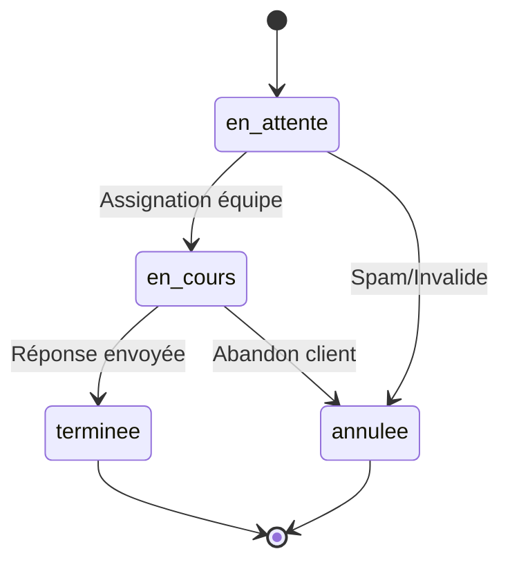

# 📋 Règles Métier - Consultations Clients

**Date** : 23 septembre 2025
**Version** : 1.0
**Status** : ✅ IMPLÉMENTÉ

## 🎯 Objectifs

Définir les règles métier pour le système de consultations clients dans Vérone Back Office, permettant :

- **Réception structurée** des demandes clients depuis différents canaux
- **Gestion workflow** avec assignation et suivi des consultations
- **Liaison exclusive** avec les produits en mode sourcing uniquement
- **Traçabilité complète** des échanges et propositions clients

## 📊 Modèle de Données

### **Table `client_consultations`**

```sql
CREATE TABLE client_consultations (
    id UUID PRIMARY KEY,

    -- Informations client
    organisation_name TEXT NOT NULL,
    client_email TEXT NOT NULL,
    client_phone TEXT,

    -- Demande
    descriptif TEXT NOT NULL CHECK (length >= 10),
    image_url TEXT,
    tarif_maximum NUMERIC(10,2),

    -- Workflow interne
    status TEXT DEFAULT 'en_attente',
    assigned_to UUID REFERENCES auth.users(id),
    notes_internes TEXT,
    priority_level INTEGER DEFAULT 2 CHECK (1-5),

    -- Métadonnées
    source_channel TEXT DEFAULT 'website',
    estimated_response_date DATE,
    created_at TIMESTAMPTZ DEFAULT now(),
    responded_at TIMESTAMPTZ,
    responded_by UUID
);
```

### **Table `consultation_products`**

```sql
CREATE TABLE consultation_products (
    id UUID PRIMARY KEY,
    consultation_id UUID REFERENCES client_consultations(id),
    product_id UUID REFERENCES products(id),

    -- Proposition commerciale
    proposed_price NUMERIC(10,2),
    notes TEXT,
    is_primary_proposal BOOLEAN DEFAULT false,

    -- Contrainte : seuls les produits sourcing sont autorisés
    CONSTRAINT only_sourcing_products CHECK (
        EXISTS (SELECT 1 FROM products p
                WHERE p.id = product_id
                AND p.creation_mode = 'sourcing')
    )
);
```

## 🔄 États et Transitions

### **Cycle de Vie Consultation**



### **Règles de Transition**

#### **EN_ATTENTE → EN_COURS**

**Conditions** :

- ✅ Consultation assignée à un utilisateur
- ✅ Utilisateur avec rôle `admin`, `catalog_manager`, ou `sales`

**Actions automatiques** :

```typescript
const takeCharge = async (consultationId: string, userId: string) => {
  await updateConsultation(consultationId, {
    status: 'en_cours',
    assigned_to: userId,
    updated_at: now(),
  });

  // Notification équipe
  await sendNotification({
    type: 'consultation_assigned',
    consultation_id: consultationId,
    assigned_to: userId,
  });
};
```

#### **EN_COURS → TERMINEE**

**Conditions** :

- ✅ Au moins un produit proposé au client
- ✅ Réponse envoyée (email/téléphone/autre)

**Actions automatiques** :

```typescript
const completeConsultation = async (consultationId: string) => {
  await updateConsultation(consultationId, {
    status: 'terminee',
    responded_at: now(),
    responded_by: getCurrentUserId(),
  });

  // Archivage automatique après 30 jours
  scheduleArchive(consultationId, addDays(30));
};
```

## 🎯 Intégration Produits

### **Règle Fondamentale : Tous Produits Éligibles**

**TOUS les produits (catalogue + sourcing) peuvent être liés aux consultations**

```sql
-- Plus de restriction sur le type de produit
-- Tous les produits peuvent être liés aux consultations
-- La fonction de validation peut être supprimée ou simplifiée

CREATE FUNCTION validate_consultation_product_link()
RETURNS TRIGGER AS $$
BEGIN
    -- Vérifier que le produit existe et n'est pas archivé
    IF NOT EXISTS (
        SELECT 1 FROM products
        WHERE id = NEW.product_id
        AND archived_at IS NULL
    ) THEN
        RAISE EXCEPTION 'Le produit n''existe pas ou est archivé';
    END IF;

    RETURN NEW;
END;
$$ LANGUAGE plpgsql;

-- Trigger sur consultation_products
CREATE TRIGGER ensure_valid_products
    BEFORE INSERT OR UPDATE ON consultation_products
    FOR EACH ROW
    EXECUTE FUNCTION validate_consultation_product_link();
```

### **Produits Éligibles - Fonction métier**

```sql
CREATE FUNCTION get_consultation_eligible_products()
RETURNS TABLE (
    id UUID,
    name VARCHAR,
    sku VARCHAR,
    status availability_status_type,
    requires_sample BOOLEAN,
    supplier_name TEXT,
    creation_mode VARCHAR
) AS $$
BEGIN
    RETURN QUERY
    SELECT p.id, p.name, p.sku, p.status, p.requires_sample,
           o.name as supplier_name,
           p.creation_mode
    FROM products p
    LEFT JOIN organisations o ON p.supplier_id = o.id
    WHERE p.archived_at IS NULL  -- Tous les produits non archivés
    ORDER BY p.name;
END;
$$ LANGUAGE plpgsql;
```

## 📝 Gestion des Propositions

### **Proposition Principale**

**Un seul produit peut être marqué comme proposition principale par consultation**

```sql
-- Contrainte unique sur is_primary_proposal
CREATE UNIQUE INDEX idx_unique_primary_proposal
ON consultation_products(consultation_id)
WHERE is_primary_proposal = true;
```

### **Workflow Proposition**

```typescript
interface ProposalWorkflow {
  // 1. Sélection produits éligibles
  eligible: 'sourcing products only';

  // 2. Proposition avec prix personnalisé
  pricing: {
    base_price: 'from product.price_ht';
    proposed_price: 'custom client price';
    margin_calculation: 'automatic';
  };

  // 3. Validation commerciale
  validation: {
    max_discount: '30%'; // vs prix catalogue
    approval_required: 'if discount > 20%';
  };
}
```

## 🔒 Permissions et Sécurité

### **RLS Policies**

```sql
-- Lecture : tous les utilisateurs authentifiés
CREATE POLICY "Consultations read access" ON client_consultations
    FOR SELECT TO authenticated
    USING (true);

-- Modification : assigné + admins/sales
CREATE POLICY "Consultations update access" ON client_consultations
    FOR UPDATE TO authenticated
    USING (
        assigned_to = auth.uid()
        OR EXISTS (
            SELECT 1 FROM user_profiles
            WHERE user_id = auth.uid()
            AND role IN ('admin', 'catalog_manager', 'sales')
        )
    );

-- Création : admins/sales uniquement
CREATE POLICY "Consultations insert access" ON client_consultations
    FOR INSERT TO authenticated
    WITH CHECK (
        EXISTS (
            SELECT 1 FROM user_profiles
            WHERE user_id = auth.uid()
            AND role IN ('admin', 'catalog_manager', 'sales')
        )
    );
```

### **Audit et Traçabilité**

```typescript
interface AuditEvents {
  consultation_created: {
    organisation_name: string;
    source_channel: string;
    created_by: string;
  };

  consultation_assigned: {
    consultation_id: string;
    assigned_to: string;
    assigned_by: string;
  };

  product_proposed: {
    consultation_id: string;
    product_id: string;
    proposed_price: number;
    is_primary: boolean;
  };

  consultation_completed: {
    consultation_id: string;
    products_count: number;
    response_time_hours: number;
  };
}
```

## 📊 Métriques Business

### **KPIs Consultations**

```typescript
interface ConsultationKPIs {
  // Performance équipe
  average_response_time: 'heures entre création et première réponse';
  completion_rate: '% consultations terminées vs abandonnées';
  products_per_consultation: 'nombre moyen produits proposés';

  // Efficacité commerciale
  conversion_rate: '% consultations → commandes clients';
  average_deal_size: 'valeur moyenne des commandes issues de consultations';
  sourcing_utilization: '% produits sourcing utilisés en consultations';

  // Qualité service
  client_satisfaction: 'scores retour clients';
  repeat_consultation_rate: '% clients avec consultations multiples';
}
```

### **Rapports Automatiques**

```sql
-- Vue statistiques consultations
CREATE VIEW consultation_stats AS
SELECT
    DATE_TRUNC('month', created_at) as month,
    COUNT(*) as total_consultations,
    COUNT(*) FILTER (WHERE status = 'terminee') as completed,
    COUNT(*) FILTER (WHERE status = 'annulee') as cancelled,
    AVG(EXTRACT(EPOCH FROM (responded_at - created_at))/3600) as avg_response_hours,
    COUNT(DISTINCT organisation_name) as unique_clients
FROM client_consultations
GROUP BY DATE_TRUNC('month', created_at)
ORDER BY month DESC;
```

## 🔄 Intégrations Externes

### **Canaux d'Entrée**

```typescript
interface SourceChannels {
  website: {
    form_endpoint: '/api/consultations/submit';
    validation: 'recaptcha + rate_limiting';
    auto_priority: 'normal';
  };

  email: {
    inbox: 'consultations@verone.com';
    parsing: 'automatic extraction';
    attachment_images: 'upload to storage';
  };

  phone: {
    manual_entry: 'by sales team';
    priority: 'high for direct calls';
  };

  other: {
    trade_shows: 'events and exhibitions';
    referrals: 'partner recommendations';
  };
}
```

### **Notifications Automatiques**

```typescript
const notifications = {
  new_consultation: {
    recipients: ['sales_team'],
    delay: 'immediate',
    escalation: 'manager if no assignment after 2h',
  },

  consultation_assigned: {
    recipients: ['assigned_user'],
    reminder: 'if no response after 24h',
  },

  urgent_consultation: {
    recipients: ['sales_team', 'managers'],
    channels: ['email', 'slack'],
    immediate: true,
  },
};
```

## ✅ Critères de Validation

### **Tests Business Critiques**

```typescript
describe('Consultations Business Rules', () => {
  test('Seuls produits sourcing acceptés', async () => {
    const standardProduct = await createProduct({ creation_mode: 'complete' });
    const sourcingProduct = await createProduct({ creation_mode: 'sourcing' });

    // Standard product → rejet
    await expect(
      linkProductToConsultation(consultation.id, standardProduct.id)
    ).rejects.toThrow('Seuls les produits en mode sourcing');

    // Sourcing product → succès
    await expect(
      linkProductToConsultation(consultation.id, sourcingProduct.id)
    ).resolves.toBeTruthy();
  });

  test('Workflow statuts complet', async () => {
    const consultation = await createConsultation(clientData);
    expect(consultation.status).toBe('en_attente');

    await assignConsultation(consultation.id, salesUser.id);
    expect(consultation.status).toBe('en_cours');

    await completeConsultation(consultation.id);
    expect(consultation.status).toBe('terminee');
    expect(consultation.responded_at).toBeTruthy();
  });

  test('Une seule proposition principale', async () => {
    await linkProductToConsultation(consultation.id, product1.id, {
      is_primary: true,
    });

    // Deuxième produit primary → erreur
    await expect(
      linkProductToConsultation(consultation.id, product2.id, {
        is_primary: true,
      })
    ).rejects.toThrow('unique constraint');
  });
});
```

### **Contraintes de Performance**

```typescript
const performanceRequirements = {
  consultation_list_load: '< 2s pour 1000 consultations',
  product_search_response: '< 1s pour filtrage sourcing',
  consultation_creation: '< 500ms création + notification',
  export_consultations: '< 10s pour 1 mois de données',
};
```

---

**Système robuste garantissant une gestion professionnelle des consultations clients avec liaison exclusive aux produits sourcing.**
