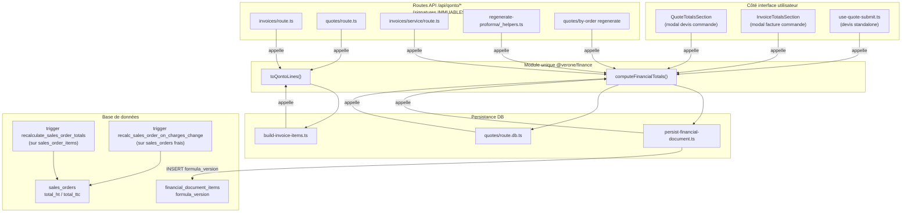

# Calcul des totaux financiers — Source de vérité unique

**Date** : 2026-05-06
**Sprint** : BO-FIN-046
**Statut** : Actif
**Public** : toute l'équipe (agents + Roméo)

---

## Le principe : 1 commande = 1 formule, partout pareil

Avant ce sprint, le calcul `quantité × prix × TVA + frais` existait dans 8 endroits différents avec des formules légèrement divergentes. Résultat : il pouvait y avoir quelques centimes d'écart entre ce qu'affichait le modal devis, ce qu'affichait le modal facture, ce qui était envoyé à Qonto, et ce qui était enregistré en base de données. C'est inacceptable.

La règle désormais : **un seul endroit calcule les totaux**, et tout le monde l'appelle.

---

## La formule canonique (round-per-line)

L'arrondi se fait **ligne par ligne**, pas sur le total. C'est ce que Qonto impose aussi.

```
Pour chaque article :
  lineHt  = ROUND(quantité × prix_ht × (1 − remise/100), 2)
  lineTtc = ROUND(quantité × prix_ht × (1 − remise/100) × (1 + tva), 2)

totalHt  = SUM(lineHt)
totalTtc = SUM(lineTtc)
         + ROUND(frais_livraison_ht × (1 + tva_frais), 2)
         + ROUND(frais_manutention_ht × (1 + tva_frais), 2)
         + ROUND(frais_assurance_ht × (1 + tva_frais), 2)
totalTva = totalTtc − totalHt
```

Règle absolue : `tax_rate` manquant (null/undefined) → erreur explicite. Jamais de fallback silencieux `?? 0.2`.

---

## Le module JS : source de vérité pour tout calcul côté application

**Emplacement** : `packages/@verone/finance/src/lib/finance-totals/`

**Ce qu'il fait** :

- Calcul preview UI (modals devis et facture)
- Construction du payload pour Qonto (`toQontoLines`)
- Calcul des totaux à persister en base (`financial_documents`, `financial_document_items`)

**Import** : `import { computeFinancialTotals } from '@verone/finance/lib/finance-totals'`

**Ce qu'il ne fait PAS** : recalculer en base côté serveur → c'est le rôle des triggers DB.

---

## Les triggers DB : second filet de sécurité

Deux triggers recalculent `sales_orders.total_ht`, `total_ttc`, `tva_amount` après toute modification :

| Trigger                                | Se déclenche quand                           |
| -------------------------------------- | -------------------------------------------- |
| `recalculate_sales_order_totals`       | INSERT/UPDATE/DELETE sur `sales_order_items` |
| `recalc_sales_order_on_charges_change` | UPDATE des frais sur `sales_orders`          |

Les deux utilisent la même formule round-per-line depuis la migration `20260506_bo_fin_046_align_recalc_so_totals_round_per_line.sql`.

---

## Le versionnement de formule

Chaque ligne `financial_document_items` a une colonne `formula_version TEXT NOT NULL DEFAULT 'round-per-line-v1'`.

Si la formule devait changer un jour (ex : nouveau taux DOM-TOM), on crée `round-per-line-v2` et on peut retrouver avec quelle formule chaque document a été calculé.

---

## Frontière de responsabilité



---

## Règle R8 (ajoutée à `.claude/rules/finance.md`)

> Toute fonction de calcul de totaux financiers DOIT importer `computeFinancialTotals` du module unique. Aucune duplication tolérée.

---

## Référence

- Sprint : `docs/scratchpad/dev-plan-2026-05-06-BO-FIN-046-tva-unique-coherence-totale.md`
- Module : `packages/@verone/finance/src/lib/finance-totals/`
- Règles métier : `.claude/rules/finance.md` R1 à R8
- Migration DB : `supabase/migrations/20260506*_bo_fin_046_*.sql`
