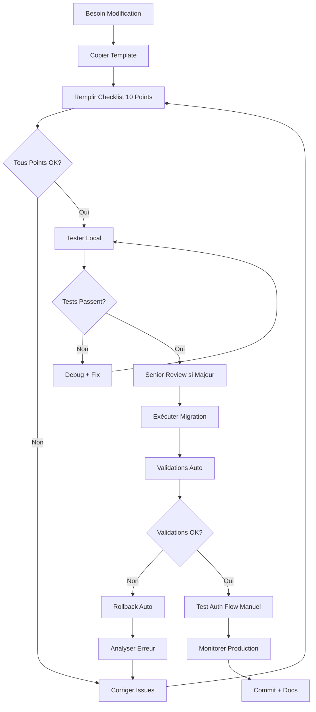

# 🔒 Protection Tables Critiques - Standards Vérone 2025

**Date création** : 2025-10-12
**Version** : 1.0
**Statut** : ✅ Standard officiel Vérone
**Framework** : Critical Table Protection 2025

---

## 🎯 OBJECTIF

Prévenir les modifications accidentelles des tables critiques qui casseraient l'authentification ou l'intégrité du système Vérone.

**Problème résolu** :

- ❌ Avant : Modification table → Auth cassé → Système DOWN → Panique
- ✅ Après : Documentation + Guards automatiques → Modifications sûres → Système stable

---

## 📋 TABLES CRITIQUES VÉRONE

### **Liste Officielle**

| Table                | Criticité       | Raison                                        | Owner        |
| -------------------- | --------------- | --------------------------------------------- | ------------ |
| **`user_profiles`**  | 🔴 CRITIQUE     | Lien direct auth.users - Breaking = Auth DOWN | Auth Team    |
| `auth.users`         | 🔴 **INTERDIT** | Géré par Supabase - NEVER MODIFY              | Supabase     |
| `auth.sessions`      | 🔴 **INTERDIT** | Géré par Supabase - NEVER MODIFY              | Supabase     |
| `organisations`      | 🟡 Important    | Relations utilisateurs - Futures              | Product Team |
| `suppliers`          | 🟡 Important    | Relations produits/commandes                  | Product Team |
| `financial_payments` | 🟡 Important    | Données comptables sensibles                  | Finance Team |

### **Règle Ajout Nouvelle Table Critique**

Quand marquer table comme CRITIQUE :

1. ✅ Table liée directement à `auth.users`
2. ✅ Table référencée dans RLS policies
3. ✅ Table utilisée dans auth middleware
4. ✅ Table contenant données sensibles (paiements, etc.)

**Process** :

1. Ajouter table à liste ci-dessus
2. Appliquer SQL comments (voir template)
3. Documenter dans cette page
4. Créer pattern Memory Bank si nouveau cas

---

## 🚨 RÈGLES ABSOLUES SUPABASE 2025

### **Règle #1 : JAMAIS Modifier Schéma `auth`**

**INTERDIT ABSOLU** :

```sql
❌ ALTER TABLE auth.users ...;
❌ DROP TABLE auth.sessions ...;
❌ CREATE TRIGGER ON auth.users ...;
❌ DISABLE ROW LEVEL SECURITY ON auth.users;
```

**Pourquoi** :

- Supabase gère automatiquement ce schéma
- Updates Supabase peuvent écraser modifications
- Modifications cassent auth system = App DOWN

**Si besoin données auth** :

```sql
✅ SELECT * FROM auth.users WHERE id = auth.uid();
✅ Lire seulement, jamais modifier
✅ Utiliser user_profiles pour données custom
```

**Source officielle** :
https://supabase.com/docs/guides/auth/managing-user-data

---

### **Règle #2 : Seulement Référencer auth.users(id)**

**BON** ✅ :

```sql
-- Primary key = garanti stable par Supabase
ALTER TABLE user_profiles
ADD CONSTRAINT user_profiles_id_fkey
FOREIGN KEY (id) REFERENCES auth.users(id) ON DELETE CASCADE;
```

**MAUVAIS** ❌ :

```sql
-- Autres colonnes peuvent changer lors updates Supabase
ALTER TABLE user_profiles
ADD CONSTRAINT fk_email
FOREIGN KEY (email) REFERENCES auth.users(email); -- ❌ email pas PK
```

**Colonnes auth.users SAFE** :

- ✅ `id` (UUID, primary key, GARANTI stable)

**Colonnes auth.users UNSAFE** :

- ❌ `email` (peut changer structure, index, format)
- ❌ `created_at` (peut être renommé, modifié)
- ❌ `raw_user_meta_data` (structure interne Supabase)
- ❌ Toute autre colonne non-PK

---

### **Règle #3 : Toujours ON DELETE CASCADE**

**BON** ✅ :

```sql
ALTER TABLE user_profiles
ADD CONSTRAINT user_profiles_id_fkey
FOREIGN KEY (id) REFERENCES auth.users(id)
ON DELETE CASCADE; -- ✅ Auto-delete profile si user supprimé
```

**MAUVAIS** ❌ :

```sql
ALTER TABLE user_profiles
ADD CONSTRAINT user_profiles_id_fkey
FOREIGN KEY (id) REFERENCES auth.users(id);
-- ❌ Manque ON DELETE CASCADE
-- → Suppression user échoue (violation FK)
-- → Orphan records dans user_profiles
```

**Pourquoi CASCADE** :

- User deleted → Profile doit être auto-supprimé
- Sans CASCADE → Violation contrainte → Erreur auth
- Intégrité données garantie

---

### **Règle #4 : SECURITY DEFINER pour Triggers Cross-Schema**

**BON** ✅ :

```sql
CREATE FUNCTION private.sync_user_metadata()
RETURNS TRIGGER
LANGUAGE plpgsql
SECURITY DEFINER -- ✅ REQUIS pour accès auth.users
SET search_path = public, auth
AS $$
BEGIN
  UPDATE auth.users
  SET raw_user_meta_data = ...
  WHERE id = NEW.id;
  RETURN NEW;
END;
$$;
```

**MAUVAIS** ❌ :

```sql
CREATE FUNCTION sync_user_metadata()
RETURNS TRIGGER
LANGUAGE plpgsql
-- ❌ Manque SECURITY DEFINER
AS $$
BEGIN
  UPDATE auth.users ...; -- ❌ ÉCHOUE: insufficient privileges
  RETURN NEW;
END;
$$;
```

**Pourquoi SECURITY DEFINER** :

- Fonction s'exécute avec privilèges créateur (pas appelant)
- Permet accès schéma `auth` depuis trigger `public`
- Sans definer → Trigger échoue → Auth flow cassé

---

### **Règle #5 : NEVER Disable RLS**

**INTERDIT ABSOLU** :

```sql
❌ ALTER TABLE user_profiles DISABLE ROW LEVEL SECURITY;
❌ DROP POLICY "users_can_view_profiles" ON user_profiles;
```

**Pourquoi** :

- RLS = Protection essentielle données utilisateurs
- Désactiver = Faille sécurité majeure
- Tous users peuvent voir/modifier toutes données

**Si problème performance RLS** :

```sql
✅ Optimiser policies (subqueries, indexes)
✅ Utiliser SECURITY DEFINER functions
✅ Créer indexes sur colonnes filtrées
❌ JAMAIS désactiver RLS
```

**Source officielle** :
https://supabase.com/docs/guides/database/postgres/row-level-security

---

## ✅ OPÉRATIONS SÛRES

### **1. Ajouter Colonne Optionnelle**

**Template** :

```sql
-- Colonne NULL = non-breaking
ALTER TABLE user_profiles
ADD COLUMN IF NOT EXISTS organisation_id UUID;

-- OU colonne avec default
ALTER TABLE user_profiles
ADD COLUMN IF NOT EXISTS status TEXT DEFAULT 'active';

-- Documentation
COMMENT ON COLUMN user_profiles.organisation_id IS
'Optional link to organisation

Type: UUID
Nullable: YES
Safe: Not used in auth flow

Added: 2025-10-12
Purpose: Multi-tenant support';
```

**Pourquoi safe** :

- NULL autorisé → Utilisateurs existants non affectés
- DEFAULT fourni → Nouveaux users ont valeur
- Pas de breaking change

---

### **2. Créer Index Performance**

**Template** :

```sql
-- Index complet
CREATE INDEX IF NOT EXISTS idx_user_profiles_organisation_id
ON user_profiles(organisation_id);

-- OU index partiel (plus efficient)
CREATE INDEX IF NOT EXISTS idx_user_profiles_organisation_id
ON user_profiles(organisation_id)
WHERE organisation_id IS NOT NULL;
```

**Pourquoi safe** :

- Index = optimisation pure, pas de logique
- Aucun impact fonctionnel
- Peut être droppé sans conséquence

---

### **3. Ajouter Contrainte CHECK Non-Breaking**

**Template** :

```sql
-- Pattern IS NULL OR ... = non-breaking
ALTER TABLE user_profiles
ADD CONSTRAINT check_phone_format CHECK (
  phone IS NULL OR
  phone ~ '^\+?[0-9]{10,15}$'
);
```

**Pourquoi safe** :

- `IS NULL OR ...` → Données existantes NULL passent
- Validation seulement si valeur fournie
- Pas de rejet données existantes

---

### **4. Créer Fonction Helper**

**Template** :

```sql
CREATE OR REPLACE FUNCTION get_user_full_name(user_record user_profiles)
RETURNS TEXT
LANGUAGE plpgsql
IMMUTABLE
AS $$
BEGIN
  RETURN TRIM(COALESCE(user_record.first_name, '') || ' ' || COALESCE(user_record.last_name, ''));
END;
$$;
```

**Pourquoi safe** :

- Fonction pure, pas d'effet de bord
- IMMUTABLE = optimisable par PostgreSQL
- Aucun impact données existantes

---

## ❌ OPÉRATIONS DANGEREUSES

### **1. ALTER COLUMN Type ou Nullability**

**DANGEREUX** ❌ :

```sql
-- Changer type
ALTER TABLE user_profiles
ALTER COLUMN phone TYPE INTEGER; -- ❌ Peut échouer données existantes

-- Enlever nullability
ALTER TABLE user_profiles
ALTER COLUMN phone SET NOT NULL; -- ❌ Échoue si phone NULL existe
```

**Si vraiment nécessaire** :

1. ✅ Audit complet code utilisant colonne
2. ✅ Migration données en 2 étapes :
   - Étape 1 : Ajouter nouvelle colonne
   - Étape 2 : Migrer données
   - Étape 3 : Supprimer ancienne (après validation)
3. ✅ Senior review + testing exhaustif
4. ✅ Rollback plan détaillé

---

### **2. DROP COLUMN**

**DANGEREUX** ❌ :

```sql
ALTER TABLE user_profiles
DROP COLUMN phone; -- ❌ Peut casser code frontend/backend
```

**Si vraiment nécessaire** :

1. ✅ Grep complet codebase pour `phone`
2. ✅ Vérifier RLS policies utilisant `phone`
3. ✅ Test parcours utilisateur complet
4. ✅ Déprécier d'abord (plusieurs releases)
5. ✅ Supprimer seulement après validation

---

### **3. Modifier Foreign Key auth.users**

**DANGEREUX** ❌ :

```sql
-- Supprimer FK
ALTER TABLE user_profiles
DROP CONSTRAINT user_profiles_id_fkey; -- ❌ Rompt lien auth

-- Modifier CASCADE behavior
ALTER TABLE user_profiles
DROP CONSTRAINT user_profiles_id_fkey,
ADD CONSTRAINT user_profiles_id_fkey
FOREIGN KEY (id) REFERENCES auth.users(id)
ON DELETE SET NULL; -- ❌ Crée orphan records
```

**JAMAIS FAIRE** sauf :

- Emergency absolue (système DOWN)
- Backup complet disponible
- Senior dev + CTO approval
- Rollback plan testé

---

### **4. Ajouter NOT NULL sans Default**

**DANGEREUX** ❌ :

```sql
ALTER TABLE user_profiles
ADD COLUMN organisation_id UUID NOT NULL; -- ❌ Bloque signup
```

**Pourquoi dangereux** :

- Nouveaux users → INSERT échoue (organisation_id manquant)
- Auth flow cassé → Impossible créer compte

**Solution** :

```sql
-- Option A : Nullable
ALTER TABLE user_profiles
ADD COLUMN organisation_id UUID; -- ✅ NULL autorisé

-- Option B : Default
ALTER TABLE user_profiles
ADD COLUMN organisation_id UUID DEFAULT uuid_generate_v4(); -- ✅ Default fourni
```

---

## 🔄 WORKFLOW MODIFICATION SÉCURISÉE

### **Process Standard (Toutes Modifications)**



---

### **Étape 1 : Copier Template**

```bash
cp supabase/migrations/_TEMPLATE_modify_critical_table.sql \
   supabase/migrations/20251012_002_add_organisation_link.sql
```

---

### **Étape 2 : Remplir Checklist**

Ouvrir : `TASKS/templates/CRITICAL-TABLE-MIGRATION-CHECKLIST.md`

Cocher TOUS les 10 points :

- [ ] 1. RLS restera activé
- [ ] 2. Pas modification FK auth.users
- [ ] 3. Nouvelles colonnes optionnelles
- [ ] 4. Aucun DROP COLUMN
- [ ] 5. CHECK constraints non-breaking
- [ ] 6. Triggers SECURITY DEFINER
- [ ] 7. Testé local
- [ ] 8. Rollback documenté
- [ ] 9. Pas référence non-PK auth.users
- [ ] 10. Senior review (si majeur)

**UN SEUL point manque** = ❌ STOP
**TOUS points validés** = ✅ Continue

---

### **Étape 3 : Tester Localement**

```bash
# Reset DB local
supabase db reset

# Appliquer migration
supabase migration up

# Tester auth flow
npm run dev
# → Login, Signup, Profile Edit, Logout

# Vérifier logs
supabase logs
# → Aucune erreur auth
```

---

### **Étape 4 : Exécuter Migration Production**

```bash
# Push migration
git add supabase/migrations/20251012_002_add_organisation_link.sql
git commit -m "🔧 DATABASE: Add organisation link to user_profiles"

# CI/CD auto-deploy OU manuel
supabase db push
```

**Validations automatiques s'exécutent** :

- ✅ Test 1/5 : RLS enabled
- ✅ Test 2/5 : Policies actives
- ✅ Test 3/5 : FK auth.users intact
- ✅ Test 4/5 : Primary key unchanged
- ✅ Test 5/5 : Table accessible

**Si UN test échoue** → Rollback auto + message erreur

---

### **Étape 5 : Post-Migration**

```bash
# Test auth flow manuel
# → Login, Signup, Profile Edit

# Monitorer Sentry (30min)
# → Aucune erreur auth

# Vérifier Supabase logs
# → Aucune erreur RLS

# Update docs si schéma changé
# → README, API docs, etc.
```

---

## 📚 EXEMPLES CONCRETS

### **Exemple 1 : Ajouter Lien Organisation (SAFE)**

**Besoin** : Lier utilisateurs à organisations pour multi-tenant

**Migration** :

```sql
-- user_profiles → organisations link
ALTER TABLE user_profiles
ADD COLUMN IF NOT EXISTS organisation_id UUID
REFERENCES organisations(id) ON DELETE SET NULL; -- SET NULL préserve user

COMMENT ON COLUMN user_profiles.organisation_id IS
'Optional link to organisation

Type: UUID
Nullable: YES
Foreign Key: organisations(id) ON DELETE SET NULL
Safe: Does NOT affect auth.users link

Added: 2025-10-12
Purpose: Multi-tenant support - Users can belong to organisation';

CREATE INDEX IF NOT EXISTS idx_user_profiles_organisation_id
ON user_profiles(organisation_id)
WHERE organisation_id IS NOT NULL;
```

**Checklist** :

- ✅ RLS enabled (pas touché)
- ✅ FK auth.users intact (pas modifié)
- ✅ Nouvelle colonne NULL (optionnel)
- ✅ Pas de DROP COLUMN
- ✅ Pas de CHECK constraint
- ✅ Pas de trigger
- ✅ Testé local (OK)
- ✅ Rollback : `DROP COLUMN organisation_id`
- ✅ Référence organisations(id), pas auth.users non-PK
- ✅ Modification mineure (pas senior review)

**Résultat** : ✅ SAFE - Déploiement OK

---

### **Exemple 2 : Changer Type Colonne (DANGEROUS)**

**Besoin** : Changer `phone` de TEXT à INTEGER

**Analyse** :

```sql
-- DANGEREUX ❌
ALTER TABLE user_profiles
ALTER COLUMN phone TYPE INTEGER USING phone::INTEGER;
-- ❌ Échoue si phone = '+33123...' (pas numeric)
-- ❌ Perd formatage international
-- ❌ Casse validations existantes
```

**Checklist** :

- ❌ Données existantes incompatibles
- ❌ Code frontend utilise format STRING
- ❌ RLS policies filtrent sur LIKE '%...'
- ❌ Pas de migration données 2-étapes

**Résultat** : ❌ REJECT - Ne pas faire

**Alternative SAFE** :

```sql
-- Ajouter nouvelle colonne
ALTER TABLE user_profiles
ADD COLUMN phone_numeric BIGINT;

-- Migrer données progressivement
-- Frontend utilise phone_numeric si présent, sinon phone

-- Supprimer phone TEXT seulement après validation complète (plusieurs releases)
```

---

### **Exemple 3 : Ajouter Trigger Sync Metadata (REQUIRES SECURITY DEFINER)**

**Besoin** : Sync nom complet vers auth.users.raw_user_meta_data

**Migration CORRECTE** :

```sql
CREATE OR REPLACE FUNCTION private.sync_user_full_name()
RETURNS TRIGGER
LANGUAGE plpgsql
SECURITY DEFINER -- ✅ REQUIS pour accès auth.users
SET search_path = public, auth
AS $$
BEGIN
  UPDATE auth.users
  SET raw_user_meta_data = COALESCE(raw_user_meta_data, '{}'::jsonb) || jsonb_build_object(
    'full_name', TRIM(COALESCE(NEW.first_name, '') || ' ' || COALESCE(NEW.last_name, '')),
    'updated_at', NOW()
  )
  WHERE id = NEW.id;

  RETURN NEW;
END;
$$;

CREATE TRIGGER on_user_profile_name_update
  AFTER UPDATE OF first_name, last_name ON user_profiles
  FOR EACH ROW
  WHEN (OLD.first_name IS DISTINCT FROM NEW.first_name OR OLD.last_name IS DISTINCT FROM NEW.last_name)
  EXECUTE FUNCTION private.sync_user_full_name();

COMMENT ON FUNCTION private.sync_user_full_name() IS
'Syncs user_profiles name changes to auth.users metadata

SECURITY DEFINER: Required to update auth.users from public schema
Safe: Only updates metadata, not critical auth fields (email, password, etc.)

Added: 2025-10-12
Purpose: Keep auth.users metadata in sync with profile changes';
```

**Checklist** :

- ✅ SECURITY DEFINER présent
- ✅ Fonction dans schéma `private` (sécurité)
- ✅ SET search_path défini
- ✅ Seulement metadata modifié (pas email/password)
- ✅ Testé local (sync fonctionne)
- ✅ Rollback : DROP TRIGGER + DROP FUNCTION

**Résultat** : ✅ SAFE avec SECURITY DEFINER

---

## 🔗 INTÉGRATIONS FUTURES

### **Organisations (En développement)**

Quand table `organisations` créée, protéger avec même framework :

```sql
COMMENT ON TABLE organisations IS
'🔒 CRITICAL TABLE - User Relationships

This table links to user_profiles via organisation_id.
Breaking this table affects multi-tenant functionality.

See: docs/engineering/standards/database/CRITICAL-TABLES-PROTECTION.md';
```

---

### **Suppliers (Futur)**

Quand table `suppliers` créée + liée à `user_profiles` :

```sql
ALTER TABLE user_profiles
ADD COLUMN supplier_id UUID
REFERENCES suppliers(id) ON DELETE SET NULL;
-- SET NULL préserve user_profiles si supplier supprimé
```

---

## 📖 RÉFÉRENCES

### **Documentation Supabase Officielle**

1. **Managing User Data** (MUST READ)
   https://supabase.com/docs/guides/auth/managing-user-data

2. **Row Level Security**
   https://supabase.com/docs/guides/database/postgres/row-level-security

3. **Database Migrations**
   https://supabase.com/docs/guides/cli/local-development#database-migrations

### **Documentation Vérone**

1. **Template Migration** : `supabase/migrations/_TEMPLATE_modify_critical_table.sql`
2. **Checklist Pré-Migration** : `TASKS/templates/CRITICAL-TABLE-MIGRATION-CHECKLIST.md`
3. **Pattern Réutilisable** : `MEMORY-BANK/patterns/critical-table-protection-pattern.md`

### **PostgreSQL Official Docs**

1. **Row Security Policies** : https://www.postgresql.org/docs/current/ddl-rowsecurity.html
2. **Explicit Locking** : https://www.postgresql.org/docs/current/explicit-locking.html
3. **Security Best Practices** : https://www.postgresql.org/docs/current/security.html

---

## ✅ RÉSUMÉ EXÉCUTIF

### **4 Best Practices 2025**

1. ✅ **SQL Comments Visibles**
   → Développeur voit danger immédiatement dans DB

2. ✅ **Templates avec Validations Auto**
   → Impossible d'oublier checks critiques

3. ✅ **Checklists Pré-Migration**
   → Process standard pour toute équipe

4. ✅ **Documentation Centralisée**
   → Onboarding nouveaux devs facile

### **Workflow Simple**

```
Modification nécessaire
↓
Copier template
↓
Remplir checklist 10 points
↓
Tester local
↓
Exécuter (validations auto)
↓
Monitorer production
↓
Commit + docs
```

### **Règle d'Or**

**Si doute → Demander senior dev AVANT modification**

**JAMAIS** :

- ❌ Modifier schéma `auth`
- ❌ Désactiver RLS
- ❌ Modifier FK auth.users
- ❌ DROP COLUMN sans audit

**TOUJOURS** :

- ✅ Utiliser template migration
- ✅ Remplir checklist complète
- ✅ Tester localement d'abord
- ✅ Documenter rollback plan

---

**Standard créé** : 2025-10-12
**Version** : 1.0
**Auteur** : Claude Code + Workflow 2025
**Maintainer** : Vérone Dev Team

_Protection Tables Critiques = Stabilité Système Garantie_ 🔒
