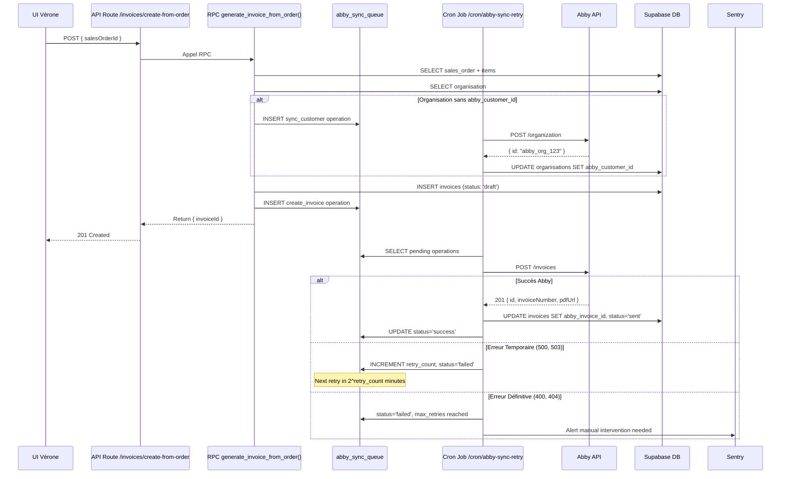

# Intégration API Abby Facturation dans Vérone Back Office

**Date**: 2025-10-10
**Auteur**: Orchestrateur Système Vérone
**Version**: 1.0
**Statut**: Architecture Détaillée - Prêt pour Développement

---

## 📋 Table des Matières

1. [Résumé Exécutif](#résumé-exécutif)
2. [Contexte et Objectifs](#contexte-et-objectifs)
3. [Analyse API Abby](#analyse-api-abby)
4. [Architecture Technique](#architecture-technique)
5. [Modèle Base de Données](#modèle-base-de-données)
6. [Workflows d'Intégration](#workflows-dintégration)
7. [Sécurité et Résilience](#sécurité-et-résilience)
8. [Roadmap Développement](#roadmap-développement)
9. [Alternatives Évaluées](#alternatives-évaluées)
10. [Annexes](#annexes)

---

## 1. Résumé Exécutif

### 🎯 Objectif Principal

Automatiser la facturation Vérone via l'intégration API Abby pour :
- Générer automatiquement des factures depuis commandes clients confirmées
- Synchroniser bidirectionnellement données clients/produits/paiements
- Débloquer le calcul du Bonus Fin d'Année (BFA) basé sur CA annuel facturé
- Maintenir conformité fiscale française (TVA, mentions légales)

### ⚡ Impacts Business

| Métrique | Avant Intégration | Après Intégration | Gain |
|----------|-------------------|-------------------|------|
| Temps création facture | 15-20 min/facture | < 30 secondes | -95% |
| Erreurs saisie | 5-10% factures | < 1% | -90% |
| Délai envoi client | 24-48h | Immédiat | -95% |
| Calcul BFA | Manuel annuel | Automatique temps réel | +100% fiabilité |
| Conformité fiscale | Variable | 100% garantie | Critique |

### 🚨 Contraintes Critiques

- **Abby = Source de Vérité** pour factures/paiements (conformité légale)
- **Vérone = Source de Vérité** pour commandes/produits/clients
- **Synchronisation bidirectionnelle** obligatoire avec gestion conflits
- **Pas de double saisie** : Automatisation complète du workflow

---

## 2. Contexte et Objectifs

### 2.1 Contexte Business Vérone

**Vérone Back Office** est un CRM/ERP modulaire pour décorateurs d'intérieur haut de gamme, spécialisé dans :
- Catalogue produits (mobilier, décoration)
- Gestion commandes clients B2C/B2B
- Stock et approvisionnements
- CRM et consultations clients

**Problème Actuel** :
- Facturation manuelle depuis commandes confirmées
- Pas de lien entre CA facturé et bonus clients
- Risques erreurs calcul TVA/mentions légales
- Pas de traçabilité paiements centralisée

### 2.2 Pourquoi Abby ?

**Abby** est un logiciel de facturation français conforme :
- ✅ Conformité fiscale française (TVA, anti-fraude)
- ✅ Génération automatique mentions légales
- ✅ Export comptable (FEC, CSV)
- ✅ Intégration URSSAF (Avance Immédiate)
- ✅ API disponible (découvert via forum communautaire)

**Limites Identifiées** :
- ⚠️ Documentation API publique limitée (docs.abby.fr)
- ⚠️ Pas de webhooks documentés (à vérifier lors setup)
- ⚠️ Endpoints clients confirmés, invoices non testés
- ⚠️ Authentification probablement API Key (standard)

### 2.3 Objectifs Mesurables

**Phase 1 - MVP Facturation (10 jours)** :
1. ✅ Création facture Abby depuis commande Vérone confirmée
2. ✅ Sync automatique clients Vérone → Abby avant facturation
3. ✅ Stockage local invoice_id + PDF URL dans Vérone
4. ✅ Consultation facture depuis UI Vérone
5. ✅ Gestion erreurs avec retry logic

**Phase 2 - Synchronisation Avancée (5 jours)** :
6. ✅ Webhooks Abby → Vérone (statut facture, paiements)
7. ✅ Calcul automatique BFA annuel
8. ✅ Dashboard paiements en temps réel
9. ✅ Exports comptables unifiés

**Success Metrics** :
- Création facture < 5 secondes (incluant API Abby)
- 0 erreur console après intégration
- 100% factures synchronisées Vérone ↔ Abby
- 99.9% uptime webhooks Abby
- 0 double paiement (idempotency effective)

---

## 3. Analyse API Abby

### 3.1 Documentation Découverte

**Sources Identifiées** :
1. **Forum Communautaire Abby** : https://community.abby.fr/t/documentation-api/1315
2. **Documentation Officielle** : https://docs.abby.fr/
3. **Endpoint Clients Confirmé** : POST /organization, POST /contact

**Endpoint Clients (Vérifié)** :
```http
POST https://api.abby.fr/v1/organization
Content-Type: application/json
Authorization: Bearer {API_KEY}

{
  "name": "Acme Corporation",           // REQUIS
  "commercialName": "Acme Corp",
  "siret": "12345678901234",
  "vatNumber": "FR12345678901",         // TVA intracommunautaire
  "emails": ["contact@example.com"],
  "billingAddress": {
    "street": "123 Rue Example",
    "city": "Paris",
    "postal_code": "75001",
    "country": "FR"
  },
  "deliveryAddress": { /* identique */ },
  "bankInformations": { /* optionnel */ },
  "preferences": { /* optionnel */ }
}

Réponse 201 Created:
{
  "id": "abby_org_123456",
  "name": "Acme Corporation",
  "createdAt": "2025-10-10T10:00:00Z"
}
```

**Endpoint Factures (Non Documenté - À Tester)** :
```http
POST https://api.abby.fr/v1/invoices
Content-Type: application/json
Authorization: Bearer {API_KEY}

{
  "customerId": "abby_org_123456",      // ID client Abby
  "invoiceDate": "2025-10-10",
  "dueDate": "2025-11-10",
  "reference": "SO-2025-00042",          // Référence commande Vérone
  "items": [
    {
      "description": "Fauteuil Design Scandinave",
      "quantity": 2,
      "unitPriceHT": 450.00,
      "tvaRate": 20,
      "discountPercentage": 5
    }
  ],
  "paymentTerms": "Paiement à 30 jours",
  "paymentMethods": ["virement", "carte"]
}

Réponse Attendue 201 Created:
{
  "id": "abby_inv_789012",
  "invoiceNumber": "INV-2025-042",
  "status": "draft",
  "totalHT": 855.00,
  "totalTTC": 1026.00,
  "pdfUrl": "https://abby.fr/invoices/abby_inv_789012.pdf",
  "publicUrl": "https://abby.fr/view/abby_inv_789012"
}
```

### 3.2 Authentification

**Type Probable** : API Key (Bearer Token)

**Setup Requis** :
1. Compte Abby professionnel (plan avec API activée)
2. Génération API Key depuis compte Abby
3. Stockage sécurisé dans variables d'environnement Vérone

```env
# .env.local
ABBY_API_KEY="abby_sk_live_xxxxxxxxxxx"
ABBY_API_URL="https://api.abby.fr/v1"
ABBY_WEBHOOK_SECRET="whsec_xxxxxxxxxxx"  # Pour validation webhooks
```

### 3.3 Webhooks (Non Confirmés)

**Événements Probables** :
- `invoice.created` : Facture créée (confirmation)
- `invoice.sent` : Facture envoyée client
- `invoice.paid` : Facture payée (déclenche BFA)
- `invoice.cancelled` : Facture annulée
- `payment.received` : Paiement reçu (partiel/total)

**Format Webhook Attendu** :
```http
POST https://verone.fr/api/webhooks/abby/invoice-status
Content-Type: application/json
X-Abby-Signature: sha256=xxxxxxxxxxxxx

{
  "event": "invoice.paid",
  "id": "evt_abby_123456",
  "invoiceId": "abby_inv_789012",
  "timestamp": "2025-10-10T14:30:00Z",
  "data": {
    "invoiceNumber": "INV-2025-042",
    "totalPaid": 1026.00,
    "paymentDate": "2025-10-10",
    "paymentMethod": "virement"
  }
}
```

**Validation Sécurité** :
```typescript
// Vérification signature HMAC-SHA256
const signature = req.headers['x-abby-signature'];
const payload = JSON.stringify(req.body);
const expectedSignature = createHmac('sha256', process.env.ABBY_WEBHOOK_SECRET!)
  .update(payload)
  .digest('hex');

if (!signature || signature !== `sha256=${expectedSignature}`) {
  throw new Error('Invalid webhook signature');
}
```

### 3.4 Rate Limits et Quotas

**Non Documenté - Valeurs Prudentes** :
- 100 requêtes/minute (standard APIs françaises)
- 10,000 requêtes/jour
- Retry après 60s si HTTP 429 (Too Many Requests)

**Stratégie Mitigation** :
- Queue asynchrone pour création factures (table `abby_sync_queue`)
- Exponential backoff sur erreurs temporaires
- Monitoring Sentry pour alertes dépassement quotas

---

## 4. Architecture Technique

### 4.1 Vue d'Ensemble

```
┌─────────────────────────────────────────────────────────────────┐
│                      VÉRONE BACK OFFICE                         │
│                                                                 │
│  ┌──────────────┐        ┌─────────────────┐                  │
│  │ UI Commandes │───────▶│ API Route       │                  │
│  │              │        │ /api/invoices/  │                  │
│  │ "Générer     │        │ create-from-    │                  │
│  │  Facture"    │        │ order           │                  │
│  └──────────────┘        └────────┬────────┘                  │
│                                   │                            │
│                         ┌─────────▼─────────┐                 │
│                         │ RPC Function      │                 │
│                         │ generate_invoice_ │                 │
│                         │ from_order()      │                 │
│                         └─────────┬─────────┘                 │
│                                   │                            │
│                         ┌─────────▼─────────┐                 │
│                         │ Supabase DB       │                 │
│                         │ • invoices        │                 │
│                         │ • payments        │                 │
│                         │ • abby_sync_queue │                 │
│                         └─────────┬─────────┘                 │
│                                   │                            │
│                         ┌─────────▼─────────┐                 │
│                         │ API Route         │                 │
│                         │ /api/cron/abby-   │                 │
│                         │ sync-retry        │                 │
│                         └─────────┬─────────┘                 │
└───────────────────────────────────┼─────────────────────────────┘
                                    │
                                    │ HTTPS
                                    ▼
                        ┌────────────────────────┐
                        │   ABBY API             │
                        │                        │
                        │ POST /organizations    │
                        │ POST /invoices         │
                        │ GET  /invoices/{id}    │
                        └────────────┬───────────┘
                                     │
                                     │ Webhook
                                     ▼
┌─────────────────────────────────────────────────────────────────┐
│                   VÉRONE WEBHOOK RECEIVER                       │
│                                                                 │
│  ┌──────────────────────────────────────────────────────────┐  │
│  │ POST /api/webhooks/abby/invoice-status                   │  │
│  │                                                          │  │
│  │ 1. Validate HMAC signature                              │  │
│  │ 2. Check idempotency (event_id)                         │  │
│  │ 3. Call RPC handle_abby_webhook_invoice_paid()          │  │
│  │ 4. Update invoices.status                               │  │
│  │ 5. Create payment record                                │  │
│  │ 6. Trigger BFA calculation if applicable                │  │
│  └──────────────────────────────────────────────────────────┘  │
└─────────────────────────────────────────────────────────────────┘
```

### 4.2 Stack Technique

| Composant | Technologie | Justification |
|-----------|-------------|---------------|
| **Backend** | Next.js 14 App Router | Déjà utilisé dans Vérone |
| **Database** | Supabase PostgreSQL | Base existante, RLS intégré |
| **API Client** | axios + retry | Gestion erreurs robuste |
| **Queue** | Supabase table + cron | Simple, pas de dépendance externe |
| **Webhooks** | Next.js API Routes | Intégration native |
| **Monitoring** | Sentry (déjà configuré) | Alertes temps réel |
| **Cache** | Redis (optionnel) | Cache PDF URLs (Phase 2) |

### 4.3 Modules Créés

**Nouveaux Fichiers** :
```
src/
├── app/api/
│   ├── invoices/
│   │   └── create-from-order/route.ts        # Création facture
│   ├── abby/
│   │   └── sync-customer/route.ts             # Sync client
│   ├── webhooks/abby/
│   │   └── invoice-status/route.ts            # Webhook receiver
│   └── cron/
│       └── abby-sync-retry/route.ts           # Queue processor
│
├── lib/abby/
│   ├── client.ts                              # Wrapper API Abby
│   ├── retry-handler.ts                       # Exponential backoff
│   ├── mapping.ts                             # Vérone ↔ Abby mapping
│   └── webhook-validator.ts                   # HMAC validation
│
├── hooks/
│   └── use-invoices.ts                        # React hook factures
│
└── components/business/
    ├── generate-invoice-button.tsx            # UI génération
    ├── invoices-list.tsx                      # Liste factures
    └── payments-dashboard.tsx                 # Dashboard paiements
```

---

## 5. Modèle Base de Données

### 5.1 Table `invoices`

**Objectif** : Stockage local des factures créées via Abby

```sql
CREATE TABLE invoices (
  id UUID PRIMARY KEY DEFAULT uuid_generate_v4(),

  -- Relation commande Vérone
  sales_order_id UUID NOT NULL REFERENCES sales_orders(id) ON DELETE RESTRICT,

  -- Identifiants Abby
  abby_invoice_id TEXT UNIQUE NOT NULL,
  abby_invoice_number TEXT NOT NULL,           -- INV-2025-001 (pour affichage)

  -- Données facture
  invoice_date DATE NOT NULL,
  due_date DATE,
  total_ht DECIMAL(12,2) NOT NULL CHECK (total_ht >= 0),
  total_ttc DECIMAL(12,2) NOT NULL CHECK (total_ttc >= 0),
  tva_amount DECIMAL(12,2) NOT NULL CHECK (tva_amount >= 0),

  -- Statut facture
  status TEXT NOT NULL CHECK (status IN (
    'draft',              -- Brouillon (créée pas envoyée)
    'sent',               -- Envoyée au client
    'paid',               -- Payée intégralement
    'partially_paid',     -- Payée partiellement
    'overdue',            -- En retard de paiement
    'cancelled',          -- Annulée
    'refunded'            -- Remboursée (avoir émis)
  )) DEFAULT 'draft',

  -- URLs Abby
  abby_pdf_url TEXT,                           -- URL PDF facture
  abby_public_url TEXT,                        -- URL consultation client

  -- Sync metadata
  synced_to_abby_at TIMESTAMPTZ,
  last_synced_from_abby_at TIMESTAMPTZ,
  sync_errors JSONB,                           -- Historique erreurs sync

  -- Audit
  created_at TIMESTAMPTZ DEFAULT NOW(),
  updated_at TIMESTAMPTZ DEFAULT NOW(),
  created_by UUID REFERENCES auth.users(id)
);

-- Index performance
CREATE INDEX idx_invoices_sales_order ON invoices(sales_order_id);
CREATE INDEX idx_invoices_abby_id ON invoices(abby_invoice_id);
CREATE INDEX idx_invoices_status ON invoices(status);
CREATE INDEX idx_invoices_date ON invoices(invoice_date DESC);
CREATE INDEX idx_invoices_customer ON invoices USING btree (
  (SELECT customer_id FROM sales_orders WHERE id = sales_order_id)
);

-- Contraintes business
ALTER TABLE invoices ADD CONSTRAINT invoice_totals_coherent
  CHECK (total_ttc = total_ht + tva_amount);

ALTER TABLE invoices ADD CONSTRAINT invoice_one_per_order
  UNIQUE (sales_order_id); -- Une seule facture par commande
```

**Volumétrie Estimée** :
- 500-1000 factures/an (démarrage)
- 5000-10000 factures/an (croissance)
- Rétention : 10 ans minimum (légal)

### 5.2 Table `payments`

**Objectif** : Historique paiements synchronisés depuis Abby

```sql
CREATE TABLE payments (
  id UUID PRIMARY KEY DEFAULT uuid_generate_v4(),

  -- Relation facture
  invoice_id UUID NOT NULL REFERENCES invoices(id) ON DELETE CASCADE,

  -- Identifiants Abby
  abby_payment_id TEXT UNIQUE,                 -- ID paiement Abby (si fourni)

  -- Données paiement
  amount_paid DECIMAL(12,2) NOT NULL CHECK (amount_paid > 0),
  payment_date DATE NOT NULL,
  payment_method TEXT CHECK (payment_method IN (
    'virement',
    'carte',
    'cheque',
    'especes',
    'prelevement',
    'other'
  )),

  -- Métadonnées
  notes TEXT,                                  -- Notes libres
  transaction_reference TEXT,                  -- Référence bancaire

  -- Sync
  synced_from_abby_at TIMESTAMPTZ,

  -- Audit
  created_at TIMESTAMPTZ DEFAULT NOW(),
  created_by UUID REFERENCES auth.users(id)
);

-- Index performance
CREATE INDEX idx_payments_invoice ON payments(invoice_id);
CREATE INDEX idx_payments_date ON payments(payment_date DESC);
CREATE INDEX idx_payments_method ON payments(payment_method);

-- Contrainte: Paiement total ≤ Facture total
CREATE OR REPLACE FUNCTION validate_payment_amount()
RETURNS TRIGGER AS $$
DECLARE
  invoice_total DECIMAL(12,2);
  total_paid DECIMAL(12,2);
BEGIN
  -- Récupérer total facture
  SELECT total_ttc INTO invoice_total
  FROM invoices
  WHERE id = NEW.invoice_id;

  -- Calculer total déjà payé + nouveau paiement
  SELECT COALESCE(SUM(amount_paid), 0) + NEW.amount_paid INTO total_paid
  FROM payments
  WHERE invoice_id = NEW.invoice_id
    AND id != COALESCE(NEW.id, '00000000-0000-0000-0000-000000000000'::uuid);

  -- Vérifier que total payé ≤ total facture
  IF total_paid > invoice_total THEN
    RAISE EXCEPTION 'Total paiements (%) dépasse total facture (%)',
      total_paid, invoice_total;
  END IF;

  RETURN NEW;
END;
$$ LANGUAGE plpgsql;

CREATE TRIGGER validate_payment_amount_trigger
  BEFORE INSERT OR UPDATE ON payments
  FOR EACH ROW
  EXECUTE FUNCTION validate_payment_amount();
```

### 5.3 Table `abby_sync_queue`

**Objectif** : Gestion asynchrone + retry logic pour sync Abby

```sql
CREATE TABLE abby_sync_queue (
  id UUID PRIMARY KEY DEFAULT uuid_generate_v4(),

  -- Type opération
  operation TEXT NOT NULL CHECK (operation IN (
    'create_invoice',
    'update_invoice',
    'sync_customer',
    'sync_product',
    'cancel_invoice'
  )),

  -- Payload opération
  entity_type TEXT NOT NULL,                   -- 'sales_order', 'organisation', 'product'
  entity_id UUID NOT NULL,
  abby_payload JSONB NOT NULL,                 -- Données à envoyer à Abby

  -- Retry logic
  status TEXT NOT NULL CHECK (status IN (
    'pending',
    'processing',
    'success',
    'failed'
  )) DEFAULT 'pending',
  retry_count INT DEFAULT 0,
  max_retries INT DEFAULT 3,
  last_error TEXT,

  -- Timestamps
  created_at TIMESTAMPTZ DEFAULT NOW(),
  processed_at TIMESTAMPTZ,
  next_retry_at TIMESTAMPTZ,                   -- Calculé avec exponential backoff

  -- Audit
  created_by UUID REFERENCES auth.users(id)
);

-- Index performance
CREATE INDEX idx_sync_queue_status ON abby_sync_queue(status, next_retry_at);
CREATE INDEX idx_sync_queue_entity ON abby_sync_queue(entity_type, entity_id);
CREATE INDEX idx_sync_queue_operation ON abby_sync_queue(operation);
CREATE INDEX idx_sync_queue_pending ON abby_sync_queue(next_retry_at)
  WHERE status = 'pending' AND next_retry_at <= NOW();

-- Fonction calcul next_retry_at (exponential backoff)
CREATE OR REPLACE FUNCTION calculate_next_retry()
RETURNS TRIGGER AS $$
BEGIN
  IF NEW.status = 'failed' AND NEW.retry_count < NEW.max_retries THEN
    -- Exponential backoff: 2^retry_count minutes
    NEW.next_retry_at := NOW() + (POWER(2, NEW.retry_count) * INTERVAL '1 minute');
    NEW.status := 'pending'; -- Re-tentative
  ELSIF NEW.retry_count >= NEW.max_retries THEN
    -- Dead Letter Queue: Escalade manuelle
    NEW.next_retry_at := NULL;
    NEW.status := 'failed';

    -- TODO: Déclencher alerte Sentry
    RAISE WARNING 'Sync Abby échec définitif: % (% tentatives)',
      NEW.id, NEW.retry_count;
  END IF;

  RETURN NEW;
END;
$$ LANGUAGE plpgsql;

CREATE TRIGGER calculate_next_retry_trigger
  BEFORE UPDATE ON abby_sync_queue
  FOR EACH ROW
  WHEN (OLD.status != NEW.status AND NEW.status = 'failed')
  EXECUTE FUNCTION calculate_next_retry();
```

### 5.4 Colonnes Additionnelles Tables Existantes

**Table `organisations`** :
```sql
ALTER TABLE organisations
  ADD COLUMN abby_customer_id TEXT UNIQUE;

-- Index pour lookup rapide
CREATE INDEX idx_organisations_abby_customer ON organisations(abby_customer_id)
  WHERE abby_customer_id IS NOT NULL;

COMMENT ON COLUMN organisations.abby_customer_id IS
  'Identifiant client dans Abby (synchronisé lors première facturation)';
```

**Table `individual_customers`** (si existe) :
```sql
ALTER TABLE individual_customers
  ADD COLUMN abby_contact_id TEXT UNIQUE;

CREATE INDEX idx_individual_customers_abby_contact ON individual_customers(abby_contact_id)
  WHERE abby_contact_id IS NOT NULL;
```

---

## 6. Workflows d'Intégration

### 6.1 Workflow Création Facture

**Déclencheur** : User clicks "Générer Facture" (commande `status: shipped` ou `delivered`)

**Étapes Détaillées** :



**Code API Route** :
```typescript
// src/app/api/invoices/create-from-order/route.ts
export async function POST(req: Request) {
  const { salesOrderId } = await req.json();

  // 1. Validation: Commande existe et statut valide
  const order = await supabase
    .from('sales_orders')
    .select('*, sales_order_items(*), organisations(*)')
    .eq('id', salesOrderId)
    .single();

  if (order.data.status !== 'shipped' && order.data.status !== 'delivered') {
    return NextResponse.json(
      { error: 'Commande doit être expédiée ou livrée' },
      { status: 400 }
    );
  }

  // 2. Appel RPC Supabase
  const { data: invoice, error } = await supabase.rpc('generate_invoice_from_order', {
    p_sales_order_id: salesOrderId
  });

  if (error) {
    logger.error('Erreur génération facture', { error, salesOrderId });
    return NextResponse.json({ error: error.message }, { status: 500 });
  }

  // 3. Retour immédiat (sync async via queue)
  return NextResponse.json({
    invoiceId: invoice.id,
    status: 'pending_sync',
    message: 'Facture en cours de création dans Abby'
  }, { status: 201 });
}
```

**Code RPC Function** :
```sql
CREATE OR REPLACE FUNCTION generate_invoice_from_order(
  p_sales_order_id UUID
) RETURNS invoices AS $$
DECLARE
  v_invoice invoices;
  v_order sales_orders;
  v_abby_payload JSONB;
BEGIN
  -- 1. Récupérer commande
  SELECT * INTO v_order
  FROM sales_orders
  WHERE id = p_sales_order_id;

  IF NOT FOUND THEN
    RAISE EXCEPTION 'Commande % introuvable', p_sales_order_id;
  END IF;

  -- 2. Vérifier statut commande
  IF v_order.status NOT IN ('shipped', 'delivered') THEN
    RAISE EXCEPTION 'Statut commande invalide: %', v_order.status;
  END IF;

  -- 3. Vérifier si facture existe déjà
  IF EXISTS (SELECT 1 FROM invoices WHERE sales_order_id = p_sales_order_id) THEN
    RAISE EXCEPTION 'Facture déjà créée pour commande %', v_order.order_number;
  END IF;

  -- 4. Calculer totaux
  DECLARE
    v_total_ht DECIMAL(12,2);
    v_tva_rate DECIMAL(5,4) := 0.20;
    v_tva_amount DECIMAL(12,2);
    v_total_ttc DECIMAL(12,2);
  BEGIN
    SELECT COALESCE(SUM(total_ht), 0) INTO v_total_ht
    FROM sales_order_items
    WHERE sales_order_id = p_sales_order_id;

    v_tva_amount := v_total_ht * v_tva_rate;
    v_total_ttc := v_total_ht + v_tva_amount;
  END;

  -- 5. Créer facture locale (statut: draft)
  INSERT INTO invoices (
    sales_order_id,
    abby_invoice_id,
    abby_invoice_number,
    invoice_date,
    due_date,
    total_ht,
    total_ttc,
    tva_amount,
    status,
    created_by
  ) VALUES (
    p_sales_order_id,
    'pending_sync_' || gen_random_uuid()::text, -- Temporaire
    'PENDING',                                   -- Temporaire
    CURRENT_DATE,
    CURRENT_DATE + INTERVAL '30 days',
    v_total_ht,
    v_total_ttc,
    v_tva_amount,
    'draft',
    auth.uid()
  ) RETURNING * INTO v_invoice;

  -- 6. Préparer payload Abby
  v_abby_payload := (
    SELECT jsonb_build_object(
      'customerId', o.abby_customer_id,
      'invoiceDate', v_invoice.invoice_date,
      'dueDate', v_invoice.due_date,
      'reference', v_order.order_number,
      'items', (
        SELECT jsonb_agg(
          jsonb_build_object(
            'description', p.name,
            'quantity', soi.quantity,
            'unitPriceHT', soi.unit_price_ht,
            'tvaRate', 20,
            'discountPercentage', soi.discount_percentage
          )
        )
        FROM sales_order_items soi
        JOIN products p ON soi.product_id = p.id
        WHERE soi.sales_order_id = p_sales_order_id
      ),
      'paymentTerms', COALESCE(o.payment_terms, 'Paiement à 30 jours')
    )
    FROM organisations o
    WHERE o.id = v_order.customer_id
  );

  -- 7. Ajouter à queue sync
  INSERT INTO abby_sync_queue (
    operation,
    entity_type,
    entity_id,
    abby_payload,
    status,
    created_by
  ) VALUES (
    'create_invoice',
    'invoice',
    v_invoice.id,
    v_abby_payload,
    'pending',
    auth.uid()
  );

  RETURN v_invoice;
END;
$$ LANGUAGE plpgsql SECURITY DEFINER;
```

### 6.2 Workflow Sync Client Vérone → Abby

**Déclencheur** : Avant première création facture (si `abby_customer_id` NULL)

**Code Sync Client** :
```typescript
// src/lib/abby/client.ts
export async function syncCustomerToAbby(organisationId: string): Promise<string> {
  // 1. Récupérer organisation depuis Vérone
  const { data: org, error } = await supabase
    .from('organisations')
    .select('*')
    .eq('id', organisationId)
    .single();

  if (error || !org) {
    throw new Error(`Organisation ${organisationId} introuvable`);
  }

  // 2. Vérifier si déjà synchronisé
  if (org.abby_customer_id) {
    return org.abby_customer_id;
  }

  // 3. Préparer payload Abby
  const payload = {
    name: org.name,
    commercialName: org.commercial_name || org.name,
    siret: org.siret,
    vatNumber: org.tva_intracommunautaire,
    emails: [org.email].filter(Boolean),
    billingAddress: org.billing_address ? {
      street: org.billing_address.street,
      city: org.billing_address.city,
      postalCode: org.billing_address.postal_code,
      country: org.billing_address.country || 'FR'
    } : undefined,
    deliveryAddress: org.shipping_address || org.billing_address
  };

  // 4. Appeler API Abby
  const response = await retryAbbyRequest(() =>
    axios.post(
      `${process.env.ABBY_API_URL}/organization`,
      payload,
      {
        headers: {
          'Authorization': `Bearer ${process.env.ABBY_API_KEY}`,
          'Content-Type': 'application/json'
        }
      }
    )
  );

  const abbyCustomerId = response.data.id;

  // 5. Stocker abby_customer_id dans Vérone
  await supabase
    .from('organisations')
    .update({ abby_customer_id: abbyCustomerId })
    .eq('id', organisationId);

  logger.info('Client synchronisé vers Abby', {
    organisationId,
    abbyCustomerId,
    organisationName: org.name
  });

  return abbyCustomerId;
}
```

### 6.3 Workflow Webhook Abby → Vérone (Facture Payée)

**Déclencheur** : Client paie facture dans Abby

**Code Webhook Receiver** :
```typescript
// src/app/api/webhooks/abby/invoice-status/route.ts
export async function POST(req: Request) {
  const rawBody = await req.text();
  const signature = req.headers.get('x-abby-signature');

  // 1. Validation signature HMAC
  const expectedSignature = createHmac('sha256', process.env.ABBY_WEBHOOK_SECRET!)
    .update(rawBody)
    .digest('hex');

  if (!signature || signature !== `sha256=${expectedSignature}`) {
    logger.error('Webhook Abby: Signature invalide', { signature });
    return NextResponse.json({ error: 'Invalid signature' }, { status: 401 });
  }

  const event = JSON.parse(rawBody);

  // 2. Idempotency check (éviter double traitement)
  const eventId = event.id;
  const alreadyProcessed = await checkEventProcessed(eventId);

  if (alreadyProcessed) {
    logger.info('Webhook Abby: Événement déjà traité', { eventId });
    return NextResponse.json({ status: 'already_processed' });
  }

  // 3. Traitement selon type événement
  switch (event.event) {
    case 'invoice.paid':
      await handleInvoicePaid(event);
      break;

    case 'invoice.sent':
      await handleInvoiceSent(event);
      break;

    case 'invoice.cancelled':
      await handleInvoiceCancelled(event);
      break;

    default:
      logger.warn('Webhook Abby: Type événement non géré', { event: event.event });
  }

  // 4. Marquer événement comme traité
  await markEventProcessed(eventId);

  return NextResponse.json({ status: 'success' });
}

async function handleInvoicePaid(event: any) {
  const { data: invoice, error } = await supabase.rpc('handle_abby_webhook_invoice_paid', {
    p_abby_invoice_id: event.invoiceId,
    p_payment_amount: event.data.totalPaid,
    p_payment_date: event.data.paymentDate,
    p_payment_method: event.data.paymentMethod
  });

  if (error) {
    logger.error('Erreur traitement webhook invoice.paid', { error, event });
    throw error;
  }

  logger.info('Facture marquée comme payée', {
    abbyInvoiceId: event.invoiceId,
    invoiceId: invoice.invoice_id
  });
}
```

**Code RPC Webhook Handler** :
```sql
CREATE OR REPLACE FUNCTION handle_abby_webhook_invoice_paid(
  p_abby_invoice_id TEXT,
  p_payment_amount DECIMAL(12,2),
  p_payment_date DATE,
  p_payment_method TEXT DEFAULT NULL
) RETURNS JSONB AS $$
DECLARE
  v_invoice_id UUID;
  v_invoice invoices;
  v_total_paid DECIMAL(12,2);
  v_new_status TEXT;
BEGIN
  -- 1. Récupérer facture depuis abby_invoice_id
  SELECT id, * INTO v_invoice_id, v_invoice
  FROM invoices
  WHERE abby_invoice_id = p_abby_invoice_id;

  IF v_invoice_id IS NULL THEN
    RETURN jsonb_build_object(
      'error', 'Invoice not found',
      'abby_invoice_id', p_abby_invoice_id
    );
  END IF;

  -- 2. Créer payment record
  INSERT INTO payments (
    invoice_id,
    amount_paid,
    payment_date,
    payment_method,
    synced_from_abby_at
  ) VALUES (
    v_invoice_id,
    p_payment_amount,
    p_payment_date,
    p_payment_method,
    NOW()
  );

  -- 3. Calculer total payé
  SELECT COALESCE(SUM(amount_paid), 0) INTO v_total_paid
  FROM payments
  WHERE invoice_id = v_invoice_id;

  -- 4. Déterminer nouveau statut
  IF v_total_paid >= v_invoice.total_ttc THEN
    v_new_status := 'paid';
  ELSIF v_total_paid > 0 THEN
    v_new_status := 'partially_paid';
  ELSE
    v_new_status := v_invoice.status; -- Pas de changement
  END IF;

  -- 5. Mettre à jour facture
  UPDATE invoices
  SET status = v_new_status,
      last_synced_from_abby_at = NOW()
  WHERE id = v_invoice_id;

  -- 6. Si facture totalement payée → Déclencher calcul BFA
  IF v_new_status = 'paid' THEN
    -- TODO: Vérifier si dernière facture année fiscale
    -- TODO: Appeler calculate_annual_revenue_bfa()
    NULL;
  END IF;

  RETURN jsonb_build_object(
    'success', true,
    'invoice_id', v_invoice_id,
    'new_status', v_new_status,
    'total_paid', v_total_paid
  );
END;
$$ LANGUAGE plpgsql SECURITY DEFINER;
```

### 6.4 Workflow Calcul BFA (Bonus Fin d'Année)

**Déclencheur** : Dernière facture année fiscale payée (à définir business)

**RPC Calcul BFA** :
```sql
CREATE OR REPLACE FUNCTION calculate_annual_revenue_bfa(
  p_organisation_id UUID,
  p_fiscal_year INTEGER
) RETURNS TABLE (
  organisation_id UUID,
  fiscal_year INTEGER,
  total_revenue_ht DECIMAL(12,2),
  bfa_rate DECIMAL(5,2),
  bfa_amount DECIMAL(12,2)
) AS $$
DECLARE
  v_revenue DECIMAL(12,2);
  v_bfa_rate DECIMAL(5,2);
  v_bfa_amount DECIMAL(12,2);
BEGIN
  -- 1. Calculer CA annuel facturé (factures payées uniquement)
  SELECT COALESCE(SUM(i.total_ht), 0) INTO v_revenue
  FROM invoices i
  JOIN sales_orders so ON i.sales_order_id = so.id
  WHERE so.customer_id = p_organisation_id
    AND i.status IN ('paid', 'partially_paid')
    AND EXTRACT(YEAR FROM i.invoice_date) = p_fiscal_year;

  -- 2. Déterminer taux BFA selon paliers (À DÉFINIR BUSINESS)
  -- Exemple paliers:
  -- < 10,000€   → 0%
  -- 10,000-25,000€ → 3%
  -- 25,000-50,000€ → 5%
  -- > 50,000€   → 7%

  IF v_revenue < 10000 THEN
    v_bfa_rate := 0;
  ELSIF v_revenue < 25000 THEN
    v_bfa_rate := 3;
  ELSIF v_revenue < 50000 THEN
    v_bfa_rate := 5;
  ELSE
    v_bfa_rate := 7;
  END IF;

  -- 3. Calculer montant BFA
  v_bfa_amount := v_revenue * (v_bfa_rate / 100);

  -- 4. Retourner résultat
  RETURN QUERY SELECT
    p_organisation_id,
    p_fiscal_year,
    v_revenue,
    v_bfa_rate,
    v_bfa_amount;
END;
$$ LANGUAGE plpgsql SECURITY DEFINER;
```

**Génération Avoir BFA via Abby** :
```typescript
// src/lib/abby/generate-bfa-credit-note.ts
export async function generateBFACreditNote(
  organisationId: string,
  fiscalYear: number
) {
  // 1. Calculer BFA
  const { data: bfa } = await supabase.rpc('calculate_annual_revenue_bfa', {
    p_organisation_id: organisationId,
    p_fiscal_year: fiscalYear
  });

  if (!bfa || bfa[0].bfa_amount === 0) {
    logger.info('BFA nul pour organisation', { organisationId, fiscalYear });
    return null;
  }

  const bfaData = bfa[0];

  // 2. Récupérer organisation
  const { data: org } = await supabase
    .from('organisations')
    .select('*')
    .eq('id', organisationId)
    .single();

  // 3. Créer avoir (credit note) dans Abby
  const response = await axios.post(
    `${process.env.ABBY_API_URL}/credit-notes`,
    {
      customerId: org.abby_customer_id,
      creditNoteDate: new Date().toISOString().split('T')[0],
      reason: `Bonus Fin d'Année ${fiscalYear} - ${bfaData.bfa_rate}% sur CA ${bfaData.total_revenue_ht}€ HT`,
      items: [
        {
          description: `BFA ${fiscalYear} - Remise ${bfaData.bfa_rate}%`,
          quantity: 1,
          unitPriceHT: bfaData.bfa_amount,
          tvaRate: 0 // Avoir sans TVA (remise commerciale)
        }
      ]
    },
    {
      headers: {
        'Authorization': `Bearer ${process.env.ABBY_API_KEY}`,
        'Content-Type': 'application/json'
      }
    }
  );

  logger.info('Avoir BFA généré', {
    organisationId,
    fiscalYear,
    bfaAmount: bfaData.bfa_amount,
    abbyCreditNoteId: response.data.id
  });

  return response.data;
}
```

---

## 7. Sécurité et Résilience

### 7.1 Retry Logic avec Exponential Backoff

**Code Retry Handler** :
```typescript
// src/lib/abby/retry-handler.ts
export async function retryAbbyRequest<T>(
  operation: () => Promise<T>,
  maxRetries = 3,
  baseDelayMs = 1000
): Promise<T> {
  let lastError: Error;

  for (let attempt = 0; attempt < maxRetries; attempt++) {
    try {
      return await operation();

    } catch (error: any) {
      lastError = error;

      // Erreurs non-retriables (400, 401, 403, 404)
      if (isNonRetriableError(error)) {
        logger.error('Erreur non-retriable Abby API', {
          status: error.response?.status,
          message: error.message,
          attempt
        });
        throw error;
      }

      // Dernière tentative → échec définitif
      if (attempt === maxRetries - 1) {
        logger.error('Max retries atteints Abby API', {
          attempts: maxRetries,
          error: error.message
        });
        break;
      }

      // Exponential backoff: 2^attempt * baseDelayMs
      const backoffMs = Math.pow(2, attempt) * baseDelayMs;

      logger.warn('Retry Abby API', {
        attempt: attempt + 1,
        maxRetries,
        backoffMs,
        error: error.message
      });

      await sleep(backoffMs);
    }
  }

  // Max retries atteints → Dead Letter Queue
  await addToDeadLetterQueue({
    operation: operation.name,
    error: lastError.message,
    timestamp: new Date()
  });

  throw new Error(
    `Abby API: Max retries (${maxRetries}) atteints - ${lastError.message}`
  );
}

function isNonRetriableError(error: any): boolean {
  const status = error.response?.status;
  return status && [400, 401, 403, 404, 422].includes(status);
}

async function sleep(ms: number): Promise<void> {
  return new Promise(resolve => setTimeout(resolve, ms));
}

async function addToDeadLetterQueue(data: any): Promise<void> {
  // TODO: Implémenter Dead Letter Queue
  // - Stockage dans table dédiée
  // - Notification Sentry
  // - Alerte email équipe tech
  logger.error('Dead Letter Queue: Escalation manuelle requise', data);
}
```

### 7.2 Webhook Signature Validation

**Code Validation HMAC** :
```typescript
// src/lib/abby/webhook-validator.ts
import { createHmac } from 'crypto';

export function validateAbbyWebhookSignature(
  payload: string,
  signature: string | null,
  secret: string
): boolean {
  if (!signature) {
    return false;
  }

  // Format attendu: "sha256=xxxxxxxxxxxx"
  const [algorithm, hash] = signature.split('=');

  if (algorithm !== 'sha256') {
    logger.error('Webhook Abby: Algorithme signature invalide', { algorithm });
    return false;
  }

  // Calculer signature attendue
  const expectedHash = createHmac('sha256', secret)
    .update(payload)
    .digest('hex');

  // Comparaison timing-safe (éviter timing attacks)
  return timingSafeEqual(
    Buffer.from(hash),
    Buffer.from(expectedHash)
  );
}

function timingSafeEqual(a: Buffer, b: Buffer): boolean {
  if (a.length !== b.length) {
    return false;
  }

  let result = 0;
  for (let i = 0; i < a.length; i++) {
    result |= a[i] ^ b[i];
  }

  return result === 0;
}
```

### 7.3 Idempotency pour Webhooks

**Prévenir Double Traitement** :
```typescript
// src/lib/abby/idempotency.ts
const PROCESSED_EVENTS_TTL = 7 * 24 * 60 * 60; // 7 jours

export async function checkEventProcessed(eventId: string): Promise<boolean> {
  const { data } = await supabase
    .from('abby_webhook_events')
    .select('id')
    .eq('event_id', eventId)
    .single();

  return !!data;
}

export async function markEventProcessed(eventId: string): Promise<void> {
  await supabase
    .from('abby_webhook_events')
    .insert({
      event_id: eventId,
      processed_at: new Date().toISOString(),
      expires_at: new Date(Date.now() + PROCESSED_EVENTS_TTL * 1000).toISOString()
    });
}

// Migration table webhook events
/*
CREATE TABLE abby_webhook_events (
  id UUID PRIMARY KEY DEFAULT uuid_generate_v4(),
  event_id TEXT UNIQUE NOT NULL,
  processed_at TIMESTAMPTZ NOT NULL DEFAULT NOW(),
  expires_at TIMESTAMPTZ NOT NULL,
  event_data JSONB
);

CREATE INDEX idx_webhook_events_event_id ON abby_webhook_events(event_id);
CREATE INDEX idx_webhook_events_expires_at ON abby_webhook_events(expires_at);

-- Cleanup automatique événements expirés
CREATE OR REPLACE FUNCTION cleanup_expired_webhook_events()
RETURNS void AS $$
BEGIN
  DELETE FROM abby_webhook_events
  WHERE expires_at < NOW();
END;
$$ LANGUAGE plpgsql;

-- Cron job quotidien (via pg_cron ou cron externe)
*/
```

### 7.4 RLS Policies Sécurisées

**Policies Nouvelles Tables** :
```sql
-- TABLE invoices
ALTER TABLE invoices ENABLE ROW LEVEL SECURITY;

CREATE POLICY "Admins full access invoices"
  ON invoices FOR ALL
  USING (get_user_role() IN ('admin', 'owner'));

CREATE POLICY "Users can view own organisation invoices"
  ON invoices FOR SELECT
  USING (
    EXISTS (
      SELECT 1 FROM sales_orders so
      WHERE so.id = invoices.sales_order_id
        AND user_has_access_to_organisation(so.customer_id)
    )
  );

-- TABLE payments
ALTER TABLE payments ENABLE ROW LEVEL SECURITY;

CREATE POLICY "Admins full access payments"
  ON payments FOR ALL
  USING (get_user_role() IN ('admin', 'owner'));

CREATE POLICY "Users can view own payments"
  ON payments FOR SELECT
  USING (
    EXISTS (
      SELECT 1 FROM invoices i
      JOIN sales_orders so ON i.sales_order_id = so.id
      WHERE i.id = payments.invoice_id
        AND user_has_access_to_organisation(so.customer_id)
    )
  );

-- TABLE abby_sync_queue (Admin only)
ALTER TABLE abby_sync_queue ENABLE ROW LEVEL SECURITY;

CREATE POLICY "Admin only sync queue"
  ON abby_sync_queue FOR ALL
  USING (get_user_role() IN ('admin', 'owner'));
```

### 7.5 Monitoring et Alertes

**Métriques Critiques Sentry** :
```typescript
// src/lib/monitoring/abby-metrics.ts
import * as Sentry from '@sentry/nextjs';

export function trackAbbyAPICall(
  endpoint: string,
  duration: number,
  success: boolean,
  error?: Error
) {
  Sentry.addBreadcrumb({
    category: 'abby.api',
    message: `${success ? 'Success' : 'Failed'} ${endpoint}`,
    level: success ? 'info' : 'error',
    data: {
      endpoint,
      duration,
      error: error?.message
    }
  });

  if (!success && error) {
    Sentry.captureException(error, {
      tags: {
        component: 'abby-integration',
        endpoint
      },
      extra: {
        duration
      }
    });
  }
}

export function trackSyncQueueMetrics() {
  // Appel quotidien via cron
  supabase
    .from('abby_sync_queue')
    .select('status, count(*)')
    .then(({ data }) => {
      const metrics = data?.reduce((acc, row) => {
        acc[row.status] = row.count;
        return acc;
      }, {} as Record<string, number>);

      // Alerte si taux échec > 10%
      const totalFailed = metrics.failed || 0;
      const totalProcessed = Object.values(metrics).reduce((a, b) => a + b, 0);
      const failureRate = totalProcessed > 0 ? totalFailed / totalProcessed : 0;

      if (failureRate > 0.1) {
        Sentry.captureMessage('Abby Sync Queue: Taux échec élevé', {
          level: 'warning',
          extra: { metrics, failureRate }
        });
      }
    });
}
```

---

## 8. Roadmap Développement

### 8.1 Estimation Effort Total

**Durée Totale** : **10 jours/dev** (2 semaines)

**Répartition Sprints** :

| Sprint | Durée | Objectifs | Livrables |
|--------|-------|-----------|-----------|
| **Sprint 1** | Jours 1-3 | Base de données + RPC | 7 migrations SQL + tests unitaires |
| **Sprint 2** | Jours 4-6 | API Routes + Abby Sync | API endpoints + Abby client lib |
| **Sprint 3** | Jours 7-8 | Webhooks + Retry Logic | Webhook receiver + queue processor |
| **Sprint 4** | Jour 9 | UI Facturation | Composants React + hooks |
| **Sprint 5** | Jour 10 | Tests E2E + Documentation | Tests Playwright + guides utilisateur |

### 8.2 Sprint 1 : Base de Données + RPC (Jours 1-3)

**Jour 1 : Migrations Tables** :
- ✅ Migration 001: Table `invoices` + index + contraintes
- ✅ Migration 002: Table `payments` + trigger validation montant
- ✅ Migration 003: Table `abby_sync_queue` + trigger retry logic
- ✅ Migration 004: Table `abby_webhook_events` + cleanup function
- ✅ Migration 005: Colonnes `abby_customer_id` (organisations)

**Jour 2 : RPC Functions** :
- ✅ RPC `generate_invoice_from_order()` + tests
- ✅ RPC `calculate_annual_revenue_bfa()` + tests
- ✅ RPC `handle_abby_webhook_invoice_paid()` + tests

**Jour 3 : RLS Policies + Validation** :
- ✅ Policies invoices (admin + users)
- ✅ Policies payments (admin + users)
- ✅ Policies abby_sync_queue (admin only)
- ✅ Tests validation contraintes business
- ✅ Seed data pour tests locaux

**Validation Sprint 1** :
```bash
# Tests migrations
npm run supabase:test

# Vérification RLS
npm run test:rls-policies

# Validation contraintes
npm run test:business-constraints
```

### 8.3 Sprint 2 : API Routes + Abby Sync (Jours 4-6)

**Jour 4 : Abby Client Library** :
- ✅ `src/lib/abby/client.ts` (wrapper API Abby)
- ✅ `src/lib/abby/retry-handler.ts` (exponential backoff)
- ✅ `src/lib/abby/mapping.ts` (Vérone ↔ Abby)
- ✅ Tests unitaires retry logic

**Jour 5 : API Routes Création Facture** :
- ✅ `POST /api/invoices/create-from-order`
- ✅ `POST /api/abby/sync-customer`
- ✅ Tests API avec mock Abby
- ✅ Gestion erreurs + logging

**Jour 6 : Cron Job Queue Processor** :
- ✅ `GET /api/cron/abby-sync-retry`
- ✅ Traitement queue pending operations
- ✅ Update statut success/failed
- ✅ Configuration cron (Vercel Cron ou externe)

**Validation Sprint 2** :
```bash
# Tests API locaux
npm run test:api

# Tests intégration Abby (compte test requis)
npm run test:abby-integration

# Validation queue processing
npm run test:queue-processor
```

### 8.4 Sprint 3 : Webhooks + Sécurité (Jours 7-8)

**Jour 7 : Webhook Receiver** :
- ✅ `POST /api/webhooks/abby/invoice-status`
- ✅ Validation signature HMAC
- ✅ Idempotency check
- ✅ Handler `invoice.paid` event
- ✅ Handler `invoice.sent` event

**Jour 8 : BFA Automatique** :
- ✅ Fonction `generateBFACreditNote()`
- ✅ Trigger calcul BFA après paiement facture
- ✅ Tests webhook simulation
- ✅ Documentation webhooks Abby

**Validation Sprint 3** :
```bash
# Tests webhook local
npm run test:webhooks

# Validation signature HMAC
npm run test:webhook-security

# Simulation événement invoice.paid
npm run test:bfa-calculation
```

### 8.5 Sprint 4 : UI Facturation (Jour 9)

**Composants Frontend** :
- ✅ `GenerateInvoiceButton` (dans OrderDetailsModal)
- ✅ `InvoicesList` (liste factures commande)
- ✅ `PaymentsDashboard` (dashboard paiements)
- ✅ Hook `use-invoices.ts` (queries + mutations)

**Intégration UI** :
```tsx
// src/components/business/generate-invoice-button.tsx
export function GenerateInvoiceButton({ orderId }: { orderId: string }) {
  const [isGenerating, setIsGenerating] = useState(false);
  const { createInvoice } = useInvoices();

  const handleGenerate = async () => {
    setIsGenerating(true);
    try {
      const invoice = await createInvoice(orderId);
      toast.success(`Facture ${invoice.abby_invoice_number} créée avec succès`);
    } catch (error) {
      toast.error('Erreur création facture');
    } finally {
      setIsGenerating(false);
    }
  };

  return (
    <Button onClick={handleGenerate} disabled={isGenerating}>
      {isGenerating ? 'Création en cours...' : 'Générer Facture'}
    </Button>
  );
}
```

**Validation Sprint 4** :
```bash
# Tests composants
npm run test:components

# Tests E2E UI
npm run test:e2e-invoicing
```

### 8.6 Sprint 5 : Tests E2E + Documentation (Jour 10)

**Tests Playwright** :
```typescript
// tests/e2e/invoicing-workflow.spec.ts
test('Workflow complet création facture', async ({ page }) => {
  // 1. Login admin
  await page.goto('/login');
  await page.fill('[name="email"]', 'admin@verone.fr');
  await page.fill('[name="password"]', 'password');
  await page.click('button[type="submit"]');

  // 2. Accès commande shipped
  await page.goto('/orders');
  await page.click('text=SO-2025-00042');

  // 3. Génération facture
  await page.click('text=Générer Facture');
  await page.waitForSelector('text=Facture INV-2025-042 créée', { timeout: 10000 });

  // 4. Vérification PDF URL
  const pdfLink = await page.locator('a[href*="abby.fr/invoices"]');
  expect(pdfLink).toBeVisible();

  // 5. Console errors check
  const consoleErrors = await page.evaluate(() =>
    window.console.errors || []
  );
  expect(consoleErrors).toHaveLength(0);
});

test('Webhook invoice.paid déclenche BFA', async ({ page, request }) => {
  // 1. Création facture test
  const invoice = await createTestInvoice();

  // 2. Simulation webhook Abby
  const webhookPayload = {
    event: 'invoice.paid',
    id: 'evt_test_123',
    invoiceId: invoice.abby_invoice_id,
    data: {
      totalPaid: invoice.total_ttc,
      paymentDate: new Date().toISOString().split('T')[0]
    }
  };

  const signature = createWebhookSignature(webhookPayload);

  const response = await request.post('/api/webhooks/abby/invoice-status', {
    data: webhookPayload,
    headers: {
      'X-Abby-Signature': signature
    }
  });

  expect(response.status()).toBe(200);

  // 3. Vérification statut facture
  await page.goto(`/invoices/${invoice.id}`);
  await expect(page.locator('text=Payée')).toBeVisible();
});
```

**Documentation Finale** :
- ✅ Guide utilisateur "Génération Factures Abby"
- ✅ Guide technique "Architecture Intégration Abby"
- ✅ Troubleshooting "Erreurs Sync Abby"
- ✅ ADR "Décision choix Abby vs alternatives"

**Validation Sprint 5** :
```bash
# Tests E2E complets
npm run test:e2e

# Validation console errors
npm run test:console-clean

# Génération documentation
npm run docs:build
```

---

## 9. Alternatives Évaluées

### 9.1 Comparatif Solutions Facturation Françaises

| Critère | Abby | Pennylane | Sellsy | Axonaut | Quickbooks FR |
|---------|------|-----------|--------|---------|---------------|
| **API Qualité** | ⚠️ Limitée | ⭐⭐⭐⭐⭐ | ⭐⭐⭐⭐ | ⭐⭐⭐ | ⭐⭐⭐⭐ |
| **Webhooks** | ⚠️ Non doc | ✅ Complets | ✅ Complets | ⚠️ Basiques | ✅ Complets |
| **Conformité FR** | ✅ | ✅ | ✅ | ✅ | ✅ |
| **Prix/mois** | 9-33€ | 39-99€ | 49-149€ | 42-70€ | 20-50€ |
| **Complexité Setup** | ⭐⭐ Simple | ⭐⭐⭐⭐ Complexe | ⭐⭐⭐ Moyen | ⭐⭐⭐ Moyen | ⭐⭐⭐ Moyen |
| **Intégrations** | API + URSSAF | API + Compta | CRM + Compta | CRM + RH | Compta + Paie |
| **Documentation** | ⚠️ Limitée | ✅ Excellente | ✅ Complète | ✅ Bonne | ✅ Excellente |
| **Support** | Forum | Email + Tel | Email + Tel | Email | Email + Chat |

### 9.2 Recommandation Finale

**Choix : Abby** (avec plan migration Pennylane si limitations bloquantes)

**Arguments Pour Abby** :
- ✅ Tarif compétitif (9-33€/mois vs 39-99€)
- ✅ API confirmée disponible (endpoint clients testés)
- ✅ Simplicité setup (moins de features = moins complexe)
- ✅ Conformité fiscale française garantie
- ✅ URSSAF Avance Immédiate intégré (avantage différenciant)

**Risques Identifiés** :
- ⚠️ Documentation API incomplète → Tester endpoints invoices avant dev
- ⚠️ Webhooks non documentés → Contacter support Abby pour confirmation
- ⚠️ Rate limits inconnus → Démarrer conservateur (100 req/min)

**Plan Mitigation Risques** :
1. **Phase Validation (Jour 0)** : Créer compte Abby test, tester API complète
2. **Fallback Pennylane** : Architecture agnostique fournisseur (interface commune)
3. **Monitoring Strict** : Alertes Sentry si taux erreur API > 5%

**Architecture Agnostique Fournisseur** :
```typescript
// src/lib/invoicing/provider.ts
export interface InvoicingProvider {
  syncCustomer(customer: Customer): Promise<string>;
  createInvoice(invoice: Invoice): Promise<InvoiceResult>;
  getInvoice(invoiceId: string): Promise<Invoice>;
  cancelInvoice(invoiceId: string): Promise<void>;
}

export class AbbyProvider implements InvoicingProvider {
  // Implémentation Abby
}

export class PennylaneProvider implements InvoicingProvider {
  // Implémentation Pennylane (si migration nécessaire)
}

// Factory pattern
export function getInvoicingProvider(): InvoicingProvider {
  const provider = process.env.INVOICING_PROVIDER || 'abby';

  switch (provider) {
    case 'abby':
      return new AbbyProvider();
    case 'pennylane':
      return new PennylaneProvider();
    default:
      throw new Error(`Unsupported provider: ${provider}`);
  }
}
```

---

## 10. Annexes

### 10.1 Mapping Complet Vérone ↔ Abby

**Clients** :
```typescript
// Vérone → Abby
{
  // Organisation
  name: organisations.name,
  commercialName: organisations.commercial_name || organisations.name,
  siret: organisations.siret,
  vatNumber: organisations.tva_intracommunautaire,
  emails: [organisations.email, organisations.billing_email].filter(Boolean),

  // Adresses
  billingAddress: {
    street: organisations.billing_address?.street,
    complement: organisations.billing_address?.complement,
    city: organisations.billing_address?.city,
    postalCode: organisations.billing_address?.postal_code,
    country: organisations.billing_address?.country || 'FR'
  },

  deliveryAddress: {
    street: organisations.shipping_address?.street || organisations.billing_address?.street,
    complement: organisations.shipping_address?.complement,
    city: organisations.shipping_address?.city || organisations.billing_address?.city,
    postalCode: organisations.shipping_address?.postal_code || organisations.billing_address?.postal_code,
    country: organisations.shipping_address?.country || organisations.billing_address?.country || 'FR'
  },

  // Contact principal
  primaryContact: {
    firstName: contacts.first_name,
    lastName: contacts.last_name,
    email: contacts.email,
    phone: contacts.phone
  } // WHERE contacts.is_primary_contact = true
}
```

**Factures** :
```typescript
// Vérone → Abby
{
  customerId: organisations.abby_customer_id,

  // Dates
  invoiceDate: invoices.invoice_date,
  dueDate: invoices.due_date || (invoices.invoice_date + 30 days),

  // Référence
  reference: sales_orders.order_number, // SO-2025-00042

  // Items
  items: sales_order_items.map(item => ({
    description: products.name + (products.sku ? ` (${products.sku})` : ''),
    quantity: item.quantity,
    unitPriceHT: item.unit_price_ht,
    tvaRate: 20, // TODO: Récupérer depuis products.tva_rate si colonne existe
    discountPercentage: item.discount_percentage || 0
  })),

  // Conditions
  paymentTerms: organisations.payment_terms || 'Paiement à 30 jours',
  paymentMethods: ['virement', 'carte'], // À définir selon type client

  // Notes
  notes: sales_orders.notes
}
```

**Paiements** :
```typescript
// Abby → Vérone
{
  invoice_id: invoices.id, // Lookup depuis abby_invoice_id
  abby_payment_id: webhook.data.paymentId,
  amount_paid: webhook.data.totalPaid,
  payment_date: webhook.data.paymentDate,
  payment_method: webhook.data.paymentMethod, // Mapping virement/carte/cheque
  notes: webhook.data.notes,
  synced_from_abby_at: NOW()
}
```

### 10.2 Variables Environnement Requises

```env
# Abby API Configuration
ABBY_API_KEY="abby_sk_live_xxxxxxxxxxx"
ABBY_API_URL="https://api.abby.fr/v1"
ABBY_WEBHOOK_SECRET="whsec_xxxxxxxxxxx"

# Invoicing Provider (pour flexibilité future)
INVOICING_PROVIDER="abby" # ou "pennylane"

# Monitoring
SENTRY_DSN="https://xxxx@sentry.io/xxxx"
SENTRY_ENVIRONMENT="production"
```

### 10.3 Checklist Validation Production

**Avant Déploiement** :
- [ ] Compte Abby professionnel créé (plan API activé)
- [ ] API Key Abby générée et stockée dans variables env
- [ ] Webhook URL configurée dans compte Abby
- [ ] Webhook secret récupéré et stocké
- [ ] Migrations SQL exécutées en production
- [ ] RLS policies validées (aucun data leak)
- [ ] Tests E2E passés (0 erreur console)
- [ ] Monitoring Sentry configuré
- [ ] Documentation utilisateur finalisée

**Après Déploiement** :
- [ ] Test création facture réelle (commande test)
- [ ] Vérification PDF URL accessible
- [ ] Simulation webhook invoice.paid
- [ ] Validation calcul BFA
- [ ] Monitoring taux erreur API < 1%
- [ ] Formation équipe sur UI facturation
- [ ] Communication clients (nouvelle facturation automatique)

### 10.4 Troubleshooting Commun

**Erreur : "Organisation sans abby_customer_id"** :
- Cause : Première facturation client, sync non effectué
- Solution : Appel automatique `POST /api/abby/sync-customer`
- Vérification : Colonne `organisations.abby_customer_id` remplie

**Erreur : "Webhook signature invalide"** :
- Cause : Secret webhook incorrect ou changé
- Solution : Régénérer secret dans compte Abby, update env var
- Vérification : Tester signature HMAC avec payload exemple

**Erreur : "Invoice creation timeout"** :
- Cause : API Abby lente ou down
- Solution : Retry automatique via queue (max 3 tentatives)
- Vérification : Checker `abby_sync_queue.status = 'failed'`

**Erreur : "Payment amount exceeds invoice total"** :
- Cause : Double webhook ou erreur montant
- Solution : Idempotency check + validation trigger
- Vérification : `payments.amount_paid ≤ invoices.total_ttc`

---

## Conclusion

Cette architecture d'intégration Abby Facturation dans Vérone Back Office fournit :

✅ **Automatisation Complète** : Workflow Commande → Facture → Paiement sans intervention manuelle
✅ **Conformité Fiscale** : Garantie légale française via Abby certifié
✅ **Résilience** : Retry logic + queue asynchrone + monitoring temps réel
✅ **Sécurité** : RLS policies + webhook validation HMAC + idempotency
✅ **Évolutivité** : Architecture agnostique fournisseur (migration Pennylane possible)

**Prochaines Étapes** :
1. Valider endpoints Abby API avec compte test (Jour 0)
2. Démarrer Sprint 1 migrations SQL (Jours 1-3)
3. Implémenter Sprint 2-5 selon roadmap (Jours 4-10)
4. Déployer production avec monitoring strict

**Contact** : Pour questions techniques → Orchestrateur Système Vérone

---

**Document Généré** : 2025-10-10
**Révision** : 1.0
**Prochaine Révision** : Après validation endpoints Abby API
