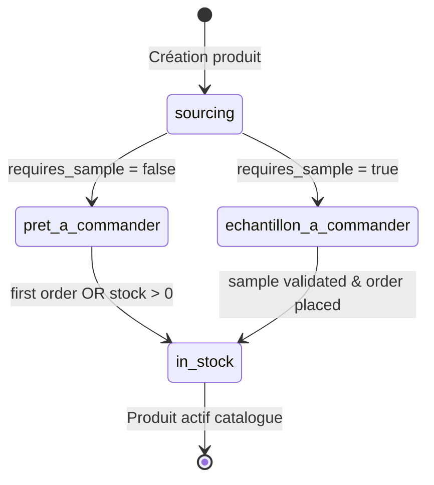
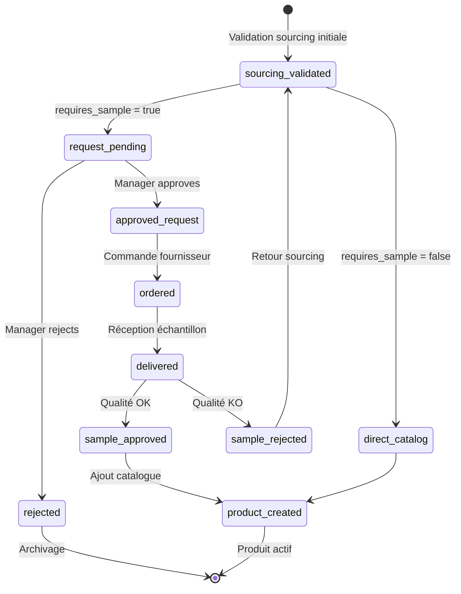
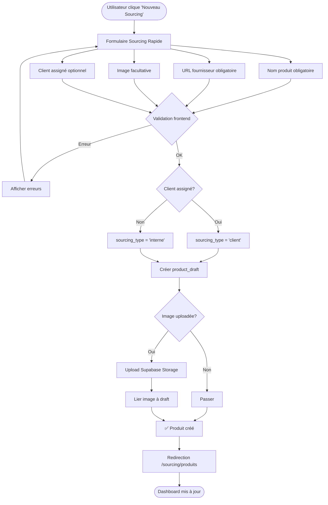
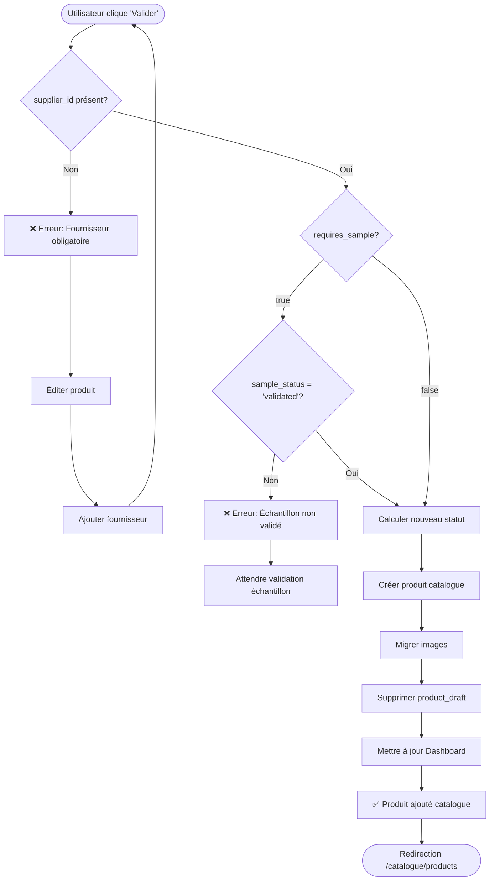
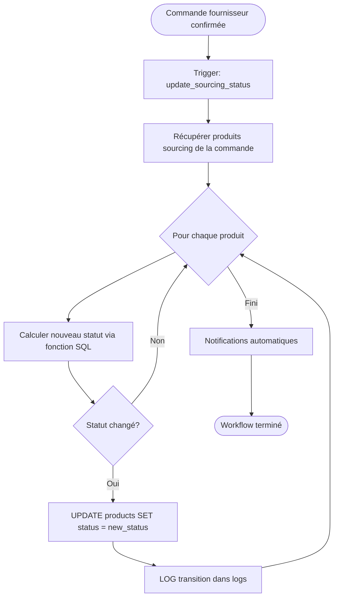
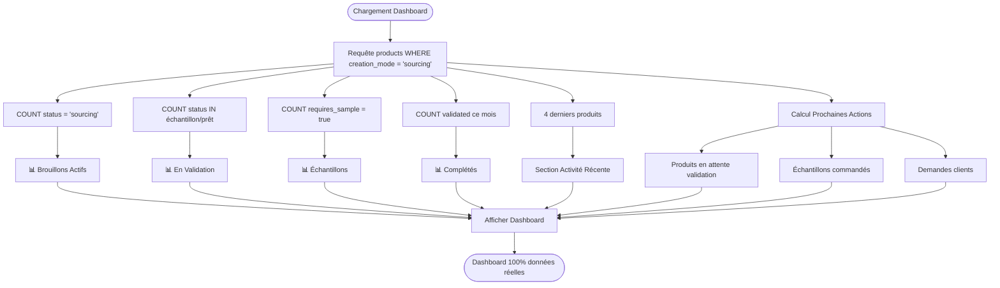
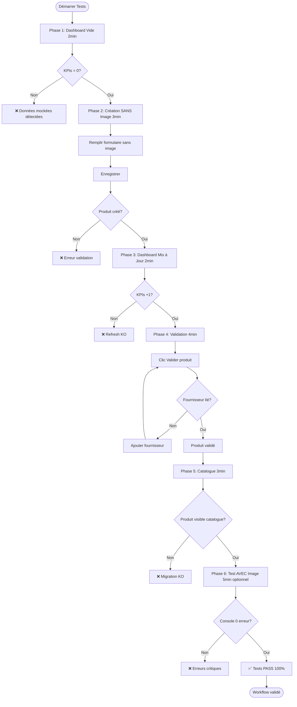
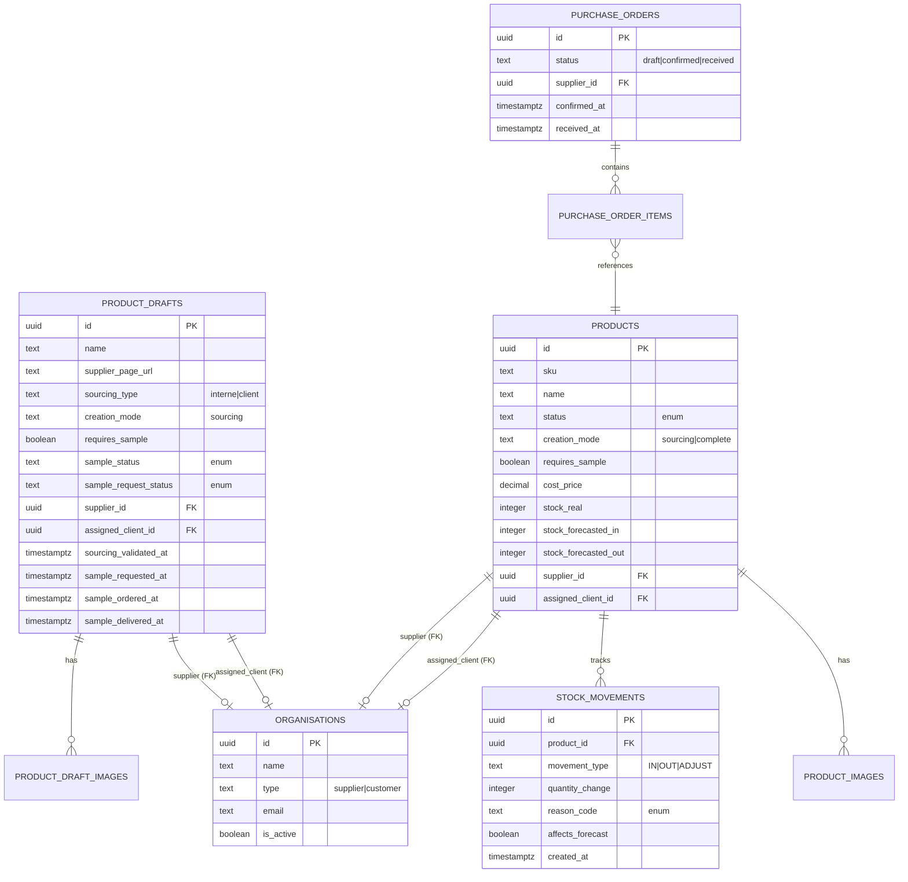
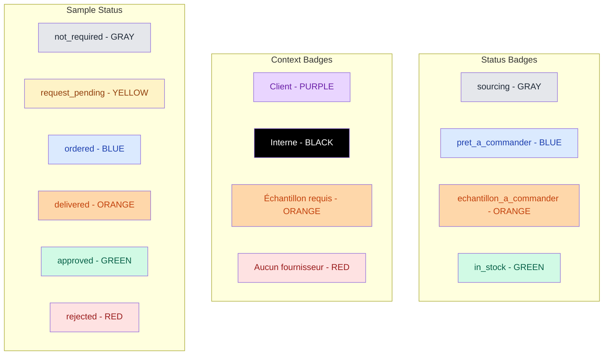

# 📊 DIAGRAMMES WORKFLOWS - VISUALISATION COMPLÈTE

**Tous les workflows en format Mermaid**

---

## 🎯 1. MACHINE À ÉTATS SOURCING PRINCIPAL



**Légende :**
- `sourcing` : État initial après création
- `echantillon_a_commander` : Échantillon requis avant commande
- `pret_a_commander` : Prêt à commander (pas d'échantillon)
- `in_stock` : Produit actif dans catalogue

---

## 🔄 2. WORKFLOW ÉCHANTILLONS CONDITIONNEL



**Légende :**
- `sourcing_validated` : Sourcing validé, décision échantillon
- `request_pending` : Demande approbation manager
- `ordered` : Échantillon commandé chez fournisseur
- `delivered` : Échantillon reçu
- `sample_approved` : Validation qualité OK
- `product_created` : Produit ajouté au catalogue

---

## 📦 3. WORKFLOW CRÉATION PRODUIT SOURCING



---

## ✅ 4. WORKFLOW VALIDATION PRODUIT → CATALOGUE



---

## 🏭 5. TRIGGERS AUTOMATIQUES STOCK



---

## 📊 6. DASHBOARD SOURCING - CALCUL KPIS



---

## 🔍 7. WORKFLOW TESTS MANUELS (15 MIN)



---

## 🏗️ 8. ARCHITECTURE TABLES RELATIONS



---

## 🎨 9. BADGES UI - CODES COULEURS



---

## 📱 10. NAVIGATION UI - SITEMAP

```mermaid
graph TD
    Root[/] --> Dashboard[/dashboard]
    Root --> Catalogue[/catalogue]
    Root --> Sourcing[/sourcing]
    Root --> Organisation[/organisation]

    Catalogue --> CatalogueProducts[/catalogue/products]
    Catalogue --> CatalogueCreate[/catalogue/create]
    Catalogue --> CatalogueCategories[/catalogue/categories]
    Catalogue --> CatalogueCollections[/catalogue/collections]
    Catalogue --> CatalogueVariants[/catalogue/variantes]

    Sourcing --> SourcingDashboard[/sourcing - Dashboard]
    Sourcing --> SourcingProducts[/sourcing/produits - Produits à Sourcer]
    Sourcing --> SourcingEchantillons[/sourcing/echantillons - Échantillons]
    Sourcing --> SourcingValidation[/sourcing/validation - Validation]

    CatalogueCreate --> QuickSourcing[Wizard: Sourcing Rapide]
    CatalogueCreate --> CompleteProduct[Wizard: Produit Complet]

    SourcingProducts --> ActionValidate[Action: Valider produit]
    SourcingProducts --> ActionEdit[Action: Éditer]
    SourcingProducts --> ActionDelete[Action: Supprimer]

    ActionValidate --> CatalogueProducts

    style Sourcing fill:#dbeafe,stroke:#1e40af,stroke-width:3px
    style SourcingDashboard fill:#e0e7ff
    style SourcingProducts fill:#e0e7ff
    style SourcingEchantillons fill:#e0e7ff
    style SourcingValidation fill:#e0e7ff
```

---

**🎯 Utiliser ces diagrammes pour visualiser et comprendre les workflows complets**

*Diagrammes créés le 2025-10-06 - Format Mermaid compatible GitHub/VS Code*
