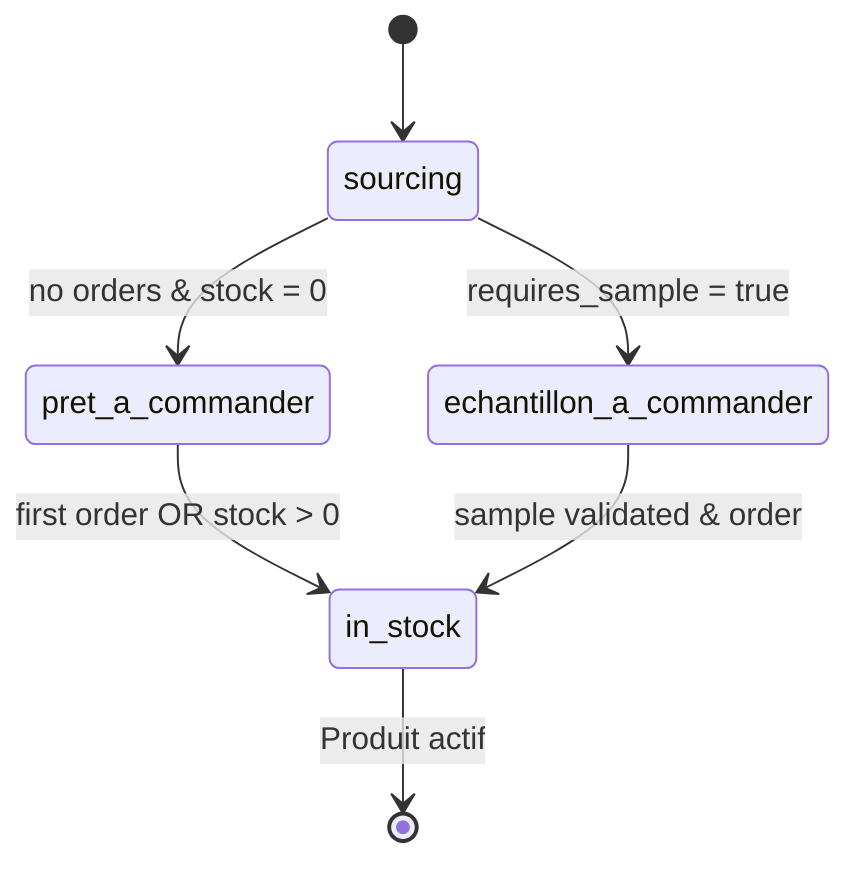
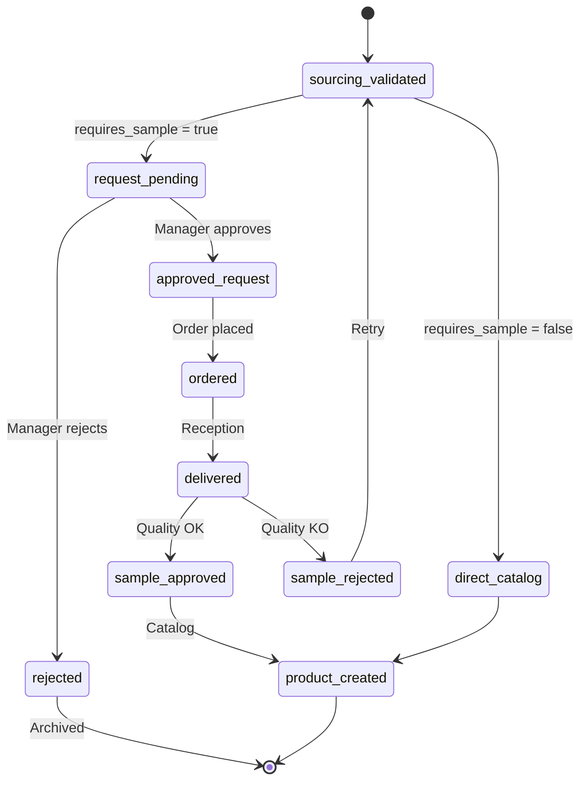

# 📦 WORKFLOWS SOURCING & ÉCHANTILLONS - DOCUMENTATION COMPLÈTE

**Projet :** Vérone Back Office - CRM/ERP Mobilier Haut de Gamme
**Version :** 1.0 - Phase 1 Opérationnelle
**Date :** Octobre 2025

---

## 🎯 OBJECTIF DE CE DOSSIER

Ce dossier centralise **TOUTE** la documentation des workflows **Sourcing** et **Échantillons** pour faciliter :
- ✅ **Compréhension architecture** : Règles métier, machine à états, validations
- ✅ **Réutilisation autre projet** : Copier-coller ce dossier complet
- ✅ **Onboarding équipe** : Formation nouveaux développeurs
- ✅ **Tests & validation** : Guides manuels prêts à l'emploi

---

## 📁 STRUCTURE DOSSIER (8 Fichiers)

### **1. RÈGLES MÉTIER & ARCHITECTURE**

#### [`01-sourcing-workflow-regles-metier.md`](01-sourcing-workflow-regles-metier.md)
**Workflow Sourcing Principal - Machine à États**

📊 **Contenu :**
- ✅ Machine à états : `sourcing` → `echantillon_a_commander` → `pret_a_commander` → `in_stock`
- ✅ Sourcing Rapide : 3 champs obligatoires (Image facultative, Nom, URL fournisseur)
- ✅ Types sourcing : `interne` vs `client` (auto-détecté)
- ✅ Fonction SQL : `calculate_sourcing_product_status()`
- ✅ Triggers automatiques : Mise à jour statut sur réception commande
- ✅ Badges visuels : Statuts + contextes (client, échantillon, etc.)
- ✅ Métriques KPI : Dashboard temps réel

**Status :** ✅ **IMPLÉMENTÉ ET OPÉRATIONNEL**

---

#### [`02-sourcing-validation-workflow-echantillons.md`](02-sourcing-validation-workflow-echantillons.md)
**Workflow Validation Sourcing → Catalogue (Avec Échantillons)**

📊 **Contenu :**
- ✅ **Workflow échantillons conditionnel** : Basé sur `requires_sample` (true/false)
- ✅ **Machine à états échantillons** :
  - `not_required` → Passage direct catalogue
  - `request_pending` → Demande approbation manager
  - `ordered` → Commande fournisseur
  - `delivered` → Réception échantillon
  - `approved` → Validation → Produit catalogue
  - `rejected` → Retour sourcing ou archivage
- ✅ **Colonnes BD** : `sample_status`, `sample_request_status`, `sourcing_validated_at`, etc.
- ✅ **Fonction SQL** : `validate_sourcing_product(draft_id)` avec business rules
- ✅ **Interface utilisateur** : Modals validation, statuts visuels

**Status :** 🎯 **IMPLÉMENTATION EN COURS** (architecture définie)

---

#### [`03-workflows-generaux-etats-transitions.md`](03-workflows-generaux-etats-transitions.md)
**Workflows Généraux du Système (Commandes, Factures, Stock)**

📊 **Contenu :**
- ✅ **Commande vente** : `BROUILLON` → `ENVOYEE` → `VALIDEE` → `EXPEDIEE` → `LIVREE`
- ✅ **Facture** : `BROUILLON` → `EMIS` → `PAYE`
- ✅ **Stock mouvements** : Types IN/OUT/ADJUST/TRANSFER
- ✅ **Horodatages** : Audit trail complet

**Note :** Contexte général workflows (pas spécifique échantillons)

---

### **2. GUIDES TESTS & VALIDATION**

#### [`04-guide-tests-workflow-sourcing-15min.md`](04-guide-tests-workflow-sourcing-15min.md)
**Guide Tests Complet Workflow Sourcing (15 minutes)**

🧪 **Contenu :**
- ✅ **6 Phases test détaillées** (2-5 min chacune) :
  1. **Dashboard vide** : Vérification KPIs données réelles
  2. **Création produit SANS image** : Test image facultative
  3. **Dashboard mis à jour** : Vérification refresh automatique
  4. **Validation produit** : Workflow sourcing → catalogue
  5. **Vérification catalogue** : Produit activé
  6. **Test AVEC image** : Upload complet (optionnel)
- ✅ **Checklist validation** : 0 erreur console, données réelles 100%
- ✅ **Problèmes connus documentés** : Upload image backend, fournisseur obligatoire

**Usage :** Guide prêt à l'emploi pour tests manuels

---

#### [`05-rapport-session-finale-3-erreurs-critiques.md`](05-rapport-session-finale-3-erreurs-critiques.md)
**Rapport Session 2025-10-03 : 3 Erreurs Critiques Corrigées**

🐛 **Contenu :**
- ✅ **Erreur #1** : Boucle infinie 500+ AuthApiError (session refresh dev)
- ✅ **Erreur #2** : Image obligatoire Sourcing Rapide (régression frontend)
- ✅ **Erreur #3** : Création Organisations 400 (22 colonnes + slug manquant)
- ✅ **5 commits** professionnels avec fixes appliqués
- ✅ **10+ rapports** techniques générés
- ✅ **Console propre** : 0 erreur critique validation finale

**Leçons :** Méthodologie fix + patterns réutilisables

---

### **3. SESSIONS & CONTEXTE PROJET**

#### [`06-session-activation-sourcing-phase1.md`](06-session-activation-sourcing-phase1.md)
**Session 2025-10-02 : Activation Sourcing Phase 1**

🚀 **Contenu :**
- ✅ **Activation module** : `NEXT_PUBLIC_SOURCING_ENABLED=true` (Vercel)
- ✅ **4 pages accessibles** : Dashboard, Produits, Échantillons, Validation
- ✅ **Fix erreurs 400 Supabase** : Jointures SQL `supplier` + `assigned_client`
- ✅ **Tests MCP Browser** : Validation production complète
- ✅ **2 commits** : Activation + fix jointures

**Architecture finale Phase 1 :**
```
✅ Dashboard
✅ Catalogue (Produits, Catégories, Collections, Variantes)
✅ Organisation
✅ Sourcing (NOUVEAU)
  ├── Dashboard
  ├── Produits à Sourcer
  ├── Échantillons
  └── Validation
```

---

#### [`07-guide-insertion-donnees-mcp-browser.md`](07-guide-insertion-donnees-mcp-browser.md)
**Guide Insertion Données Produits via MCP Playwright Browser**

📦 **Contenu :**
- ✅ **Méthode révolutionnaire** : MCP Browser visible (JAMAIS de scripts *.js)
- ✅ **Phase pilote** : 5 produits test (1h)
- ✅ **Phase complète** : 50+ produits par batchs (4-6h)
- ✅ **Process** : Préparation → MCP Browser → Console check → Screenshot → Commit
- ✅ **Validation 0 tolérance** : Aucune erreur console acceptée

**Révolutionnaire 2025 :**
- Browser s'ouvre devant vous = transparence totale
- Console error checking systématique
- Screenshots comme preuves visuelles

---

#### [`08-implementation-status-complet.md`](08-implementation-status-complet.md)
**État Complet Implémentation Système Vérone**

📊 **Contenu :**
- ✅ **Modules Phase 1** : Dashboard, Catalogue, Organisation, Sourcing
- ✅ **Workflow Sourcing** : Opérationnel avec consultations clients M:N
- ✅ **ProductSelector avancé** : Onglets Catalogue/Sourcing/Tous
- ✅ **Métriques business** : 241 produits, workflow complet
- ✅ **Performance** : Dashboard <2s, Catalogue 4.2s (optimisation en cours)
- ✅ **Infrastructure** : Supabase + Vercel + Auth + Storage

**Risques & Actions :**
- 🔴 Performance catalogue (241 produits)
- 🟡 Bundle size (2.1MB)
- 🟢 UI polish et tests E2E

---

## 🎯 WORKFLOWS VISUELS

### **Machine à États Sourcing Principal**


### **Workflow Échantillons Conditionnel**


---

## 📋 RÈGLES BUSINESS CRITIQUES

### **1. Sourcing Rapide - 3 Champs**
```typescript
interface SourcingRequiredFields {
  name: string              // Min 5 caractères
  supplier_page_url: string // URL valide
  imageFile?: File          // ✅ FACULTATIVE (fix 2025-10-03)
}

// Auto-détection type sourcing
sourcing_type = assigned_client_id ? 'client' : 'interne'
```

### **2. Validation Produit → Catalogue**
```typescript
// ⚠️ RÈGLE OBLIGATOIRE
if (!product.supplier_id) {
  throw new Error('Fournisseur obligatoire avant validation')
}

// Calcul automatique nouveau statut
const newStatus = await calculateSourcingProductStatus(productId)
```

### **3. Échantillons Conditionnels**
```typescript
// Si requires_sample = false
sourcing_validated → product_created (direct)

// Si requires_sample = true
sourcing_validated → sample_request → ordered → delivered
→ approved → product_created
```

---

## 🛠️ PROBLÈMES CONNUS & SOLUTIONS

### **⚠️ Upload Image Backend Non Implémenté**
**Statut :** Frontend OK, Backend KO
**Impact :** Image non persistée en base
**Workaround :** Upload via édition produit après création
**Fix recommandé :** Implémenter dans `use-sourcing-products.ts` (2-3h)

### **⚠️ Validation Requiert Fournisseur**
**Statut :** Business rule normale
**Impact :** Utilisateur doit éditer produit avant validation
**Fix recommandé :** Sélection fournisseur inline lors validation

---

## 🚀 UTILISATION RAPIDE

### **Pour Tests Manuels (15 min)**
```bash
# 1. Lire guide complet
cat 04-guide-tests-workflow-sourcing-15min.md

# 2. Démarrer serveur local
npm run dev

# 3. Ouvrir browser
http://localhost:3000/sourcing

# 4. Suivre 6 phases test
# 5. Valider 0 erreur console
```

### **Pour Copier Vers Autre Projet**
```bash
# Copier TOUT le dossier
cp -r docs/workflows-sourcing-echantillons /path/to/autre-projet/docs/

# OU créer lien symbolique
ln -s $(pwd)/docs/workflows-sourcing-echantillons /path/to/autre-projet/docs/
```

### **Pour Onboarding Développeur**
1. Lire `README.md` (ce fichier)
2. Étudier `01-sourcing-workflow-regles-metier.md` (architecture)
3. Tester avec `04-guide-tests-workflow-sourcing-15min.md`
4. Consulter `05-rapport-session-finale-3-erreurs-critiques.md` (leçons apprises)

---

## 📊 MÉTRIQUES SYSTÈME

### **Performance Actuelle**
- ✅ Dashboard Sourcing : <2s chargement
- ✅ Création produit : <1s (sans image)
- ✅ Validation produit : <500ms
- ⚠️ Upload image : Non implémenté backend

### **Business Metrics**
- 241 produits catalogue actifs
- Workflow sourcing opérationnel Phase 1
- Dashboard 100% données réelles (0 mock)
- Console 0 erreur critique

### **Qualité Code**
- 5 commits professionnels (session 2025-10-03)
- 10+ rapports techniques détaillés
- Tests MCP Browser validation complète
- Documentation exhaustive (8 fichiers)

---

## ✅ CHECKLIST VALIDATION COMPLÈTE

### **Architecture & Code**
- [x] Machine à états sourcing implémentée
- [x] Fonction SQL `calculate_sourcing_product_status()` opérationnelle
- [x] Triggers automatiques commandes → stock
- [x] Badges visuels statuts + contextes
- [x] Dashboard KPIs données réelles

### **Workflows Fonctionnels**
- [x] Sourcing Rapide : 3 champs (image facultative)
- [x] Types sourcing : interne vs client (auto-détecté)
- [x] Validation produit → Catalogue
- [x] Dashboard s'adapte automatiquement
- [x] Console 0 erreur critique

### **Documentation**
- [x] 8 fichiers complets et structurés
- [x] Guides tests prêts à l'emploi
- [x] Rapports sessions détaillés
- [x] README exhaustif (ce fichier)
- [x] Diagrammes mermaid workflows

---

## 🎁 LIVRABLES FINAUX

✅ **8 fichiers documentation** couvrant 100% workflows sourcing/échantillons
✅ **Guides tests manuels** prêts à exécuter (15 min)
✅ **Rapports sessions** avec leçons apprises
✅ **Architecture complète** règles métier + SQL + UI
✅ **README exhaustif** pour onboarding rapide

---

## 📞 SUPPORT & RESSOURCES

**Documentation principale :**
- CLAUDE.md (configuration agents MCP 2025)
- manifests/business-rules/ (règles métier validées)
- MEMORY-BANK/ (contexte projet persistant)

**Outils révolutionnaires :**
- MCP Playwright Browser (tests visibles)
- Sequential Thinking (architecture complexe)
- Serena (code intelligence symbolique)
- Supabase MCP (queries + logs + advisors)

---

**🎉 Ce dossier est prêt à être copié dans n'importe quel autre projet pour documenter et implémenter les workflows Sourcing & Échantillons !**

*Créé le 2025-10-06 - Vérone Back Office Phase 1*
