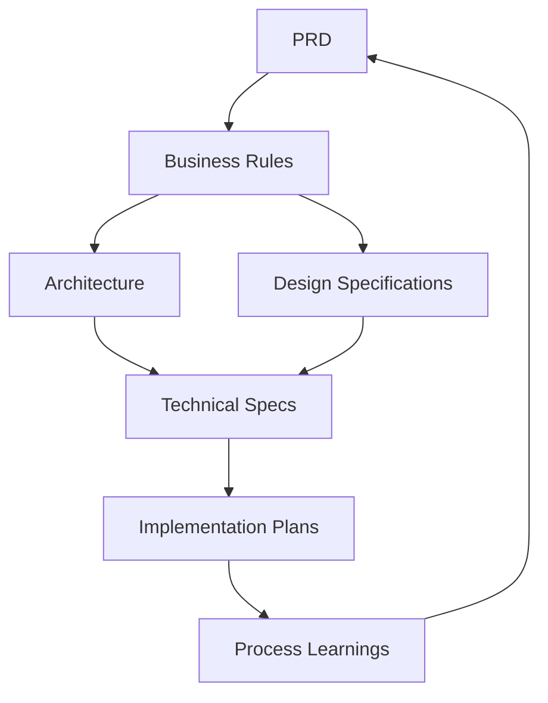

# 📋 Manifestes - Vérone Back Office

> Documentation métier et technique structurée selon les bonnes pratiques Anthropic

## 🗂️ Organisation des Manifestes

### **📋 business-rules/**
Règles métier spécifiques par module système
- `catalogue.md` - Règles de gestion du catalogue produits
- `workflows.md` - Processus métier transversaux
- `tarification.md` - Règles de calcul des prix
- `stocks.md` - Gestion des inventaires et statuts
- `integrations.md` - Règles pour feeds externes et webhooks

### **🏛️ architecture/**
Architecture technique et business
- `database-schema.md` - Schémas SQL complets avec triggers
- `business-architecture.md` - Architecture métier et flux de données
- `api-design.md` - Spécifications des APIs REST
- `integrations-architecture.md` - Architecture des intégrations externes

### **📊 technical-specs/**
Spécifications techniques détaillées
- `performance-targets.md` - Objectifs de performance quantifiés
- `security-requirements.md` - Exigences sécurité et RLS policies
- `data-validation.md` - Règles de validation des données
- `monitoring-observability.md` - Métriques et alertes

### **🎨 design-specifications/**
Design system et spécifications UI/UX
- `verone-design-system.md` - Couleurs, composants, guidelines
- `responsive-design.md` - Adaptation mobile et desktop
- `user-workflows.md` - Parcours utilisateur détaillés
- `accessibility.md` - Standards WCAG et bonnes pratiques

### **🚀 implementation-plans/**
Plans d'implémentation et roadmaps
- `phase-overview.md` - Vue d'ensemble des phases de développement
- `mvp-catalogue.md` - Plan détaillé MVP catalogue partageable
- `rollout-strategy.md` - Stratégie de déploiement
- `migration-plans.md` - Plans de migration de données

### **📚 process-learnings/**
Apprentissages et décisions architecturales
- `decisions.md` - Log des décisions techniques importantes
- `lessons-learned.md` - Retours d'expérience par phase
- `best-practices.md` - Bonnes pratiques découvertes
- `troubleshooting.md` - Solutions aux problèmes rencontrés

### **📖 prd/**
Product Requirements Documents par module
- `PRD-MVP-CATALOGUE.md` - Spécifications MVP catalogue partageable
- `PRD-BACK-OFFICE.md` - Interface d'administration
- `PRD-FEEDS-PUBLICITAIRES.md` - Exports Meta/Google
- `PRD-WEBHOOKS-BREVO.md` - Intégration marketing
- `PRD-CLIENT-INTERFACES.md` - Interfaces publiques

## 🎯 **Principes d'Organisation**

### **Documentation métier d'abord**
- Toujours documenter les **règles métier** avant le code
- Les **business rules** guident l'architecture technique
- Les **PRDs** définissent clairement le périmètre et les acceptance criteria

### **Architecture Decision Records (ADR)**
- Documenter les **décisions importantes** dans `process-learnings/`
- Justifier les **choix techniques** avec contexte et alternatives
- Maintenir un **log des changements** architecturaux

### **Tests et validation**
- Chaque **règle métier** doit avoir ses tests correspondants
- Les **critères d'acceptation** (Given/When/Then) guident les tests
- Les **spécifications techniques** définissent les métriques de succès

### **Évolutivité**
- Structure **modulaire** pour faciliter l'ajout de nouveaux modules
- **Versioning** des spécifications importantes
- **Rétrocompatibilité** documentée lors des changements majeurs

## 🔗 **Relations entre Manifestes**

## 📝 **Comment Contribuer**

1. **Nouveau module** : Commencer par créer le PRD correspondant
2. **Nouvelle fonctionnalité** : Documenter les règles métier d'abord
3. **Changement architectural** : Créer un ADR dans `process-learnings/`
4. **Retour d'expérience** : Documenter les apprentissages

## 🚀 **Workflow de Développement**

1. **📖 PRD** → Définir le périmètre et les critères d'acceptation
2. **📋 Business Rules** → Documenter les règles métier spécifiques
3. **🏛️ Architecture** → Concevoir la solution technique
4. **📊 Technical Specs** → Définir les exigences non-fonctionnelles
5. **🚀 Implementation** → Développer selon les spécifications
6. **📚 Learning** → Documenter les retours d'expérience

---

**Vérone Back Office** - Documentation structurée pour un développement efficace