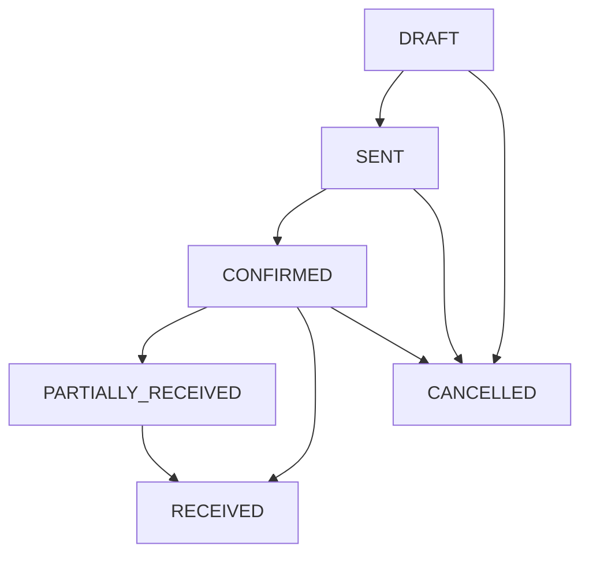
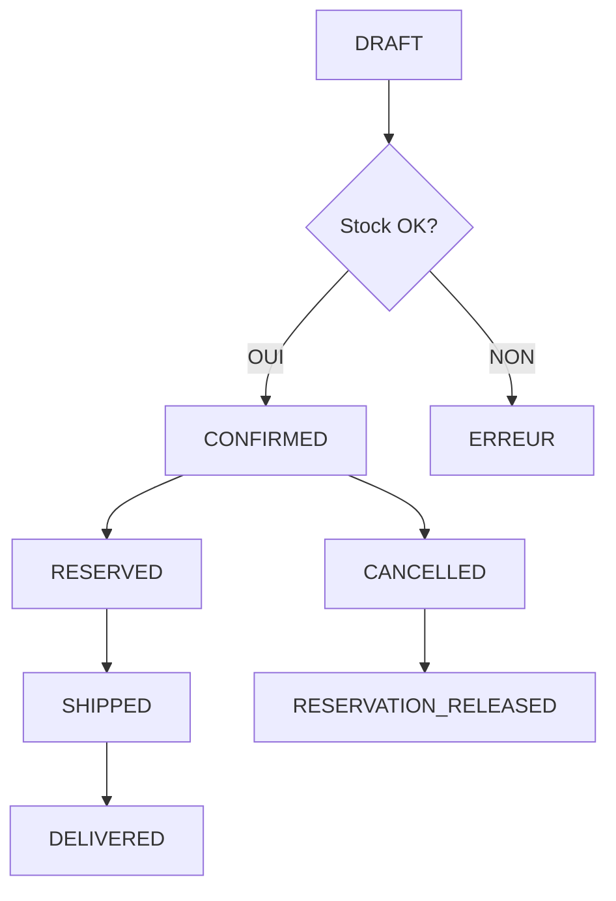

# 🏗️ Architecture Système Stock et Commandes

**Date Création** : 16 septembre 2025
**Version** : 1.0
**Status** : ✅ IMPLÉMENTÉ

## 📋 Vue d'Ensemble

Le système Stock et Commandes de Vérone Back Office suit les meilleures pratiques ERP (inspiré ERPNext) avec une architecture moderne TypeScript/Supabase garantissant :

- **Traçabilité complète** des mouvements de stock
- **Prévention survente** via système de réservations
- **Workflows stricts** pour commandes fournisseurs et clients
- **Intégration transparente** avec le stock à chaque étape

## 🗄️ Schéma Base de Données

### **Tables Principales**

#### 1. **stock_movements**

```sql
CREATE TABLE stock_movements (
  id uuid PRIMARY KEY DEFAULT gen_random_uuid(),
  product_id uuid NOT NULL REFERENCES products(id),
  movement_type movement_type_enum NOT NULL, -- IN, OUT, ADJUST, TRANSFER
  quantity_change decimal(10,2) NOT NULL,
  unit_cost decimal(10,2),
  reference_type varchar(50), -- 'purchase_order', 'sales_order', 'adjustment'
  reference_id uuid,
  notes text,
  created_by uuid REFERENCES auth.users(id),
  created_at timestamptz DEFAULT now()
);
```

**Rôle** : Traçabilité exhaustive tous mouvements stock

#### 2. **stock_reservations**

```sql
CREATE TABLE stock_reservations (
  id uuid PRIMARY KEY DEFAULT gen_random_uuid(),
  product_id uuid NOT NULL REFERENCES products(id),
  quantity decimal(10,2) NOT NULL,
  reference_type varchar(50) NOT NULL, -- 'sales_order', 'production_order'
  reference_id uuid NOT NULL,
  expires_at timestamptz NOT NULL DEFAULT (now() + interval '24 hours'),
  status reservation_status_enum DEFAULT 'active', -- active, expired, consumed
  created_at timestamptz DEFAULT now()
);
```

**Rôle** : Prévention survente avec réservations temporaires

#### 3. **purchase_orders**

```sql
CREATE TABLE purchase_orders (
  id uuid PRIMARY KEY DEFAULT gen_random_uuid(),
  po_number varchar(50) UNIQUE NOT NULL,
  supplier_id uuid NOT NULL REFERENCES organisations(id),
  status po_status_enum DEFAULT 'draft', -- draft, sent, confirmed, partially_received, received, cancelled
  currency varchar(3) DEFAULT 'EUR',
  tax_rate decimal(5,4) DEFAULT 0.20,
  total_ht decimal(12,2) NOT NULL DEFAULT 0,
  total_ttc decimal(12,2) NOT NULL DEFAULT 0,
  expected_delivery_date date,
  delivery_address jsonb,
  payment_terms text,
  notes text,

  -- Workflow tracking
  created_by uuid REFERENCES auth.users(id),
  validated_by uuid REFERENCES auth.users(id),
  sent_by uuid REFERENCES auth.users(id),
  received_by uuid REFERENCES auth.users(id),

  validated_at timestamptz,
  sent_at timestamptz,
  received_at timestamptz,
  cancelled_at timestamptz,

  created_at timestamptz DEFAULT now(),
  updated_at timestamptz DEFAULT now()
);
```

**Rôle** : Gestion commandes fournisseurs avec workflow complet

#### 4. **purchase_order_items**

```sql
CREATE TABLE purchase_order_items (
  id uuid PRIMARY KEY DEFAULT gen_random_uuid(),
  purchase_order_id uuid NOT NULL REFERENCES purchase_orders(id) ON DELETE CASCADE,
  product_id uuid NOT NULL REFERENCES products(id),
  quantity decimal(10,2) NOT NULL,
  unit_price_ht decimal(10,2) NOT NULL,
  discount_percentage decimal(5,2) DEFAULT 0,
  total_ht decimal(12,2) GENERATED ALWAYS AS (quantity * unit_price_ht * (1 - discount_percentage/100)) STORED,
  quantity_received decimal(10,2) DEFAULT 0,
  expected_delivery_date date,
  notes text,
  created_at timestamptz DEFAULT now(),
  updated_at timestamptz DEFAULT now()
);
```

**Rôle** : Détail items commandes fournisseurs avec réceptions partielles

#### 5. **sales_orders** + **sales_order_items**

Structure similaire aux purchase_orders avec adaptations pour gestion client et intégration stock.

### **Fonctions Business Logic**

#### **generate_po_number()**

```sql
CREATE OR REPLACE FUNCTION generate_po_number()
RETURNS text AS $$
DECLARE
  next_number integer;
  po_number text;
BEGIN
  SELECT COALESCE(MAX(CAST(SUBSTRING(po_number FROM 9) AS integer)), 0) + 1
  INTO next_number
  FROM purchase_orders
  WHERE po_number LIKE 'PO-' || EXTRACT(year FROM now()) || '-%';

  po_number := 'PO-' || EXTRACT(year FROM now()) || '-' || LPAD(next_number::text, 4, '0');

  RETURN po_number;
END;
$$ LANGUAGE plpgsql;
```

#### **get_available_stock(product_id)**

```sql
CREATE OR REPLACE FUNCTION get_available_stock(p_product_id uuid)
RETURNS decimal AS $$
DECLARE
  stock_qty decimal;
  reserved_qty decimal;
BEGIN
  SELECT stock_quantity INTO stock_qty
  FROM products WHERE id = p_product_id;

  SELECT COALESCE(SUM(quantity), 0) INTO reserved_qty
  FROM stock_reservations
  WHERE product_id = p_product_id
    AND status = 'active'
    AND expires_at > now();

  RETURN GREATEST(stock_qty - reserved_qty, 0);
END;
$$ LANGUAGE plpgsql;
```

#### **update_product_stock() TRIGGER**

```sql
CREATE OR REPLACE FUNCTION update_product_stock()
RETURNS trigger AS $$
BEGIN
  IF NEW.movement_type IN ('IN', 'ADJUST') THEN
    UPDATE products
    SET stock_quantity = stock_quantity + NEW.quantity_change,
        updated_at = now()
    WHERE id = NEW.product_id;
  ELSIF NEW.movement_type IN ('OUT', 'TRANSFER') THEN
    UPDATE products
    SET stock_quantity = stock_quantity - NEW.quantity_change,
        updated_at = now()
    WHERE id = NEW.product_id;
  END IF;

  RETURN NEW;
END;
$$ LANGUAGE plpgsql;
```

### **Sécurité RLS (Row Level Security)**

Toutes les tables implémentent des policies multi-tenant :

```sql
-- Exemple pour stock_movements
CREATE POLICY "Users can only see movements from their organization"
ON stock_movements FOR ALL
USING (
  product_id IN (
    SELECT id FROM products
    WHERE organisation_id = (
      SELECT organisation_id FROM user_organisations
      WHERE user_id = auth.uid() AND is_active = true
    )
  )
);
```

## 🔗 Couche Hooks TypeScript

### **Architecture Pattern**

Chaque hook suit le pattern React standard avec :

- **État local** via `useState`
- **Optimisation** via `useCallback` + `useMemo`
- **Gestion erreurs** unifiée avec `useToast`
- **Type safety** strict TypeScript

### **use-stock-movements.ts**

```typescript
interface StockMovement {
  id: string;
  product_id: string;
  movement_type: 'IN' | 'OUT' | 'ADJUST' | 'TRANSFER';
  quantity_change: number;
  unit_cost?: number;
  reference_type?: string;
  reference_id?: string;
  notes?: string;
  created_by: string;
  created_at: string;
}

export function useStockMovements() {
  const [movements, setMovements] = useState<StockMovement[]>([]);
  const [loading, setLoading] = useState(false);

  const createMovement = useCallback(async (data: CreateMovementData) => {
    // Validation + insertion + trigger automatique stock_quantity
  }, []);

  const getAvailableStock = useCallback(async (productId: string) => {
    // Appel fonction get_available_stock()
  }, []);

  return { movements, loading, createMovement, getAvailableStock };
}
```

### **use-purchase-orders.ts**

Gestion complète workflow PO avec :

- **Création** avec calculs automatiques
- **Transitions statuts** avec validation business
- **Réception items** avec mouvements stock automatiques
- **Statistiques** temps réel

### **use-sales-orders.ts**

Intégration avancée avec stock :

- **Validation disponibilité** avant confirmation
- **Réservations automatiques** à la confirmation
- **Libération réservations** à l'annulation/expédition
- **Mouvements OUT** automatiques à l'expédition

## 🖼️ Couche Interface UI

### **Architecture Composants**

- **Pages** : `/stocks`, `/commandes/fournisseurs`, `/commandes/clients`
- **Composants Business** : Formulaires, modals, listes avec filtres
- **Design System** : shadcn/ui avec thème Vérone (noir/blanc/gris)

### **Performance UX**

- **Pagination** : 25-50 éléments par page
- **Lazy Loading** : Chargement différé composants lourds
- **Debouncing** : 300ms sur recherches/filtres
- **Optimistic Updates** : UI réactive avec rollback erreurs

### **Responsive Design**

- **Mobile-first** : Interface tactile adaptative
- **Breakpoints** : sm/md/lg/xl suivant Tailwind
- **Touch-friendly** : Boutons 44px minimum, gestures intuitifs

## 🔄 Workflows Business

### **Commande Fournisseur Complète**



**Actions Automatiques** :

- **SENT** : Email fournisseur + timestamp
- **CONFIRMED** : Validation business + alerte livraison
- **RECEIVED** : Mouvements stock IN + recalcul totaux

### **Commande Client avec Stock**



**Intégration Stock** :

- **Validation** : Contrôle get_available_stock() temps réel
- **Réservation** : Création automatique à confirmation
- **Expédition** : Mouvement OUT + libération réservation

## 📊 Métriques & Monitoring

### **Performance Cibles**

- **Chargement pages** : <2s (stocks/commandes)
- **Validation stock** : <500ms temps réel
- **Recherche produits** : <300ms avec autocomplete
- **Pagination** : <1s changement page

### **Business KPIs**

- **Précision stock** : 100% cohérence mouvements ↔ stock_quantity
- **Prévention survente** : 0% commandes acceptées sans stock
- **Workflow integrity** : 100% transitions statuts respectées
- **Audit trail** : 100% traçabilité utilisateurs + timestamps

### **Sécurité & Compliance**

- **RLS Enforcement** : 100% isolation multi-tenant
- **Data Integrity** : Contraintes FK + triggers validation
- **Audit Logging** : Tous mouvements avec utilisateur + timestamp
- **Backup Strategy** : Point-in-time recovery <15min

## 🚀 Extensibilité Future

### **Modules Compatibles**

- **Facturation** : Export commandes → factures automatique
- **Comptabilité** : Intégration valorisation stock + mouvements
- **Analytics** : Dashboard métriques performance stock/commandes
- **Mobile App** : API-first permettant app mobile native

### **Intégrations Externes**

- **ERP Tiers** : APIs standardisées import/export
- **E-commerce** : Synchronisation stock temps réel
- **Logistique** : Suivi livraisons + notifications automatiques

---

**Architecture robuste, scalable et maintenable suivant les meilleures pratiques ERP modernes.**
