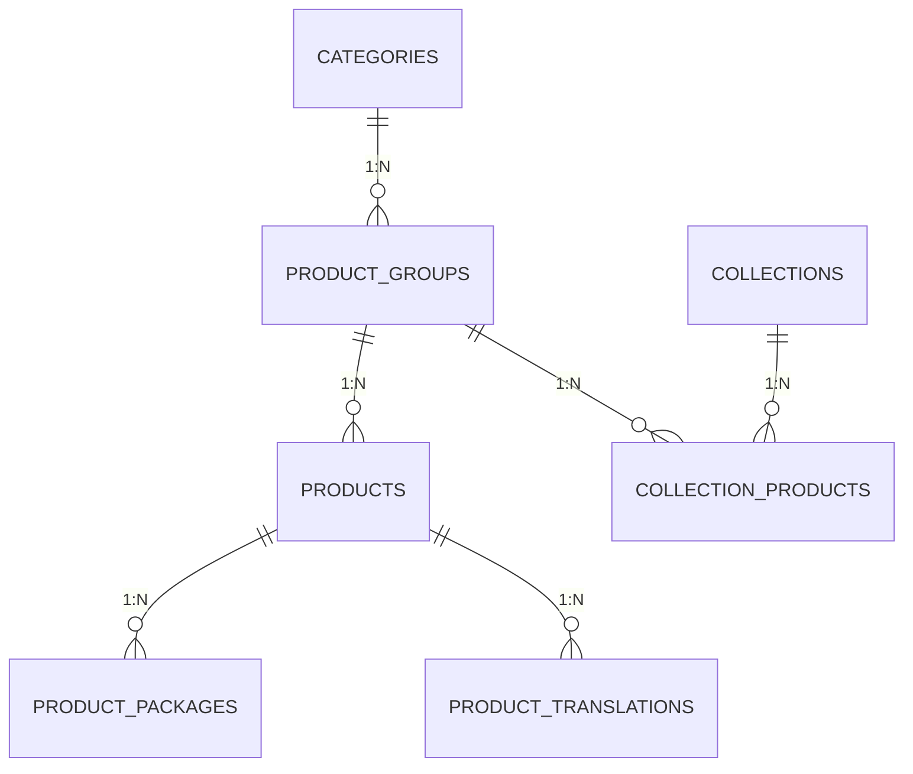

# ERD Catalogue V1 — Architecture Base de Données

> **Version** : 1.0 MVP  
> **Database** : PostgreSQL + Supabase  
> **Focus** : Catalogue flexible avec conditionnements et feeds

## 🎯 Vue d'Ensemble Architecture

### **Principes Design**
- **Flexibilité** : Support conditionnements complexes
- **Multilingue** : Traductions séparées pour scalabilité
- **Performance** : Index optimisés pour feeds exports
- **Sécurité** : RLS (Row Level Security) intégré
- **Évolutivité** : Structure extensible V2+

### **Entités Core**


## 📊 Schéma Détaillé

### **Tables Principales**

#### **product_groups** — Groupes Produits
```sql
CREATE TABLE product_groups (
  id UUID PRIMARY KEY DEFAULT gen_random_uuid(),
  
  -- Identification
  name VARCHAR(255) NOT NULL,              -- "Tabouret Romeo"
  description TEXT,                        -- Description groupe
  slug VARCHAR(255) UNIQUE NOT NULL,       -- URL-friendly
  
  -- Classification
  category_id UUID NOT NULL REFERENCES categories(id),
  brand VARCHAR(100),                      -- "Vérone" | marque fournisseur
  
  -- Statut
  status VARCHAR(20) DEFAULT 'draft' CHECK (status IN ('draft', 'active', 'inactive', 'discontinued')),
  
  -- Métadonnées
  created_at TIMESTAMPTZ DEFAULT NOW(),
  updated_at TIMESTAMPTZ DEFAULT NOW(),
  created_by UUID REFERENCES auth.users(id),
  
  -- Index performance
  CONSTRAINT product_groups_name_check CHECK (length(name) >= 2),
  CONSTRAINT product_groups_slug_check CHECK (slug ~ '^[a-z0-9\-]+$')
);

-- Index optimisation
CREATE INDEX idx_product_groups_status ON product_groups(status);
CREATE INDEX idx_product_groups_category ON product_groups(category_id);
CREATE INDEX idx_product_groups_created_at ON product_groups(created_at DESC);
```

#### **products** — Produits Individuels
```sql
CREATE TABLE products (
  id UUID PRIMARY KEY DEFAULT gen_random_uuid(),
  product_group_id UUID NOT NULL REFERENCES product_groups(id) ON DELETE CASCADE,
  
  -- Identification unique
  sku VARCHAR(100) UNIQUE NOT NULL,        -- "VER-TAB-001-BLANC"
  name VARCHAR(255) NOT NULL,              -- "Tabouret Romeo Blanc"
  slug VARCHAR(255) UNIQUE NOT NULL,       -- URL-friendly
  
  -- Prix & Coûts (en centimes pour précision)
  price_ht INTEGER NOT NULL,               -- Prix HT × 100 (7500 = 75.00€)
  cost_price INTEGER,                      -- Prix achat × 100
  tax_rate DECIMAL(4,4) DEFAULT 0.2000,   -- Taux TVA (0.2000 = 20%)
  
  -- Disponibilité
  status VARCHAR(20) DEFAULT 'in_stock' CHECK (
    status IN ('in_stock', 'out_of_stock', 'preorder', 'coming_soon', 'discontinued')
  ),
  condition VARCHAR(20) DEFAULT 'new' CHECK (condition IN ('new', 'refurbished', 'used')),
  
  -- Attributs & Variantes (JSONB pour flexibilité)
  variant_attributes JSONB DEFAULT '{}',   -- {color: "Blanc", material: "Métal"}
  dimensions JSONB,                        -- {length: 40, width: 40, height: 75}
  weight DECIMAL(8,2),                     -- kg
  
  -- Images & Médias
  primary_image_url TEXT NOT NULL,         -- Image principale
  gallery_images TEXT[] DEFAULT '{}',     -- Array URLs images
  video_url TEXT,                          -- URL vidéo démo
  
  -- Références externes
  supplier_reference VARCHAR(100),         -- Référence fournisseur
  gtin VARCHAR(20),                        -- Code-barres EAN13/UPC
  
  -- Métadonnées
  created_at TIMESTAMPTZ DEFAULT NOW(),
  updated_at TIMESTAMPTZ DEFAULT NOW(),
  
  -- Contraintes business
  CONSTRAINT products_sku_format CHECK (sku ~ '^[A-Z0-9\-]+$'),
  CONSTRAINT products_price_positive CHECK (price_ht > 0),
  CONSTRAINT products_cost_positive CHECK (cost_price IS NULL OR cost_price > 0),
  CONSTRAINT products_weight_positive CHECK (weight IS NULL OR weight > 0),
  CONSTRAINT products_gtin_format CHECK (gtin IS NULL OR gtin ~ '^[0-9]+$')
);

-- Index performance critique
CREATE INDEX idx_products_sku ON products(sku);
CREATE INDEX idx_products_status ON products(status);
CREATE INDEX idx_products_group_id ON products(product_group_id);
CREATE INDEX idx_products_variant_attrs ON products USING GIN(variant_attributes);
CREATE INDEX idx_products_updated_at ON products(updated_at DESC);

-- Index composé pour feeds
CREATE INDEX idx_products_feeds ON products(status, product_group_id) 
WHERE status IN ('in_stock', 'preorder', 'coming_soon');
```

#### **product_packages** — Conditionnements Flexibles
```sql
CREATE TABLE product_packages (
  id UUID PRIMARY KEY DEFAULT gen_random_uuid(),
  product_id UUID NOT NULL REFERENCES products(id) ON DELETE CASCADE,
  
  -- Configuration package
  name VARCHAR(100) NOT NULL,              -- "Pack 4 tabourets"
  type VARCHAR(20) NOT NULL CHECK (type IN ('single', 'pack', 'bulk', 'custom')),
  
  -- Quantités
  base_quantity INTEGER NOT NULL DEFAULT 1, -- Nombre unités dans package
  min_order_quantity INTEGER NOT NULL DEFAULT 1, -- MOQ ce package
  
  -- Prix (exclusif : soit discount_rate soit unit_price_ht)
  discount_rate DECIMAL(4,4),              -- Remise (0.1500 = 15%)
  unit_price_ht INTEGER,                   -- Prix unitaire spécifique × 100
  
  -- Métadonnées
  description TEXT,                        -- Description package
  is_default BOOLEAN DEFAULT FALSE,        -- Package par défaut (un seul par produit)
  is_active BOOLEAN DEFAULT TRUE,          -- Disponible commande
  display_order INTEGER DEFAULT 0,         -- Ordre affichage
  
  created_at TIMESTAMPTZ DEFAULT NOW(),
  updated_at TIMESTAMPTZ DEFAULT NOW(),
  
  -- Contraintes business
  CONSTRAINT pkg_quantity_positive CHECK (base_quantity > 0),
  CONSTRAINT pkg_moq_positive CHECK (min_order_quantity > 0),
  CONSTRAINT pkg_moq_logical CHECK (min_order_quantity <= base_quantity),
  CONSTRAINT pkg_discount_range CHECK (discount_rate IS NULL OR (discount_rate >= 0 AND discount_rate < 0.5)),
  CONSTRAINT pkg_price_positive CHECK (unit_price_ht IS NULL OR unit_price_ht > 0),
  CONSTRAINT pkg_pricing_exclusive CHECK (
    (discount_rate IS NULL AND unit_price_ht IS NULL) OR  -- Automatic pricing
    (discount_rate IS NOT NULL AND unit_price_ht IS NULL) OR  -- Discount
    (discount_rate IS NULL AND unit_price_ht IS NOT NULL)     -- Fixed price
  )
);

-- Index performance
CREATE INDEX idx_packages_product_id ON product_packages(product_id);
CREATE INDEX idx_packages_type ON product_packages(type);
CREATE INDEX idx_packages_active ON product_packages(is_active) WHERE is_active = TRUE;
CREATE INDEX idx_packages_default ON product_packages(product_id, is_default) WHERE is_default = TRUE;

-- Contrainte unique : un seul package par défaut par produit
CREATE UNIQUE INDEX idx_packages_unique_default 
ON product_packages(product_id) WHERE is_default = TRUE;
```

#### **product_translations** — Multilingue
```sql
CREATE TABLE product_translations (
  id UUID PRIMARY KEY DEFAULT gen_random_uuid(),
  product_id UUID NOT NULL REFERENCES products(id) ON DELETE CASCADE,
  
  -- Langue
  language VARCHAR(2) NOT NULL CHECK (language IN ('fr', 'en', 'pt')),
  
  -- Contenu traduit
  name VARCHAR(255) NOT NULL,              -- Nom traduit
  description TEXT,                        -- Description traduite
  meta_title VARCHAR(255),                 -- SEO title
  meta_description TEXT,                   -- SEO description
  
  -- Attributs traduits (couleurs, matières, etc.)
  variant_attributes JSONB DEFAULT '{}',   -- Traduction attributs
  
  created_at TIMESTAMPTZ DEFAULT NOW(),
  updated_at TIMESTAMPTZ DEFAULT NOW(),
  
  -- Contrainte unique : une traduction par langue par produit
  UNIQUE(product_id, language)
);

-- Index performance
CREATE INDEX idx_product_translations_product ON product_translations(product_id);
CREATE INDEX idx_product_translations_lang ON product_translations(language);
```

### **Tables Classification**

#### **categories** — Hiérarchie Catégories
```sql
CREATE TABLE categories (
  id UUID PRIMARY KEY DEFAULT gen_random_uuid(),
  
  -- Hiérarchie
  parent_id UUID REFERENCES categories(id),
  name VARCHAR(255) NOT NULL,
  slug VARCHAR(255) UNIQUE NOT NULL,
  level INTEGER DEFAULT 0,                 -- 0=racine, 1=sous-cat, etc.
  
  -- Mappings externes (pour feeds)
  google_category_id INTEGER,              -- Google Taxonomy ID
  facebook_category VARCHAR(255),          -- Catégorie Facebook
  
  -- Affichage
  description TEXT,
  image_url TEXT,
  is_active BOOLEAN DEFAULT TRUE,
  display_order INTEGER DEFAULT 0,
  
  created_at TIMESTAMPTZ DEFAULT NOW(),
  updated_at TIMESTAMPTZ DEFAULT NOW(),
  
  -- Contraintes hiérarchie
  CONSTRAINT categories_level_check CHECK (level >= 0 AND level <= 5),
  CONSTRAINT categories_no_self_parent CHECK (id != parent_id)
);

-- Index hiérarchie et performance
CREATE INDEX idx_categories_parent ON categories(parent_id);
CREATE INDEX idx_categories_level ON categories(level);
CREATE INDEX idx_categories_active ON categories(is_active) WHERE is_active = TRUE;
CREATE INDEX idx_categories_google_id ON categories(google_category_id) WHERE google_category_id IS NOT NULL;
```

#### **category_translations** — Catégories Multilingues
```sql
CREATE TABLE category_translations (
  id UUID PRIMARY KEY DEFAULT gen_random_uuid(),
  category_id UUID NOT NULL REFERENCES categories(id) ON DELETE CASCADE,
  language VARCHAR(2) NOT NULL CHECK (language IN ('fr', 'en', 'pt')),
  
  name VARCHAR(255) NOT NULL,
  description TEXT,
  
  created_at TIMESTAMPTZ DEFAULT NOW(),
  
  UNIQUE(category_id, language)
);

CREATE INDEX idx_category_translations_cat ON category_translations(category_id);
CREATE INDEX idx_category_translations_lang ON category_translations(language);
```

### **Tables Collections**

#### **collections** — Collections Marketing
```sql
CREATE TABLE collections (
  id UUID PRIMARY KEY DEFAULT gen_random_uuid(),
  
  -- Identification
  name VARCHAR(255) NOT NULL,
  slug VARCHAR(255) UNIQUE NOT NULL,
  description TEXT,
  
  -- Configuration
  is_public BOOLEAN DEFAULT FALSE,         -- Partageable externe
  is_featured BOOLEAN DEFAULT FALSE,       -- Collection mise en avant
  
  -- Métadonnées
  season VARCHAR(100),                     -- "Automne 2024"
  style_tags TEXT[] DEFAULT '{}',         -- ["moderne", "minimaliste"]
  
  -- Ownership
  created_by UUID NOT NULL REFERENCES auth.users(id),
  
  created_at TIMESTAMPTZ DEFAULT NOW(),
  updated_at TIMESTAMPTZ DEFAULT NOW()
);

-- Index performance
CREATE INDEX idx_collections_public ON collections(is_public) WHERE is_public = TRUE;
CREATE INDEX idx_collections_featured ON collections(is_featured) WHERE is_featured = TRUE;
CREATE INDEX idx_collections_creator ON collections(created_by);
CREATE INDEX idx_collections_updated ON collections(updated_at DESC);
```

#### **collection_translations** — Collections Multilingues
```sql
CREATE TABLE collection_translations (
  id UUID PRIMARY KEY DEFAULT gen_random_uuid(),
  collection_id UUID NOT NULL REFERENCES collections(id) ON DELETE CASCADE,
  language VARCHAR(2) NOT NULL CHECK (language IN ('fr', 'en', 'pt')),
  
  name VARCHAR(255) NOT NULL,
  description TEXT,
  
  created_at TIMESTAMPTZ DEFAULT NOW(),
  
  UNIQUE(collection_id, language)
);

CREATE INDEX idx_collection_translations_coll ON collection_translations(collection_id);
```

#### **collection_products** — Association Collections-Produits
```sql
CREATE TABLE collection_products (
  id UUID PRIMARY KEY DEFAULT gen_random_uuid(),
  collection_id UUID NOT NULL REFERENCES collections(id) ON DELETE CASCADE,
  product_group_id UUID NOT NULL REFERENCES product_groups(id) ON DELETE CASCADE,
  
  -- Organisation
  display_order INTEGER DEFAULT 0,         -- Ordre dans collection
  is_featured BOOLEAN DEFAULT FALSE,       -- Produit vedette collection
  
  created_at TIMESTAMPTZ DEFAULT NOW(),
  
  -- Unicité : un produit par collection
  UNIQUE(collection_id, product_group_id)
);

-- Index performance liaison
CREATE INDEX idx_collection_products_coll ON collection_products(collection_id);
CREATE INDEX idx_collection_products_prod ON collection_products(product_group_id);
CREATE INDEX idx_collection_products_order ON collection_products(collection_id, display_order);
```

## 🔄 Tables Exports Feeds

### **feed_configs** — Configuration Exports
```sql
CREATE TABLE feed_configs (
  id UUID PRIMARY KEY DEFAULT gen_random_uuid(),
  
  -- Configuration
  name VARCHAR(255) NOT NULL,              -- "Google Merchant France"
  platform VARCHAR(50) NOT NULL CHECK (platform IN ('google_merchant', 'facebook_meta', 'custom')),
  language VARCHAR(2) NOT NULL CHECK (language IN ('fr', 'en', 'pt')),
  
  -- Format & Scheduling
  format VARCHAR(10) DEFAULT 'csv' CHECK (format IN ('csv', 'xml', 'json')),
  schedule_frequency VARCHAR(20) DEFAULT 'manual' CHECK (
    schedule_frequency IN ('manual', 'daily', 'weekly', 'monthly')
  ),
  schedule_day INTEGER,                    -- Jour semaine (0=dimanche)
  schedule_hour INTEGER DEFAULT 6,        -- Heure UTC
  
  -- Filtres (JSONB pour flexibilité)
  filters JSONB DEFAULT '{}',              -- {category_ids: [...], status: [...]}
  
  -- Sécurité
  access_token VARCHAR(255) NOT NULL,      -- Token API sécurisé
  webhook_url TEXT,                        -- URL notification
  
  -- État
  is_active BOOLEAN DEFAULT TRUE,
  last_export_at TIMESTAMPTZ,
  
  created_at TIMESTAMPTZ DEFAULT NOW(),
  updated_at TIMESTAMPTZ DEFAULT NOW(),
  created_by UUID NOT NULL REFERENCES auth.users(id),
  
  -- Contraintes
  CONSTRAINT feed_schedule_day_check CHECK (schedule_day IS NULL OR (schedule_day >= 0 AND schedule_day <= 6)),
  CONSTRAINT feed_schedule_hour_check CHECK (schedule_hour >= 0 AND schedule_hour <= 23)
);

-- Index performance
CREATE INDEX idx_feed_configs_platform ON feed_configs(platform);
CREATE INDEX idx_feed_configs_active ON feed_configs(is_active) WHERE is_active = TRUE;
CREATE INDEX idx_feed_configs_schedule ON feed_configs(schedule_frequency, schedule_day, schedule_hour) 
WHERE is_active = TRUE AND schedule_frequency != 'manual';
```

### **feed_exports** — Historique Exports
```sql
CREATE TABLE feed_exports (
  id UUID PRIMARY KEY DEFAULT gen_random_uuid(),
  feed_config_id UUID NOT NULL REFERENCES feed_configs(id),
  
  -- État export
  status VARCHAR(20) DEFAULT 'pending' CHECK (
    status IN ('pending', 'processing', 'completed', 'failed', 'cancelled')
  ),
  
  -- Résultats
  file_url TEXT,                           -- URL fichier généré
  file_size BIGINT,                        -- Taille octets
  products_count INTEGER DEFAULT 0,        -- Nombre produits exportés
  
  -- Timing
  started_at TIMESTAMPTZ DEFAULT NOW(),
  completed_at TIMESTAMPTZ,
  duration_seconds INTEGER,                -- Durée traitement
  
  -- Erreurs & Logs
  error_message TEXT,
  logs JSONB DEFAULT '[]',                 -- Array logs détaillés
  
  created_at TIMESTAMPTZ DEFAULT NOW()
);

-- Index performance
CREATE INDEX idx_feed_exports_config ON feed_exports(feed_config_id);
CREATE INDEX idx_feed_exports_status ON feed_exports(status);
CREATE INDEX idx_feed_exports_started ON feed_exports(started_at DESC);
```

## 🔒 Row Level Security (RLS)

### **Policies Principales**

#### **Products Access**
```sql
-- Enable RLS
ALTER TABLE product_groups ENABLE ROW LEVEL SECURITY;
ALTER TABLE products ENABLE ROW LEVEL SECURITY;
ALTER TABLE product_packages ENABLE ROW LEVEL SECURITY;

-- Policy produits : accès selon rôle
CREATE POLICY "products_access" ON products
  FOR ALL USING (
    -- Rôles avec accès complet
    get_user_role() IN ('owner', 'admin', 'catalog_manager') OR
    -- Sales : lecture seule produits actifs
    (get_user_role() = 'sales' AND status IN ('in_stock', 'preorder'))
  );

-- Policy groupes produits
CREATE POLICY "product_groups_access" ON product_groups  
  FOR ALL USING (
    get_user_role() IN ('owner', 'admin', 'catalog_manager') OR
    (get_user_role() = 'sales' AND status = 'active')
  );

-- Policy packages
CREATE POLICY "packages_access" ON product_packages
  FOR ALL USING (
    EXISTS (
      SELECT 1 FROM products p 
      WHERE p.id = product_id 
      AND (
        get_user_role() IN ('owner', 'admin', 'catalog_manager') OR
        (get_user_role() = 'sales' AND p.status IN ('in_stock', 'preorder'))
      )
    )
  );
```

#### **Collections Access**
```sql
ALTER TABLE collections ENABLE ROW LEVEL SECURITY;
ALTER TABLE collection_products ENABLE ROW LEVEL SECURITY;

-- Collections : créateur + admins + public
CREATE POLICY "collections_access" ON collections
  FOR ALL USING (
    created_by = auth.uid() OR
    get_user_role() IN ('owner', 'admin') OR
    (is_public = true AND auth.role() IS NOT NULL)
  );

-- Association collection-produits
CREATE POLICY "collection_products_access" ON collection_products
  FOR ALL USING (
    EXISTS (
      SELECT 1 FROM collections c
      WHERE c.id = collection_id
      AND (
        c.created_by = auth.uid() OR
        get_user_role() IN ('owner', 'admin') OR
        c.is_public = true
      )
    )
  );
```

#### **Feeds Access**
```sql
ALTER TABLE feed_configs ENABLE ROW LEVEL SECURITY;
ALTER TABLE feed_exports ENABLE ROW LEVEL SECURITY;

-- Feeds : rôles autorisés seulement
CREATE POLICY "feeds_access" ON feed_configs
  FOR ALL USING (
    get_user_role() IN ('owner', 'admin', 'catalog_manager')
  );

CREATE POLICY "feed_exports_access" ON feed_exports
  FOR SELECT USING (
    get_user_role() IN ('owner', 'admin', 'catalog_manager')
  );
```

### **Helper Functions**
```sql
-- Fonction : récupérer rôle utilisateur
CREATE OR REPLACE FUNCTION get_user_role()
RETURNS TEXT AS $$
  SELECT COALESCE(
    (SELECT role FROM user_profiles WHERE user_id = auth.uid()),
    'guest'
  )
$$ LANGUAGE SQL SECURITY DEFINER STABLE;

-- Trigger : mise à jour updated_at automatique
CREATE OR REPLACE FUNCTION update_updated_at()
RETURNS TRIGGER AS $$
BEGIN
  NEW.updated_at = NOW();
  RETURN NEW;
END;
$$ LANGUAGE plpgsql;

-- Application triggers sur toutes tables avec updated_at
CREATE TRIGGER trigger_update_product_groups_updated_at
  BEFORE UPDATE ON product_groups
  FOR EACH ROW EXECUTE FUNCTION update_updated_at();

CREATE TRIGGER trigger_update_products_updated_at  
  BEFORE UPDATE ON products
  FOR EACH ROW EXECUTE FUNCTION update_updated_at();

CREATE TRIGGER trigger_update_product_packages_updated_at
  BEFORE UPDATE ON product_packages  
  FOR EACH ROW EXECUTE FUNCTION update_updated_at();
```

## 📈 Performance & Optimisation

### **Index Critiques**
```sql
-- Index composés pour requêtes feeds fréquentes
CREATE INDEX idx_products_active_with_group ON products(product_group_id, status, updated_at) 
WHERE status IN ('in_stock', 'preorder', 'coming_soon');

-- Index pour recherche full-text (futures versions)
CREATE INDEX idx_products_name_trgm ON products USING gin(name gin_trgm_ops);
CREATE INDEX idx_product_groups_name_trgm ON product_groups USING gin(name gin_trgm_ops);

-- Index JSONB pour attributs variantes
CREATE INDEX idx_products_color ON products USING gin((variant_attributes->>'color'));
CREATE INDEX idx_products_material ON products USING gin((variant_attributes->>'material'));
```

### **Vues Matérialisées (V2)**
```sql
-- Vue pour exports feeds optimisée
CREATE MATERIALIZED VIEW mv_products_feed_ready AS
SELECT 
  p.id,
  p.sku,
  p.name,
  p.price_ht,
  p.status,
  pg.category_id,
  pg.brand,
  c.google_category_id,
  pp.base_quantity,
  pp.discount_rate
FROM products p
JOIN product_groups pg ON p.product_group_id = pg.id
JOIN categories c ON pg.category_id = c.id  
LEFT JOIN product_packages pp ON p.id = pp.product_id AND pp.is_default = TRUE
WHERE p.status IN ('in_stock', 'preorder', 'coming_soon')
AND pg.status = 'active';

-- Index sur vue matérialisée
CREATE INDEX idx_mv_products_feed_status ON mv_products_feed_ready(status);
CREATE INDEX idx_mv_products_feed_category ON mv_products_feed_ready(category_id);

-- Refresh automatique (cron job)
-- SELECT cron.schedule('refresh-products-feed', '0 */6 * * *', 'REFRESH MATERIALIZED VIEW mv_products_feed_ready;');
```

Cette architecture ERD assure performances optimales pour exports feeds tout en conservant flexibilité maximale pour évolutions futures.