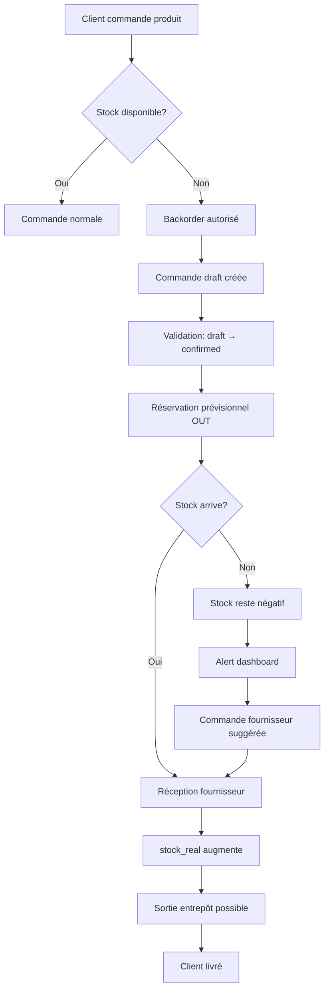

# 📦 Politique Backorders - Vérone Back Office

**Version**: 1.0
**Date**: 2025-10-14
**Statut**: ✅ **ACTIF**

---

## 🎯 **DÉFINITION**

Un **backorder** (commande en attente) se produit lorsqu'un produit est vendu alors que le stock physique est insuffisant ou nul. Le système autorise la création de commandes même avec stock = 0, et le stock peut devenir négatif.

**Stock négatif = Nombre d'unités vendues en attente de réapprovisionnement**

---

## 📋 **RÈGLES MÉTIER**

### **1. Création Commandes**
✅ **Autorisée** même si `stock_real = 0` ou `stock_available < quantité_demandée`

**Workflow**:
```
1. Utilisateur ajoute produit (stock = 0)
2. Alerte rouge affichée: "Stock insuffisant (Disponible: 0, Demandé: X)"
3. Utilisateur peut créer commande quand même
4. Commande créée en statut "draft"
```

### **2. Validation Commande (draft → confirmed)**
✅ **Autorisée** même avec stock insuffisant

**Impact Stock**:
```sql
-- Trigger: handle_sales_order_stock()
-- Action: Réservation stock prévisionnel OUT
stock_forecasted_out = stock_forecasted_out + quantité_commandée
```

**Exemple**:
- Stock réel: 5
- Commande: 10 unités
- Résultat: `stock_forecasted_out = 10` ✅ Autorisé

### **3. Sortie Entrepôt (warehouse_exit)**
✅ **Autorisée** même si stock réel devient négatif

**Impact Stock**:
```sql
-- Trigger: handle_sales_order_stock()
-- Action: Déduction stock réel
stock_real = stock_real - quantité_expédiée
-- Stock peut devenir négatif
```

**Exemple**:
- Stock réel: 3
- Expédition: 8 unités
- Résultat: `stock_real = -5` ✅ **Backorder de 5 unités**

### **4. Annulation Commande**
✅ Restauration automatique des réservations

**Impact Stock**:
```sql
-- Si commande confirmée mais pas expédiée
stock_forecasted_out = stock_forecasted_out - quantité_annulée
```

---

## 🔧 **IMPLÉMENTATION TECHNIQUE**

### **Base de Données**
```sql
-- Colonnes products acceptant valeurs négatives
stock_quantity       INTEGER  -- Peut être < 0
stock_real           INTEGER  -- Peut être < 0
stock_forecasted_in  INTEGER  -- Peut être < 0
stock_forecasted_out INTEGER  -- Peut être < 0

-- AUCUNE contrainte CHECK (supprimées migration 005)
```

### **Migrations Appliquées**
- `20251014_005_allow_negative_stock.sql` ⭐ **Migration critique**
  - Suppression 4 contraintes CHECK
  - Documentation backorders dans commentaires colonnes

### **Triggers Concernés**
1. `handle_sales_order_stock()`: Gestion réservations + déductions
2. `maintain_stock_coherence()`: Cohérence stock_real
3. `recalculate_forecasted_stock()`: Calcul prévisionnels

---

## 📊 **ALERTES & MONITORING**

### **Interface Utilisateur**

#### **Création Commande**
```typescript
// Alert destructive rouge (non bloquante)
"Problèmes de stock détectés :"
"• [Produit] : Stock insuffisant (Disponible: X, Demandé: Y)"
```

#### **Dashboard Stocks** (Recommandé - À implémenter)
```typescript
// Badge "Backorder" si stock_real < 0
Stock: -5  🔴 BACKORDER
```

#### **Tableau Commandes**
```typescript
// Indicateur visuel
Status: En cours  ⚠️ Backorder
```

### **Alertes Automatiques** (Recommandé - À implémenter)
1. Email admin si `stock_real < 0`
2. Suggestion commande fournisseur automatique
3. Email client: "Livraison différée 2-8 semaines"

---

## 🎯 **CAS D'USAGE**

### **Cas 1: Précommande Fournisseur**
**Scénario**: Client commande produit non encore reçu du fournisseur

```
1. Stock réel: 0
2. Client commande 10 unités
3. ✅ Commande acceptée (backorder)
4. Commande fournisseur créée
5. Réception: stock_real passe de 0 à 10
6. Expédition client: stock_real passe à 0
```

### **Cas 2: Commande Urgente**
**Scénario**: Client VIP demande livraison rapide, stock insuffisant

```
1. Stock réel: 3
2. Client commande 8 unités
3. ✅ Commande acceptée
4. Expédition 3 unités disponibles
5. stock_real = -5 (backorder)
6. Réception fournisseur: +10 unités
7. stock_real = 5
8. Expédition 5 unités restantes
9. stock_real = 0
```

### **Cas 3: Gestion Prévisionnelle**
**Scénario**: Anticiper besoins réapprovisionnement

```
1. Stock réel: 20
2. Commandes en attente: 35 unités
3. stock_forecasted_out = 35
4. stock_available = 20 - 35 = -15
5. 🚨 Alert: "Besoin réapprovisionnement 15 unités"
6. Commande fournisseur anticipée
```

---

## 🌐 **CONFORMITÉ STANDARDS ERP 2025**

### **Références Professionnelles**
- ✅ **NetSuite**: "Backorder policy allows negative inventory"
- ✅ **Fishbowl**: "Negative stock = Units on backorder"
- ✅ **Smart Software**: "Under backorder policy, speak of negative inventory"
- ✅ **LeanDNA**: "Backorders enable continuous sales despite stock-outs"

### **Meilleures Pratiques**
1. **Transparence Client**: Communiquer délais livraison
2. **Priorisation**: Traiter backorders FIFO (First In, First Out)
3. **Automatisation**: Réapprovisionnement suggéré si stock < seuil
4. **Reporting**: Statistiques backorders par produit/période

---

## 📈 **WORKFLOW COMPLET**



---

## ⚠️ **LIMITATIONS & PRÉCAUTIONS**

### **Limitations Connues**
1. **Pas de limite négative**: Stock peut devenir très négatif (ex: -100)
   - Solution future: Alert si backorder > seuil critique
2. **Pas de priorisation auto**: Backorders traités manuellement
   - Solution future: FIFO automatique

### **Bonnes Pratiques**
✅ Communiquer délais clients
✅ Suivre backorders dashboard
✅ Réapprovisionner rapidement
✅ Éviter overselling chronique

### **À NE PAS FAIRE**
❌ Ignorer alertes backorders
❌ Promettre livraison immédiate si backorder
❌ Cumuler backorders sans réapprovisionner
❌ Désactiver alertes stock insuffisant

---

## 📝 **HISTORIQUE MODIFICATIONS**

| Date | Version | Modification | Auteur |
|------|---------|--------------|--------|
| 2025-10-14 | 1.0 | Création politique backorders | Claude Code |
| 2025-10-14 | 1.0 | Migration 005 appliquée | System |

---

## 📎 **RÉFÉRENCES TECHNIQUES**

### **Migrations**
- `supabase/migrations/20251014_005_allow_negative_stock.sql`

### **Documentation**
- `MEMORY-BANK/sessions/RAPPORT-SESSION-BACKORDERS-2025-10-14.md`

### **Tests**
- Screenshot: `.playwright-mcp/test-backorders-success-stock-negatif.png`
- Commande test: SO-2025-00017 (Hotel Le Luxe, Fauteuil Milo Kaki)

---

**✅ POLITIQUE ACTIVE DEPUIS**: 2025-10-14
**🎯 OBJECTIF**: Fluidité opérationnelle + Conformité ERP 2025
**🏆 STATUT**: Implémentation complète et validée

*Vérone Back Office - Professional Inventory Management*
