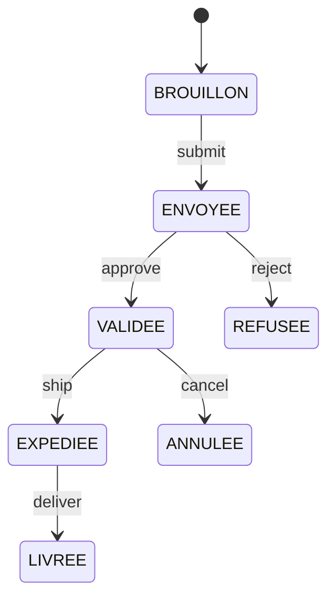
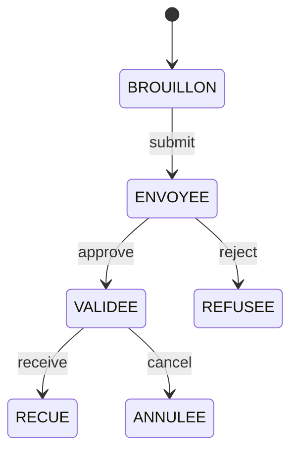

# Module Commandes - Vérone Back Office

Gestion complète du cycle de vie des commandes clients et fournisseurs avec workflows multi-états.

---

## Vue d'ensemble

Le module Commandes centralise la gestion des commandes de vente (clients) et d'achat (fournisseurs), avec workflows complets de la création à la livraison/réception.

**Routes principales**: `/commandes`

---

## Structure Module

```
commandes/
├── page.tsx                    # Dashboard commandes (vue globale)
├── clients/                    # Commandes clients (ventes)
│   ├── page.tsx               # Liste commandes clients
│   └── [id]/                  # Détail commande client
├── fournisseurs/              # Commandes fournisseurs (achats)
│   ├── page.tsx               # Liste commandes fournisseurs
│   └── [id]/                  # Détail commande fournisseur
└── expeditions/               # Gestion expéditions
    └── page.tsx               # Liste expéditions
```

---

## Fonctionnalités

### Commandes Clients (Ventes)

#### Workflow États


#### États Disponibles
- **BROUILLON**: Commande en cours de création
- **ENVOYEE**: Commande soumise au client
- **VALIDEE**: Commande approuvée par le client
- **EXPEDIEE**: Commande expédiée
- **LIVREE**: Commande livrée au client
- **ANNULEE**: Commande annulée
- **REFUSEE**: Commande refusée par le client

#### Fonctionnalités
- Création/édition brouillon
- Validation multi-niveaux
- Gestion lignes commandes (produits, quantités, prix)
- Calculs automatiques (sous-totaux, TVA, total TTC)
- Gestion backorders (ruptures stock)
- Export PDF commandes
- Historique modifications (audit trail)

### Commandes Fournisseurs (Achats)

#### Workflow États


#### États Disponibles
- **BROUILLON**: Commande en cours de création
- **ENVOYEE**: Commande envoyée au fournisseur
- **VALIDEE**: Commande confirmée par le fournisseur
- **RECUE**: Marchandise réceptionnée
- **ANNULEE**: Commande annulée
- **REFUSEE**: Commande refusée par le fournisseur

#### Fonctionnalités
- Gestion achats (produits, quantités, coûts)
- Réception partielle/complète
- Mise à jour stocks automatique
- Gestion délais livraison
- Export PDF bons de commande

### Expéditions

#### Fonctionnalités
- Création expéditions depuis commandes validées
- Gestion transporteurs
- Suivi numéros tracking
- Statuts expédition (préparation, expédiée, livrée)
- Historique expéditions

---

## Business Rules

### Workflow Commandes Clients

#### Horodatages
- `validated_at`: Date validation commande
- `shipped_at`: Date expédition
- `delivered_at`: Date livraison
- `cancelled_at`: Date annulation

#### Règles Stock
- **Réserve**: Stock réservé à l'état `VALIDEE`
- **Décrémentation**: Stock décrémenté à l'état `EXPEDIEE`
- **Libération**: Stock libéré si annulation

#### Règles Pricing
- Prix selon canal (B2C, B2B)
- Remises clients appliquées
- Quantités minimales (MOQ) respectées
- Paliers prix (quantity breaks)

### Workflow Commandes Fournisseurs

#### Horodatages
- `validated_at`: Date confirmation fournisseur
- `received_at`: Date réception marchandise
- `cancelled_at`: Date annulation

#### Règles Stock
- **Incrémentation**: Stock incrémenté à l'état `RECUE`
- **Mouvements**: Création automatique mouvements IN

---

## Bugs Résolus (Sessions Précédentes)

### Bug ComboBox Critiques (2025-10-13)
- **Symptôme**: Composants ComboBox non fonctionnels
- **Solution**: Migration Design System V2
- **Tests**: Formulaires commandes validés

### Bug Formulaire Commandes (2025-10-13)
- **Symptôme**: Validation formulaire incorrecte
- **Solution**: Correction logique validation
- **Tests**: Création commandes clients/fournisseurs validée

### Bug Annulation Workflow (2025-10-14)
- **Symptôme**: Annulation commande ne libère pas stock
- **Solution**: Correction workflow annulation
- **Tests**: Validation libération stock

### Bug Backorders Frontend (2025-10-14)
- **Symptôme**: Interface backorders incomplète
- **Solution**: Implémentation complète interface
- **Tests**: Gestion backorders validée

---

## Sécurité

### RLS Policies

**Tables commandes**:
- `sales_orders` (commandes clients)
- `purchase_orders` (commandes fournisseurs)
- `order_lines` (lignes commandes)
- `shipments` (expéditions)

**Authentification**:
- SELECT: `authenticated`
- INSERT/UPDATE: `sales_manager`, `purchase_manager`
- DELETE: `admin`
- Annulation: `sales_manager`, `admin`

---

## Performance

### Optimisations en Place
- Pagination listes commandes
- Cache SWR (5 min revalidation)
- Queries optimisées (SELECT colonnes essentielles)
- Index database sur colonnes fréquentes (status, dates)

### SLOs Estimés
- **Liste commandes**: <2s (non mesuré Phase 4)
- **Détail commande**: <1s (non mesuré)
- **Export PDF**: <5s (SLO défini, non mesuré)

---

## Fichiers Critiques

### Hooks Custom
- `use-sales-orders.ts` (gestion commandes clients)
- `use-purchase-orders.ts` (gestion commandes fournisseurs)
- `use-order-lines.ts` (lignes commandes)
- `use-shipments.ts` (expéditions)

### Composants Business
- `sales-order-form.tsx` (formulaire commandes clients)
- `purchase-order-form.tsx` (formulaire commandes fournisseurs)
- `order-lines-table.tsx` (tableau lignes)
- `shipment-wizard.tsx` (création expéditions)

### API Routes
- `api/sales-orders/[id]/pdf/route.ts` (export PDF commandes)
- `api/purchase-orders/[id]/receive/route.ts` (réception marchandise)

---

## Intégrations

### Module Stocks
- Réservation stock (VALIDEE)
- Décrémentation stock (EXPEDIEE)
- Incrémentation stock (RECUE fournisseurs)
- Mouvements automatiques (IN, OUT)

### Module Facturation
- Génération factures depuis commandes validées
- Synchronisation montants TTC
- Historique paiements

### Module CRM
- Liaison organisations (clients, fournisseurs)
- Historique commandes par organisation
- Statistiques commandes (CA, fréquence)

---

## Prochaines Étapes

### Court Terme (1 semaine)
1. Tests E2E workflows complets (GROUPE 4-5)
2. Validation export PDF (<5s SLO)
3. Tests backorders multiples

### Moyen Terme (2 semaines)
1. Optimisation requêtes SQL (SELECT spécifiques)
2. Amélioration UX formulaires (autocomplete)
3. Gestion relances automatiques

### Long Terme (1 mois)
1. Workflows avancés (approbations multi-niveaux)
2. Intégration transporteurs (API tracking)
3. Analytics commandes temps réel

---

## Documentation Connexe

- **Business Rules**: `/manifests/business-rules/WORKFLOWS.md`
- **Rapports Sessions**: `/MEMORY-BANK/sessions/RAPPORT-SESSION-*-COMMANDES-*.md`
- **Code Review**: `/MEMORY-BANK/sessions/RAPPORT-PHASE-3-CODE-REVIEW-2025-10-16.md`

---

**Module maintenu par**: Vérone System Orchestrator
**Dernière mise à jour**: 2025-10-16
**Statut**: ✅ Fonctionnel (Tests sessions précédentes validés)
